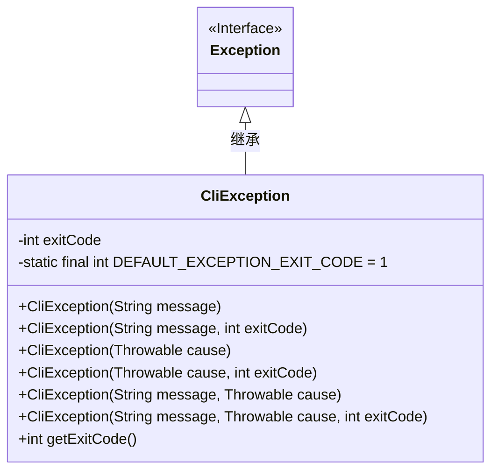
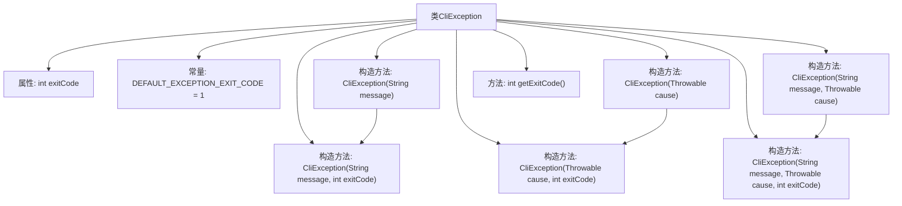

# 基础信息

|      |      |
|------|------|
| 名称 | CliException |
| 编码语言 | .java |
| 代码路径 | zookeeper/zookeeper-server/src/main/java/org/apache/zookeeper/cli/CliException.java |
| 包名 | org.apache.zookeeper.cli |
| 依赖项 | [] |
| 概述说明 | CliException是自定义异常类，继承Exception，包含退出码属性，默认值为1，提供多种构造方法支持消息、原因及退出码设置，可获取退出码。 |

# 说明

该内容定义了一个名为CliException的Java异常类，继承自Exception类。该类用于命令行应用程序中的异常处理，包含一个表示退出码的整型字段exitCode，默认值为1。提供了多个构造函数，支持通过消息、原因或两者结合来创建异常实例，并可指定自定义退出码。还包含一个获取退出码的方法getExitCode。该设计允许在抛出异常时携带特定退出码，便于调用者根据退出码进行后续处理。

# 类列表 Class Summary

| 名称   | 类型  | 说明 |
|-------|------|-------------|
| CliException | class | CliException是自定义异常类，继承Exception，包含退出码属性，提供多种构造方法，默认退出码为1，可获取退出码。 |

## 类 CliException

|      |      |
|------|------|
| 访问范围 | @SuppressWarnings("serial");public |
| 类型 | class |
| 名称 | CliException |
| 说明 | CliException是自定义异常类，继承Exception，包含退出码属性，提供多种构造方法，默认退出码为1，可获取退出码。 |

### UML类图

这段代码定义了一个`CliException`类，继承自`Exception`，用于处理命令行异常。类中包含多种构造方法，支持通过消息、原因或两者组合创建异常，并可指定退出码（默认为1）。核心功能是通过`getExitCode()`获取异常对应的程序退出状态码，便于命令行工具统一错误处理流程。

### 内部方法调用关系图

这段代码定义了一个名为CliException的自定义异常类，继承自Exception。该类包含多个构造方法，用于处理不同的异常场景，并允许设置退出码。流程图展示了类的结构，包括属性、常量、构造方法和方法之间的调用关系。CliException类主要用于命令行应用程序中，通过exitCode属性可以指定程序退出时的状态码，便于错误处理和调试。

### 字段列表 Field List

| 名称  | 类型  | 说明 |
|-------|-------|------|
| DEFAULT_EXCEPTION_EXIT_CODE = 1 | int | 定义默认异常退出码为1的静态常量。 |
| exitCode | int | 保护类型整型变量exitCode，用于存储退出状态码。 |

### 方法列表 Method List

| 名称  | 类型  | 说明 |
|-------|-------|------|
| getExitCode | int | 该方法返回整型变量exitCode的值，无参数。 |

