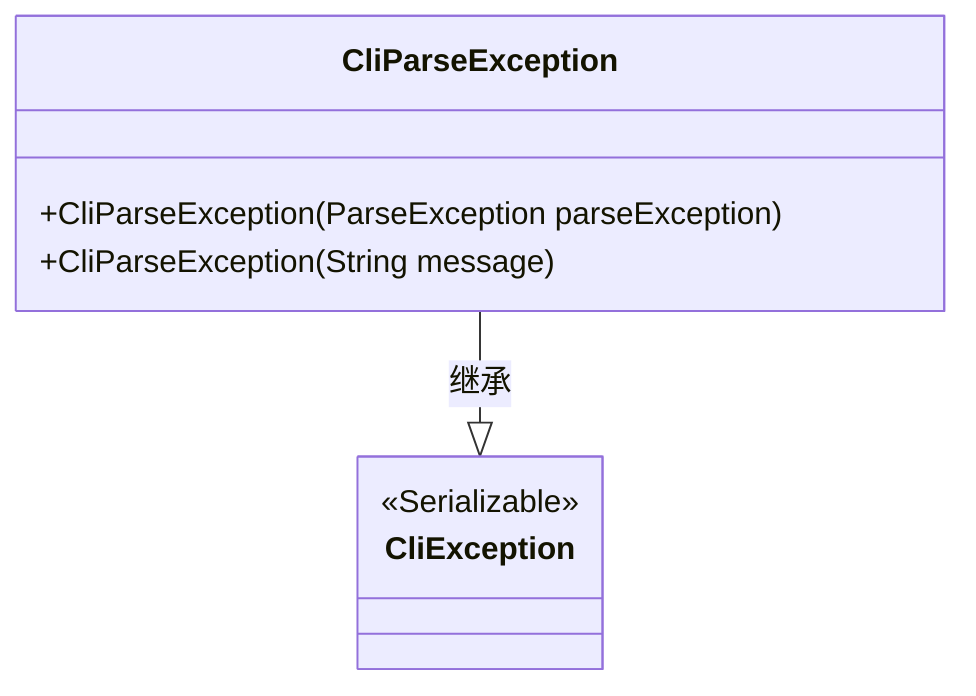
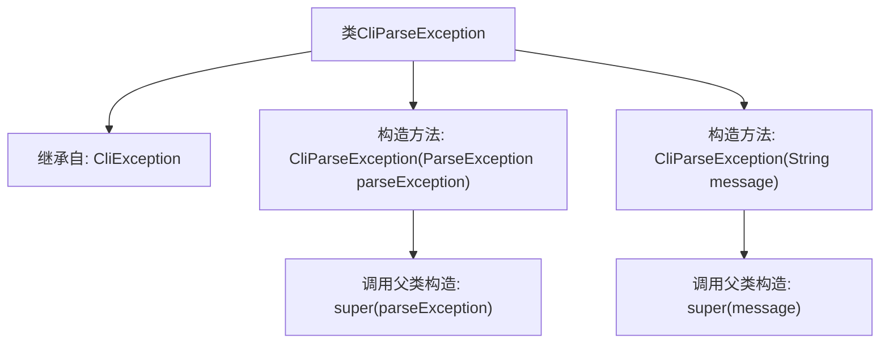

# 基础信息

|      |      |
|------|------|
| 名称 | CliParseException |
| 编码语言 | .java |
| 代码路径 | zookeeper/zookeeper-server/src/main/java/org/apache/zookeeper/cli/CliParseException.java |
| 包名 | org.apache.zookeeper.cli |
| 依赖项 | ['org.apache.commons.cli.ParseException'] |
| 概述说明 | CliParseException继承自CliException，提供两种构造方法：接收ParseException或字符串消息。用于命令行解析异常处理。 |

# 说明

这是一个名为CliParseException的Java类，继承自CliException类。它提供了两个构造函数：一个接受ParseException参数并传递给父类构造函数，另一个接受String类型消息参数并同样传递给父类构造函数。类上使用了@SuppressWarnings注解抑制序列化警告。这个类主要用于处理命令行解析过程中的异常情况。

# 类列表 Class Summary

| 名称   | 类型  | 说明 |
|-------|------|-------------|
| CliParseException | class | CliParseException继承自CliException，提供两种构造方法：接收ParseException或字符串参数。 |

## 类 CliParseException

|      |      |
|------|------|
| 访问范围 | @SuppressWarnings("serial");public |
| 类型 | class |
| 名称 | CliParseException |
| 说明 | CliParseException继承自CliException，提供两种构造方法：接收ParseException或字符串参数。 |

### UML类图

这段类图展示了CliParseException继承自CliException的关系。CliException是一个可序列化(Serializable)的基类，而CliParseException提供了两个构造函数：一个接受ParseException参数，另一个接受String消息参数。作为异常类，它继承了Java的异常处理机制，主要用于命令行参数解析错误的场景。图中清晰体现了类之间的继承关系，符合Java异常处理的设计模式。

### 内部方法调用关系图

该流程图展示了CliParseException类的继承关系和构造方法逻辑。该类继承自CliException，包含两个重载构造方法：一个接收ParseException参数并传递给父类构造器，另一个接收String消息参数同样传递给父类。图形清晰地反映了异常类的封装特性和构造方法的调用链，体现了Java异常处理中"包装异常"的常见模式。

### 字段列表 Field List

| 名称  | 类型  | 说明 |
|-------|-------|------|

### 方法列表 Method List

| 名称  | 类型  | 说明 |
|-------|-------|------|

