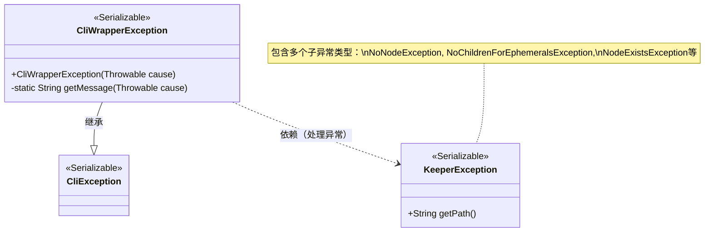
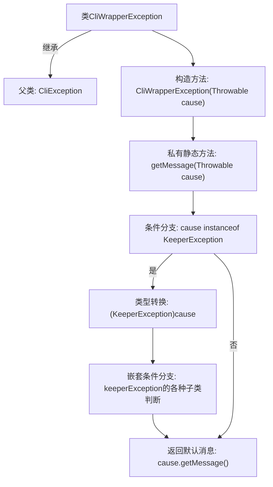

# 基础信息

|      |      |
|------|------|
| 名称 | CliWrapperException |
| 编码语言 | .java |
| 代码路径 | zookeeper/zookeeper-server/src/main/java/org/apache/zookeeper/cli/CliWrapperException.java |
| 包名 | org.apache.zookeeper.cli |
| 依赖项 | ['org.apache.zookeeper.KeeperException'] |
| 概述说明 | CliWrapperException继承自CliException，封装KeeperException异常，根据不同类型返回对应错误信息，如节点不存在、无权限、参数无效等。 |

# 说明

CliWrapperException是CliException的子类，用于封装KeeperException及其子类异常。构造函数接收Throwable参数，并通过getMessage方法生成详细错误信息。该方法针对不同类型的KeeperException返回特定错误描述，包括节点不存在、临时节点不能有子节点、节点已存在、节点非空、非只读调用、无效ACL、权限不足、参数无效、版本号无效、重配置进行中、新配置无法定人数、配额超限等场景。若异常非KeeperException类型，则返回原始异常信息。

# 类列表 Class Summary

| 名称   | 类型  | 说明 |
|-------|------|-------------|
| CliWrapperException | class | CliWrapperException继承自CliException，封装KeeperException异常，根据不同类型返回对应错误信息，如节点不存在、无权限、参数无效等。 |

## 类 CliWrapperException

|      |      |
|------|------|
| 访问范围 | @SuppressWarnings("serial");public |
| 类型 | class |
| 名称 | CliWrapperException |
| 说明 | CliWrapperException继承自CliException，封装KeeperException异常，根据不同类型返回对应错误信息，如节点不存在、无权限、参数无效等。 |

### UML类图

这段代码展示了一个异常处理类`CliWrapperException`，它继承自`CliException`并专门处理ZooKeeper的`KeeperException`及其子类异常。通过静态方法`getMessage`，根据不同的`KeeperException`子类型生成对应的错误信息，包括节点不存在、临时节点不能有子节点、节点已存在等17种情况。类图清晰地体现了继承关系和异常处理的依赖逻辑，适用于分布式系统中ZooKeeper客户端错误的精细化封装。

### 内部方法调用关系图

这段代码展示了一个CliWrapperException类，继承自CliException，主要用于包装不同类型的KeeperException异常并生成对应的错误消息。流程图清晰展示了从构造函数开始，通过getMessage方法处理多种KeeperException子类情况，最终返回相应错误消息或默认消息的逻辑路径，体现了异常处理的层次结构和条件分支关系。

### 字段列表 Field List

| 名称  | 类型  | 说明 |
|-------|-------|------|

### 方法列表 Method List

| 名称  | 类型  | 说明 |
|-------|-------|------|
| getMessage | String | 静态方法getMessage处理KeeperException异常，返回对应错误信息，如节点不存在、无子节点、节点已存在等，非KeeperException返回原始信息。 |

