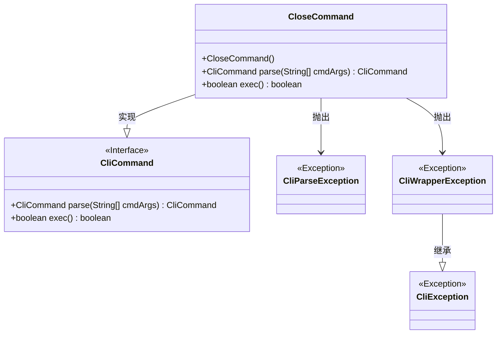
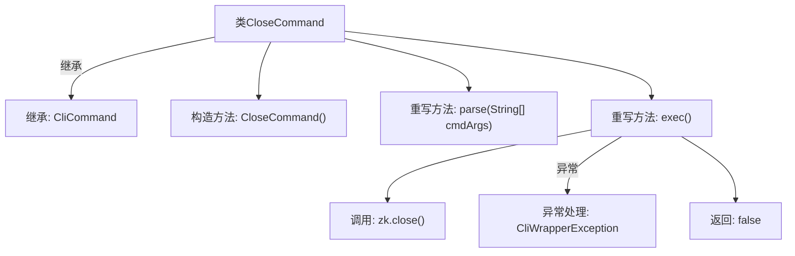

# 基础信息

|      |      |
|------|------|
| 名称 | CloseCommand |
| 编码语言 | .java |
| 代码路径 | zookeeper/zookeeper-server/src/main/java/org/apache/zookeeper/cli/CloseCommand.java |
| 包名 | org.apache.zookeeper.cli |
| 依赖项 | [] |
| 概述说明 | CloseCommand是CliCommand的子类，用于关闭zk连接。构造函数初始化命令名，parse方法直接返回自身，exec方法执行关闭操作并处理异常。 |

# 说明

这段内容描述了一个名为CloseCommand的Java类，继承自CliCommand类。该类实现了命令行关闭功能，构造函数设置命令名为"close"。parse方法直接返回当前对象，不做额外解析。exec方法执行核心关闭逻辑，调用zk对象的close方法关闭连接，捕获异常时包装为CliWrapperException抛出。方法固定返回false，可能表示操作结果状态。整个类结构简洁，专注于关闭功能的实现与异常处理。

# 类列表 Class Summary

| 名称   | 类型  | 说明 |
|-------|------|-------------|
| CloseCommand | class | CloseCommand是CliCommand的子类，用于关闭zk连接。parse方法直接返回自身，exec方法执行关闭操作，异常时抛出CliWrapperException。 |

## 类 CloseCommand

|      |      |
|------|------|
| 访问范围 | public |
| 类型 | class |
| 名称 | CloseCommand |
| 说明 | CloseCommand是CliCommand的子类，用于关闭zk连接。parse方法直接返回自身，exec方法执行关闭操作，异常时抛出CliWrapperException。 |

### UML类图

这段类图展示了CloseCommand类继承自CliCommand接口，并实现了parse和exec方法。CloseCommand在执行时会抛出CliParseException和CliWrapperException异常，其中CliWrapperException继承自CliException。该结构体现了命令模式的设计，通过接口统一了命令的解析和执行流程，同时通过异常处理机制增强了代码的健壮性。

### 内部方法调用关系图

这段代码展示了一个CloseCommand类，继承自CliCommand基类，主要用于关闭ZooKeeper(zk)连接。类包含构造方法和两个重写方法：parse直接返回当前对象，exec执行核心关闭操作并处理异常。流程图清晰呈现了类继承关系、方法调用链和异常处理路径，特别突出了zk.close()的关键操作和错误封装为CliWrapperException的细节。

### 字段列表 Field List

| 名称  | 类型  | 说明 |
|-------|-------|------|

### 方法列表 Method List

| 名称  | 类型  | 说明 |
|-------|-------|------|
| exec | boolean | 重写exec方法，关闭zk连接，异常时抛出CliWrapperException，默认返回false。 |
| parse | CliCommand | 重写父类方法，直接返回当前对象实例。 |

