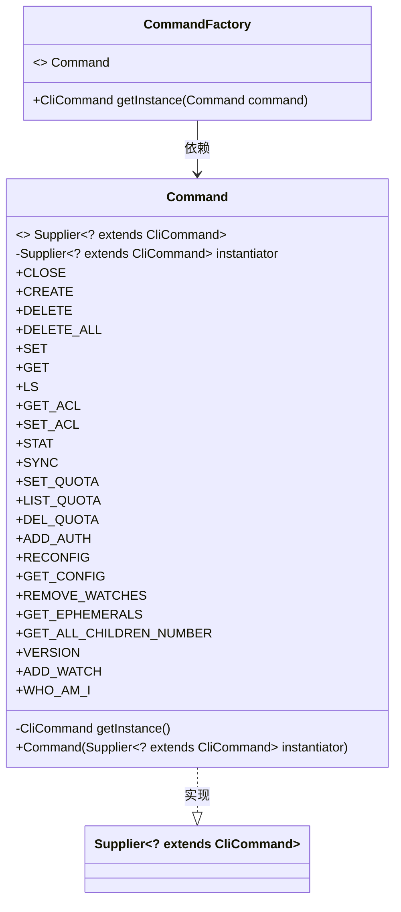
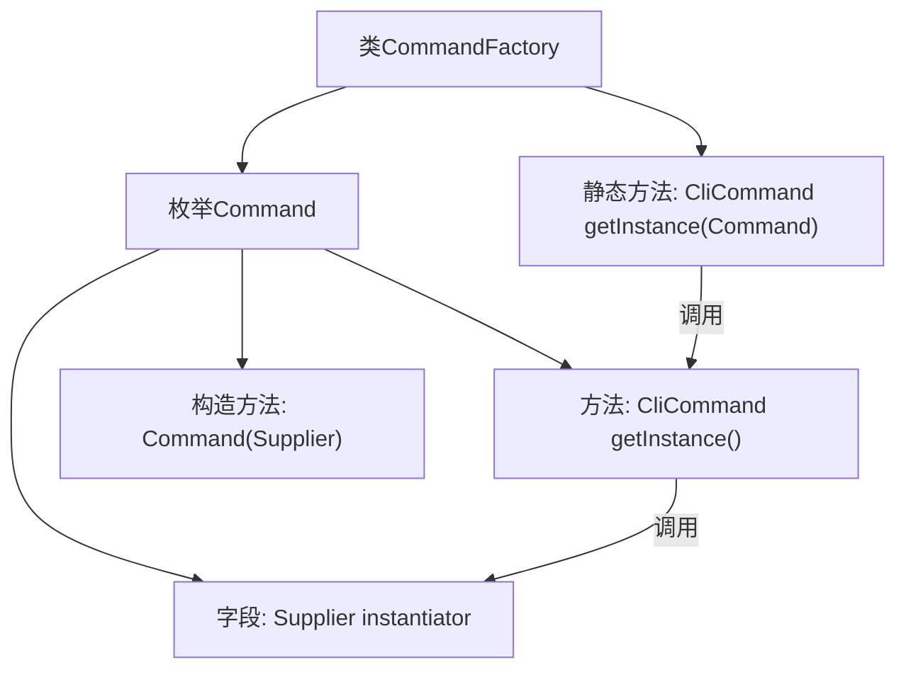

# 基础信息

|      |      |
|------|------|
| 名称 | CommandFactory |
| 编码语言 | .java |
| 代码路径 | zookeeper/zookeeper-server/src/main/java/org/apache/zookeeper/cli/CommandFactory.java |
| 包名 | org.apache.zookeeper.cli |
| 依赖项 | ['java.util.function.Supplier'] |
| 概述说明 | CommandFactory类定义了枚举Command，包含多种CLI命令类型，并通过getInstance方法创建对应的CliCommand实例。 |

# 说明

该代码定义了一个CommandFactory类，用于创建不同类型的CliCommand实例。通过枚举Command列出了所有可用的CLI命令，每个命令对应一个特定的命令类（如CloseCommand、CreateCommand等）。枚举中的每个项通过Supplier接口保存对应命令类的实例化逻辑。CommandFactory提供了静态方法getInstance，根据传入的Command枚举值调用相应命令的实例化方法，返回对应的CliCommand对象。该设计实现了命令对象的集中管理和按需创建。

# 类列表 Class Summary

| 名称   | 类型  | 说明 |
|-------|------|-------------|
| CommandFactory | class | CommandFactory类定义了枚举Command，包含多种CLI命令类型，通过getInstance方法创建对应命令实例。 |

## 类 CommandFactory

|      |      |
|------|------|
| 访问范围 | public |
| 类型 | class |
| 名称 | CommandFactory |
| 说明 | CommandFactory类定义了枚举Command，包含多种CLI命令类型，通过getInstance方法创建对应命令实例。 |

### UML类图

这段代码展示了一个命令工厂模式的设计，其中CommandFactory类通过枚举类型Command来创建不同类型的CliCommand实例。Command枚举实现了Supplier接口，每个枚举值都关联到一个特定的命令类构造函数。该设计通过工厂方法getInstance()解耦了命令对象的创建过程，使得客户端无需直接实例化具体命令类。类图清晰地反映了工厂与枚举的依赖关系，以及枚举对泛型接口的实现关系。

### 内部方法调用关系图

该流程图展示了CommandFactory类及其内部枚举Command的结构关系。Command枚举包含一个Supplier类型的instantiator字段和getInstance()方法，用于创建具体的CliCommand实例。CommandFactory类通过静态方法getInstance()调用枚举的getInstance()方法，进而通过Supplier实例化对应的CliCommand。这种设计实现了命令模式的工厂方法，将命令对象的创建与使用解耦，便于扩展新的命令类型。

### 字段列表 Field List

| 名称  | 类型  | 说明 |
|-------|-------|------|

### 方法列表 Method List

| 名称  | 类型  | 说明 |
|-------|-------|------|
| getInstance | CliCommand | 静态方法getInstance接收Command参数，返回其调用getInstance()的结果。 |

