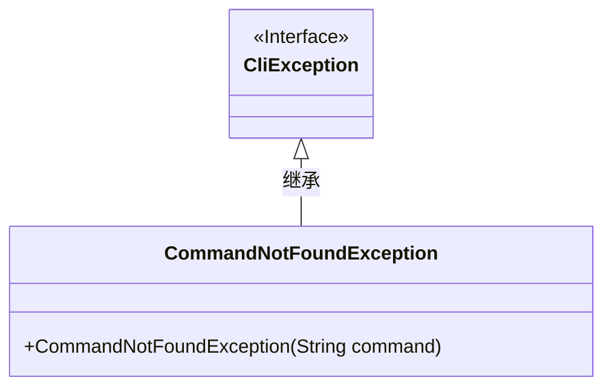
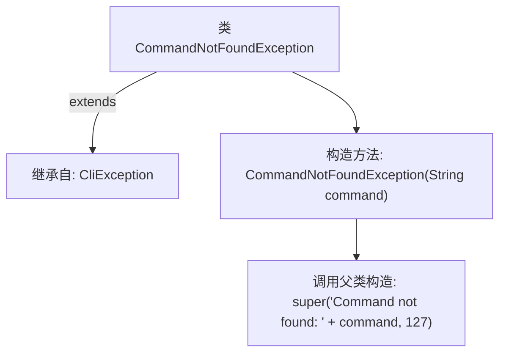

# 基础信息

|      |      |
|------|------|
| 名称 | CommandNotFoundException |
| 编码语言 | .java |
| 代码路径 | zookeeper/zookeeper-server/src/main/java/org/apache/zookeeper/cli/CommandNotFoundException.java |
| 包名 | org.apache.zookeeper.cli |
| 依赖项 | [] |
| 概述说明 | 定义CommandNotFoundException类，继承CliException，构造时传入未找到的命令名并设置错误码127。 |

# 说明

该内容定义了一个名为CommandNotFoundException的Java异常类，继承自CliException。该异常在命令行工具中用于表示未找到指定命令的情况。构造函数接收一个字符串参数command，将其拼接到预设的错误信息中，并调用父类构造函数传递错误信息和固定退出码127。类注解@SuppressWarnings("serial")表明该异常类无需实现序列化接口。

# 类列表 Class Summary

| 名称   | 类型  | 说明 |
|-------|------|-------------|
| CommandNotFoundException | class | 定义了一个CommandNotFoundException类，继承自CliException。当命令未找到时抛出，包含错误信息和状态码127。 |

## 类 CommandNotFoundException

|      |      |
|------|------|
| 访问范围 | @SuppressWarnings("serial");public |
| 类型 | class |
| 名称 | CommandNotFoundException |
| 说明 | 定义了一个CommandNotFoundException类，继承自CliException。当命令未找到时抛出，包含错误信息和状态码127。 |

### UML类图

这段代码展示了一个异常类`CommandNotFoundException`，它继承自`CliException`接口。该异常类通过构造函数接收一个命令字符串参数，并调用父类构造函数传递格式化错误信息和固定错误码127。类图清晰地表示了继承关系，其中`CliException`作为接口标记，`CommandNotFoundException`作为具体实现类包含一个公有构造函数。该设计用于在CLI环境中处理未找到命令的错误情况。

### 内部方法调用关系图

这段代码定义了一个继承自CliException的CommandNotFoundException异常类。流程图展示了类继承关系和构造方法的调用链。当创建该异常时，会调用父类CliException的构造方法，传递包含错误命令名的错误消息和固定的退出码127。该异常专门用于处理命令行环境中未找到命令的情况，通过继承机制复用父类的异常处理逻辑。

### 字段列表 Field List

| 名称  | 类型  | 说明 |
|-------|-------|------|

### 方法列表 Method List

| 名称  | 类型  | 说明 |
|-------|-------|------|

