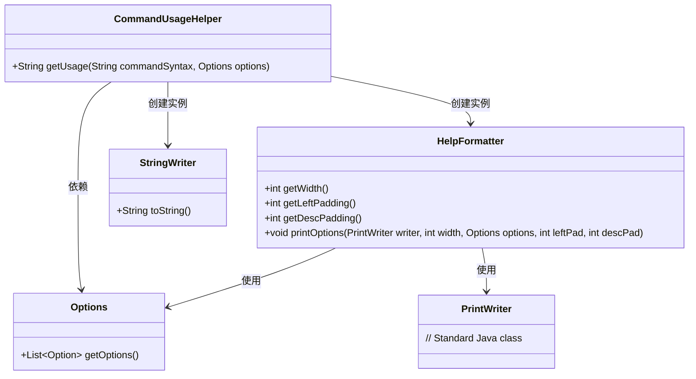
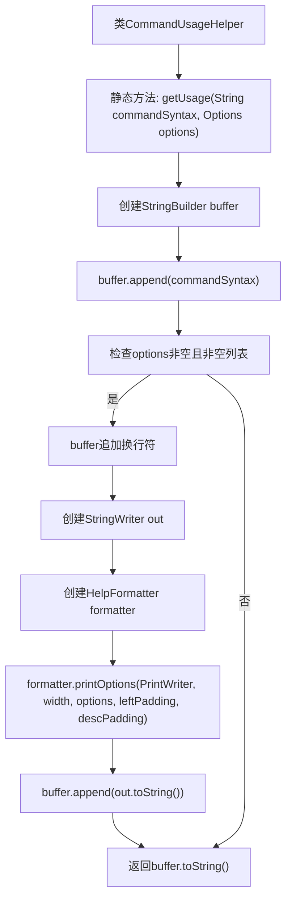

# 基础信息

|      |      |
|------|------|
| 名称 | CommandUsageHelper |
| 编码语言 | .java |
| 代码路径 | zookeeper/zookeeper-server/src/main/java/org/apache/zookeeper/cli/CommandUsageHelper.java |
| 包名 | org.apache.zookeeper.cli |
| 依赖项 | ['java.io.PrintWriter', 'java.io.StringWriter', 'javax.annotation.Nullable', 'org.apache.commons.cli.HelpFormatter', 'org.apache.commons.cli.Options'] |
| 概述说明 | CommandUsageHelper类提供静态方法getUsage，用于生成命令使用说明，包含语法和可选参数信息。 |

# 说明

该代码定义了一个名为CommandUsageHelper的公共类，包含一个静态方法getUsage。该方法接收两个参数：命令语法字符串commandSyntax和可空选项对象options。方法功能是生成命令使用说明字符串：首先将命令语法添加到缓冲区，若options非空且包含选项，则追加换行符后使用HelpFormatter格式化选项信息（包括选项描述的对齐和宽度处理），最终返回拼接后的完整使用说明字符串。整个过程不直接操作IO，而是通过StringWriter和StringBuilder实现内存操作。

# 类列表 Class Summary

| 名称   | 类型  | 说明 |
|-------|------|-------------|
| CommandUsageHelper | class | CommandUsageHelper类提供getUsage方法，根据命令语法和可选参数生成使用说明，包含语法和格式化选项信息。 |

## 类 CommandUsageHelper

|      |      |
|------|------|
| 访问范围 | public |
| 类型 | class |
| 名称 | CommandUsageHelper |
| 说明 | CommandUsageHelper类提供getUsage方法，根据命令语法和可选参数生成使用说明，包含语法和格式化选项信息。 |

### UML类图

这段代码展示了一个命令行工具帮助信息生成器。CommandUsageHelper类通过组合Options、HelpFormatter和StringWriter等组件，将命令语法和可选参数格式化为易读的帮助文本。核心是HelpFormatter的printOptions方法，它处理参数对齐和排版，最终结果通过StringWriter收集并返回。整个设计体现了单一职责原则，各组件协作完成格式化输出功能。

### 内部方法调用关系图

这段代码流程图展示了CommandUsageHelper类中getUsage方法的完整执行逻辑。该方法首先构建基础命令语法，当存在可选参数时，通过HelpFormatter格式化选项说明并追加到输出中。流程清晰展现了条件分支（检查options）和核心操作（字符串构建与格式化），最终返回组合后的使用说明字符串。该方法主要用于生成命令行工具的标准帮助文档格式。

### 字段列表 Field List

| 名称  | 类型  | 说明 |
|-------|-------|------|

### 方法列表 Method List

| 名称  | 类型  | 说明 |
|-------|-------|------|
| getUsage | String | 静态方法生成命令用法说明，包含语法和可选参数信息。若无参数则仅返回语法。 |

