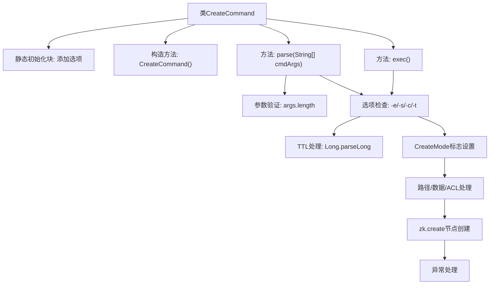

# 基础信息

|      |      |
|------|------|
| 名称 | CreateCommand |
| 编码语言 | .java |
| 代码路径 | zookeeper/zookeeper-server/src/main/java/org/apache/zookeeper/cli/CreateCommand.java |
| 包名 | org.apache.zookeeper.cli |
| 依赖项 | ['java.nio.charset.StandardCharsets.UTF_8', 'java.util.List', 'org.apache.commons.cli.CommandLine', 'org.apache.commons.cli.DefaultParser', 'org.apache.commons.cli.Option', 'org.apache.commons.cli.Options', 'org.apache.commons.cli.ParseException', 'org.apache.zookeeper.CreateMode', 'org.apache.zookeeper.KeeperException', 'org.apache.zookeeper.ZooDefs', 'org.apache.zookeeper.data.ACL', 'org.apache.zookeeper.data.Stat', 'org.apache.zookeeper.server.EphemeralType'] |
| 概述说明 | CreateCommand类处理ZooKeeper节点创建，支持选项-e（临时）、-s（顺序）、-c（容器）、-t（TTL），验证参数组合合法性并执行创建操作。 |

# 说明

这是一个名为CreateCommand的Java类，继承自CliCommand，用于处理创建ZooKeeper节点的命令行操作。该类定义了四个选项：-e（临时节点）、-s（顺序节点）、-c（容器节点）和-t（生存时间）。构造函数设置命令名称为"create"并指定使用格式。parse方法解析命令行参数并验证参数数量。exec方法执行创建节点的逻辑，处理各种选项组合和验证，包括检查选项冲突（如容器节点不能与临时或顺序节点同时使用）、解析TTL值、确定创建模式（如EPHEMERAL_SEQUENTIAL或PERSISTENT_WITH_TTL等）。最后，它调用ZooKeeper的create方法创建节点，处理路径、数据、ACL等参数，并捕获可能出现的异常。

# 类列表 Class Summary

| 名称   | 类型  | 说明 |
|-------|------|-------------|
| CreateCommand | class | CreateCommand类处理ZooKeeper节点创建，支持选项-e临时节点、-s顺序节点、-c容器节点、-t TTL值，验证参数组合有效性后调用zk.create完成创建。 |

## 类 CreateCommand

|      |      |
|------|------|
| 访问范围 | public |
| 类型 | class |
| 名称 | CreateCommand |
| 说明 | CreateCommand类处理ZooKeeper节点创建，支持选项-e临时节点、-s顺序节点、-c容器节点、-t TTL值，验证参数组合有效性后调用zk.create完成创建。 |

### UML类图

```mermaid
classDiagram
    class CliCommand {
        <<Interface>>
        +parse(String[] cmdArgs) CliCommand
        +exec() boolean
    }
    class CreateCommand {
        -Options options
        -String[] args
        -CommandLine cl
        +CreateCommand()
        +parse(String[] cmdArgs) CliCommand
        +exec() boolean
    }
    class Options {
        +addOption(Option opt)
    }
    class Option {
        +Option(String opt, boolean hasArg, String description)
    }
    class DefaultParser {
        +parse(Options options, String[] args) CommandLine
    }
    class CommandLine {
        +hasOption(String opt) boolean
        +getOptionValue(String opt) String
        +getArgs() String[]
    }
    class CreateMode {
        <<Enum>>
        EPHEMERAL_SEQUENTIAL
        EPHEMERAL
        PERSISTENT_SEQUENTIAL
        PERSISTENT_SEQUENTIAL_WITH_TTL
        CONTAINER
        PERSISTENT
        PERSISTENT_WITH_TTL
    }
    class EphemeralType {
        <<Enum>>
        TTL
        +toEphemeralOwner(long ttl) 
    }
    class AclParser {
        +parse(String aclStr) List~ACL~
    }
    class ZooDefs.Ids {
        OPEN_ACL_UNSAFE
    }
    class CliParseException
    class MalformedCommandException
    class CliWrapperException
    class KeeperException {
        <<Interface>>
    }

    CreateCommand --|> CliCommand : 实现
    CreateCommand --> Options : 使用
    CreateCommand --> DefaultParser : 使用
    CreateCommand --> CommandLine : 使用
    CreateCommand --> CreateMode : 使用
    CreateCommand --> EphemeralType : 使用
    CreateCommand --> AclParser : 使用
    CreateCommand --> ZooDefs.Ids : 使用
    CreateCommand ..> CliParseException : 抛出
    CreateCommand ..> MalformedCommandException : 抛出
    CreateCommand ..> CliWrapperException : 抛出
    Options --> Option : 包含
    DefaultParser ..> ParseException : 抛出
    KeeperException <|.. KeeperException.EphemeralOnLocalSessionException : 继承
    KeeperException <|.. KeeperException.InvalidACLException : 继承
```

这段代码描述了一个`CreateCommand`类，它继承自`CliCommand`接口，用于处理创建ZooKeeper节点的命令行操作。类中定义了多种选项（如ephemeral、sequential等）和参数（如ttl），并通过`DefaultParser`解析命令行输入。执行时根据选项组合创建不同类型的节点，处理各种异常情况（如参数格式错误、ACL解析失败等）。流程图展示了类之间的依赖关系和异常处理链路，体现了复杂的命令行参数校验和节点创建逻辑。

### 内部方法调用关系图

这段代码是ZooKeeper客户端创建节点命令的实现类。流程图展示了从类初始化到命令执行的全过程：首先静态初始化块定义命令行选项，构造方法设置命令格式；parse方法解析参数并验证参数数量；exec方法处理各种选项组合（-e临时节点/-s顺序节点/-c容器节点/-t TTL），进行参数校验后根据选项组合设置CreateMode标志，最后调用zk.create创建节点并处理可能出现的异常情况。整个过程包含严格的参数校验和异常处理机制。

### 字段列表 Field List

| 名称  | 类型  | 说明 |
|-------|-------|------|
| args | String[] | 声明一个私有字符串数组变量args。 |
| cl | CommandLine | 私有命令行对象cl。 |
| options = new Options() | Options | 私有静态变量options初始化为Options类的新实例。 |

### 方法列表 Method List

| 名称  | 类型  | 说明 |
|-------|-------|------|
| parse | CliCommand | 重写parse方法，使用DefaultParser解析命令行参数，捕获异常并转换，检查参数数量，不足则抛出异常，最后返回当前对象。 |
| exec | boolean | 该方法检查命令行参数组合有效性，处理节点创建模式及TTL设置，验证路径和数据后调用zk.create创建节点，捕获异常并输出结果。 |

