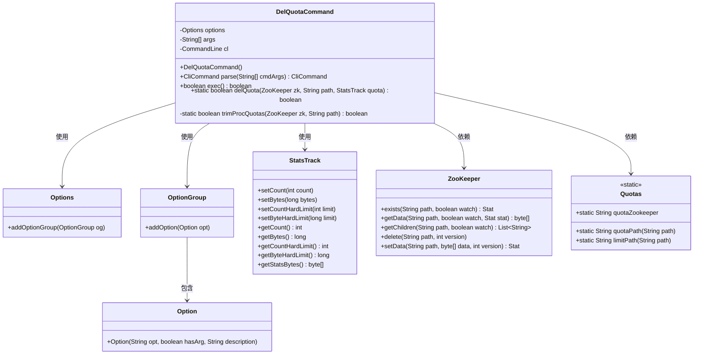
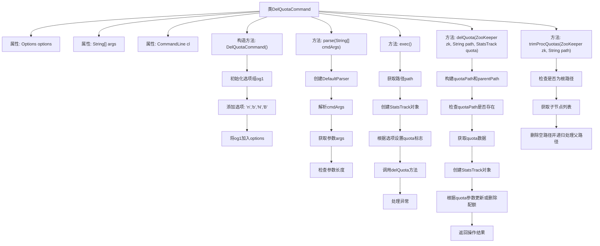

# 基础信息

|      |      |
|------|------|
| 名称 | DelQuotaCommand |
| 编码语言 | .java |
| 代码路径 | zookeeper/zookeeper-server/src/main/java/org/apache/zookeeper/cli/DelQuotaCommand.java |
| 包名 | org.apache.zookeeper.cli |
| 依赖项 | ['java.util.List', 'org.apache.commons.cli.CommandLine', 'org.apache.commons.cli.DefaultParser', 'org.apache.commons.cli.Option', 'org.apache.commons.cli.OptionGroup', 'org.apache.commons.cli.Options', 'org.apache.commons.cli.ParseException', 'org.apache.zookeeper.KeeperException', 'org.apache.zookeeper.Quotas', 'org.apache.zookeeper.StatsTrack', 'org.apache.zookeeper.ZooKeeper', 'org.apache.zookeeper.data.Stat'] |
| 概述说明 | DelQuotaCommand类用于删除ZooKeeper节点配额，支持软硬配额类型选项，通过StatsTrack对象标记需删除的配额类型，执行配额删除或全部清除操作。 |

# 说明

DelQuotaCommand是一个用于删除ZooKeeper配额管理的命令行工具类。它继承自CliCommand，提供四种配额删除选项：n（数量软配额）、b（字节软配额）、N（数量硬配额）、B（字节硬配额）。通过parse方法解析输入参数，exec方法执行配额删除操作。核心功能由delQuota方法实现，支持删除指定类型的配额或全部配额，并包含trimProcQuotas方法用于清理空配额节点。当配额不存在时会提示错误，处理过程中会捕获路径异常、节点不存在等错误情况。

# 类列表 Class Summary

| 名称   | 类型  | 说明 |
|-------|------|-------------|
| DelQuotaCommand | class | DelQuotaCommand类用于删除ZooKeeper节点配额，支持软硬配额类型选项，通过StatsTrack对象标记删除项，处理路径验证和异常。 |

## 类 DelQuotaCommand

|      |      |
|------|------|
| 访问范围 | public |
| 类型 | class |
| 名称 | DelQuotaCommand |
| 说明 | DelQuotaCommand类用于删除ZooKeeper节点配额，支持软硬配额类型选项，通过StatsTrack对象标记删除项，处理路径验证和异常。 |

### UML类图

这段代码描述了一个用于删除ZooKeeper配额（quota）的命令行工具类`DelQuotaCommand`。该类继承自`CliCommand`，提供了解析命令行参数、执行配额删除操作的功能。主要涉及与ZooKeeper交互、配额数据处理（通过`StatsTrack`）以及配额路径处理（通过`Quotas`工具类）。类图中清晰地展示了各个类之间的关系和主要方法，包括命令解析、配额删除逻辑和递归清理空配额节点等核心功能。

### 内部方法调用关系图

这段代码实现了一个ZooKeeper配额删除命令，主要包含DelQuotaCommand类和其核心方法。流程图展示了类结构、构造方法初始化选项组的过程，以及parse、exec、delQuota和trimProcQuotas等关键方法的执行流程。该命令支持通过不同选项(-n/-b/-N/-B)删除特定类型的配额，或删除所有配额，包含完整的参数解析、配额操作和异常处理机制。

### 字段列表 Field List

| 名称  | 类型  | 说明 |
|-------|-------|------|
| options = new Options() | Options | 初始化私有选项对象options。 |
| cl | CommandLine | 私有命令行对象cl。 |
| args | String[] | 私有字符串数组args。 |

### 方法列表 Method List

| 名称  | 类型  | 说明 |
|-------|-------|------|
| delQuota | boolean | 删除ZooKeeper配额的方法，检查路径存在后处理数据，无配额则递归删除子节点，有配额则更新对应限制值。 |
| parse | CliCommand | 重写parse方法，使用DefaultParser解析命令行参数，捕获异常并转换，检查参数数量，不足则抛出异常，最后返回当前对象。 |
| exec | boolean | 重写exec方法，根据选项设置配额删除标志，调用delQuota删除路径配额，处理异常并返回false。 |
| trimProcQuotas | boolean | 私有方法trimProcQuotas递归检查ZooKeeper路径配额，若路径无子节点则删除并向上递归父路径，否则返回true。处理异常KeeperException和InterruptedException。 |

