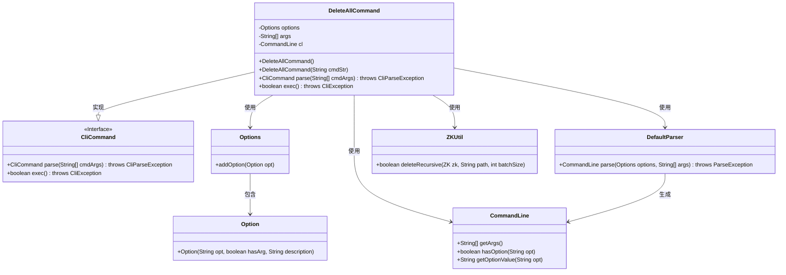
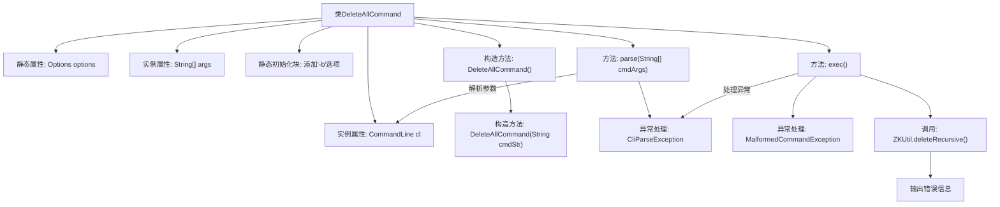

# 基础信息

|      |      |
|------|------|
| 名称 | DeleteAllCommand |
| 编码语言 | .java |
| 代码路径 | zookeeper/zookeeper-server/src/main/java/org/apache/zookeeper/cli/DeleteAllCommand.java |
| 包名 | org.apache.zookeeper.cli |
| 依赖项 | ['org.apache.commons.cli.CommandLine', 'org.apache.commons.cli.DefaultParser', 'org.apache.commons.cli.Option', 'org.apache.commons.cli.Options', 'org.apache.commons.cli.ParseException', 'org.apache.zookeeper.KeeperException', 'org.apache.zookeeper.ZKUtil'] |
| 概述说明 | DeleteAllCommand类继承CliCommand，用于递归删除ZooKeeper节点路径。支持-b参数指定批量大小，默认1000。解析参数后调用ZKUtil.deleteRecursive执行删除，处理异常并返回结果。 |

# 说明

DeleteAllCommand是一个继承自CliCommand的类，用于实现删除命令功能。它支持命令行参数解析，包括可选的批处理大小参数-b。构造函数初始化命令名称和用法说明。parse方法解析输入参数并验证参数数量，exec方法执行删除操作，处理路径和批处理大小，调用ZKUtil.deleteRecursive删除指定路径下的节点，捕获并处理可能的异常。

# 类列表 Class Summary

| 名称   | 类型  | 说明 |
|-------|------|-------------|
| DeleteAllCommand | class | DeleteAllCommand是CLI命令类，用于递归删除ZooKeeper路径。支持-b指定批量大小，默认1000。解析参数后调用ZKUtil.deleteRecursive执行删除，处理异常并返回结果。 |

## 类 DeleteAllCommand

|      |      |
|------|------|
| 访问范围 | public |
| 类型 | class |
| 名称 | DeleteAllCommand |
| 说明 | DeleteAllCommand是CLI命令类，用于递归删除ZooKeeper路径。支持-b指定批量大小，默认1000。解析参数后调用ZKUtil.deleteRecursive执行删除，处理异常并返回结果。 |

### UML类图

这段代码展示了一个继承自CliCommand接口的DeleteAllCommand类，主要用于解析和执行批量删除命令。类中包含参数解析、批量大小设置及递归删除ZooKeeper节点等功能，通过组合Options、DefaultParser等工具类实现命令行参数处理，并依赖ZKUtil执行实际删除操作。异常处理覆盖了参数格式、路径合法性及ZK操作异常等多种边缘情况。

### 内部方法调用关系图

这段代码展示了一个DeleteAllCommand类，继承自CliCommand，用于实现递归删除ZooKeeper节点的功能。流程图清晰地呈现了类结构、静态初始化、构造方法链、参数解析逻辑和核心删除操作的执行流程，包括异常处理路径和结果输出。主要功能包括解析带有批量大小参数的命令行输入，验证路径有效性，并通过ZKUtil工具执行批量删除操作，同时处理各种可能出现的异常情况。

### 字段列表 Field List

| 名称  | 类型  | 说明 |
|-------|-------|------|
| cl | CommandLine | 私有命令行对象cl。 |
| args | String[] | 私有字符串数组args。 |
| options = new Options() | Options | 定义私有静态变量options，初始化为Options类的新实例。 |

### 方法列表 Method List

| 名称  | 类型  | 说明 |
|-------|-------|------|
| parse | CliCommand | 解析命令行参数，失败抛出异常，参数不足时提示用法并返回当前对象。 |
| exec | boolean | 重写exec方法，处理批量删除ZooKeeper节点。检查-b参数是否为整数，默认1000。递归删除指定路径节点，捕获异常并转换为自定义错误。删除失败时输出提示，返回false。 |

