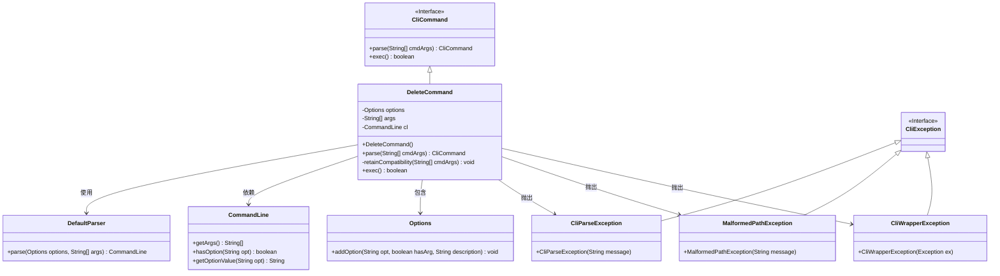
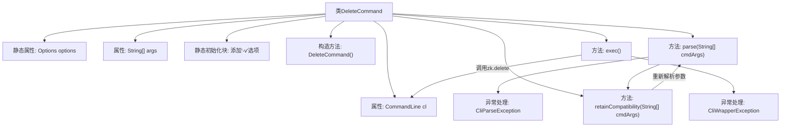
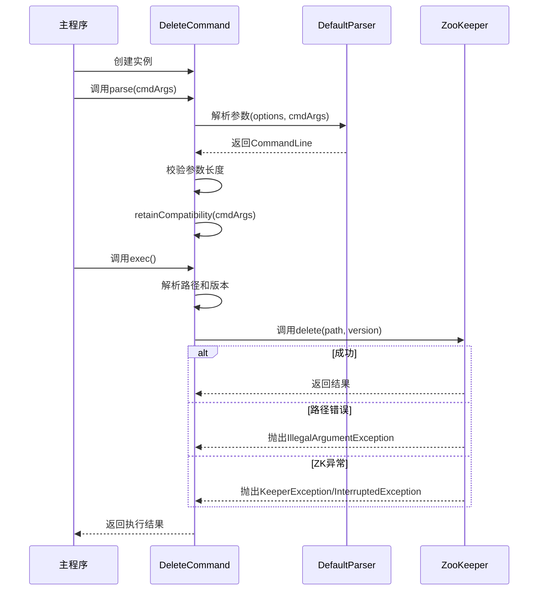

# 基础信息

|      |      |
|------|------|
| 名称 | DeleteCommand |
| 编码语言 | .java |
| 代码路径 | zookeeper/zookeeper-server/src/main/java/org/apache/zookeeper/cli/DeleteCommand.java |
| 包名 | org.apache.zookeeper.cli |
| 依赖项 | ['org.apache.commons.cli.CommandLine', 'org.apache.commons.cli.DefaultParser', 'org.apache.commons.cli.Options', 'org.apache.commons.cli.ParseException', 'org.apache.zookeeper.KeeperException'] |
| 概述说明 | DeleteCommand类实现CLI删除命令，支持-v指定版本号，兼容旧语法但提示更新，通过ZooKeeper执行删除操作，处理异常并返回结果。 |

# 说明

这是一个名为DeleteCommand的Java类，继承自CliCommand，用于实现删除操作的命令行功能。类中定义了静态选项options，包含一个版本参数-v。构造函数设置命令名称为delete，并指定参数格式。parse方法解析命令行参数，验证参数数量并处理兼容性问题。exec方法执行删除操作，支持指定版本号，处理路径异常和ZK异常，返回操作结果。类还包含保留兼容性的逻辑，提示用户使用新参数格式。

# 类列表 Class Summary

| 名称   | 类型  | 说明 |
|-------|------|-------------|
| DeleteCommand | class | DeleteCommand是处理删除操作的命令行类，支持-v指定版本号，解析参数后调用zk删除路径，兼容旧版命令格式。 |

## 类 DeleteCommand

|      |      |
|------|------|
| 访问范围 | public |
| 类型 | class |
| 名称 | DeleteCommand |
| 说明 | DeleteCommand是处理删除操作的命令行类，支持-v指定版本号，解析参数后调用zk删除路径，兼容旧版命令格式。 |

### UML类图

这段类图展示了DeleteCommand类的结构和关系。DeleteCommand继承自CliCommand接口，实现了parse()和exec()方法。它使用DefaultParser解析命令行参数，依赖CommandLine和Options类处理选项和参数。在执行过程中可能抛出CliParseException、MalformedPathException和CliWrapperException等异常。该类主要负责处理带有版本选项的删除命令，包括参数解析、兼容性保留和实际删除操作执行。

### 内部方法调用关系图

流程图描述了DeleteCommand类的完整生命周期：从静态初始化选项开始，经过构造方法创建实例，通过parse方法解析命令行参数（含兼容性处理），最后在exec方法中执行ZooKeeper删除操作。时序图则详细展示了主程序调用DeleteCommand时，参数解析、兼容性检查、删除操作执行及异常处理的完整交互过程，突出了与DefaultParser和ZooKeeper组件的协作关系。

### 字段列表 Field List

| 名称  | 类型  | 说明 |
|-------|-------|------|
| cl | CommandLine | 私有命令行对象cl。 |
| args | String[] | 声明一个私有字符串数组变量args。 |
| options = new Options() | Options | 私有静态变量options初始化为Options类的新实例。 |

### 方法列表 Method List

| 名称  | 类型  | 说明 |
|-------|-------|------|
| parse | CliCommand | 解析命令行参数，处理异常并检查参数数量，保留兼容性后返回当前对象。 |
| retainCompatibility | void | 
该方法处理命令行参数兼容性，若参数超过2个则提示使用新格式并解析参数，否则抛出异常。 |
| exec | boolean | 重写exec方法，解析路径和版本参数，调用zk.delete删除指定路径。处理非法参数和异常，返回false。 |

