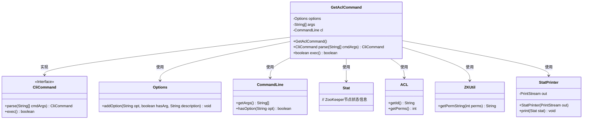
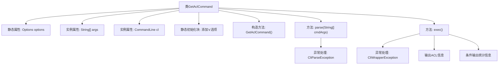

# 基础信息

|      |      |
|------|------|
| 名称 | GetAclCommand |
| 编码语言 | .java |
| 代码路径 | zookeeper/zookeeper-server/src/main/java/org/apache/zookeeper/cli/GetAclCommand.java |
| 包名 | org.apache.zookeeper.cli |
| 依赖项 | ['java.util.List', 'org.apache.commons.cli.CommandLine', 'org.apache.commons.cli.DefaultParser', 'org.apache.commons.cli.Options', 'org.apache.commons.cli.ParseException', 'org.apache.zookeeper.KeeperException', 'org.apache.zookeeper.ZKUtil', 'org.apache.zookeeper.data.ACL', 'org.apache.zookeeper.data.Stat'] |
| 概述说明 | GetAclCommand是获取ZooKeeper节点ACL权限的命令行工具，支持-s选项显示节点状态，解析路径参数后输出权限列表及可选状态信息。 |

# 说明

该代码定义了一个名为GetAclCommand的类，继承自CliCommand，用于获取ZooKeeper节点的ACL权限信息。类中包含静态选项配置，支持-s参数显示节点统计信息。构造函数设置命令名称和用法。parse方法解析输入参数并验证路径参数是否存在。exec方法执行核心逻辑：通过zk对象获取指定路径的ACL列表和节点状态信息，遍历输出ACL权限字符串，若包含-s选项则调用StatPrinter输出节点统计信息。处理了路径异常、权限异常及中断异常等错误情况。

# 类列表 Class Summary

| 名称   | 类型  | 说明 |
|-------|------|-------------|
| GetAclCommand | class | 这是一个Java类GetAclCommand，继承自CliCommand，用于获取ZooKeeper节点的ACL权限信息。支持-s选项显示节点统计信息，包含路径参数验证和异常处理。 |

## 类 GetAclCommand

|      |      |
|------|------|
| 访问范围 | public |
| 类型 | class |
| 名称 | GetAclCommand |
| 说明 | 这是一个Java类GetAclCommand，继承自CliCommand，用于获取ZooKeeper节点的ACL权限信息。支持-s选项显示节点统计信息，包含路径参数验证和异常处理。 |

### UML类图

这段代码展示了一个ZooKeeper客户端命令`GetAclCommand`的实现，用于获取节点的ACL权限信息。该类继承自`CliCommand`接口，包含解析参数和执行命令的核心逻辑。通过`Options`和`CommandLine`处理命令行参数，调用ZooKeeper API获取ACL列表和节点状态，并使用`ZKUtil`转换权限位为可读字符串。当指定-s选项时，会通过`StatPrinter`输出节点状态信息。整个设计体现了命令模式，将参数解析、命令执行和结果输出分离，具有良好的扩展性。

### 内部方法调用关系图

这段代码流程图展示了GetAclCommand类的完整结构和工作流程。该类继承自CliCommand，主要用于处理获取ZooKeeper节点ACL权限的命令行操作。核心流程包括：静态初始化选项、解析命令行参数、执行ACL获取操作以及处理可能出现的异常情况。当执行时，会先验证路径参数有效性，然后通过ZK客户端获取ACL信息并格式化输出，最后根据-s选项决定是否输出节点统计信息。整个流程体现了命令解析、权限获取和结果输出的完整链路。

### 字段列表 Field List

| 名称  | 类型  | 说明 |
|-------|-------|------|
| options = new Options() | Options | 声明一个私有静态变量options，初始化为Options类的新实例。 |
| args | String[] | 声明一个私有字符串数组变量args。 |
| cl | CommandLine | 声明一个私有命令行对象cl。 |

### 方法列表 Method List

| 名称  | 类型  | 说明 |
|-------|-------|------|
| parse | CliCommand | 解析命令行参数，使用DefaultParser处理输入，捕获异常并转换为CliParseException。检查参数数量，不足则抛出异常。返回当前对象。 |
| exec | boolean | 重写exec方法，获取ZooKeeper路径ACL并打印，处理异常。若带-s选项则打印stat信息。返回false。 |

