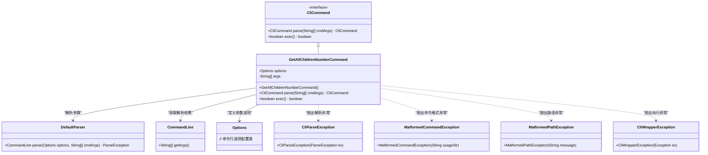
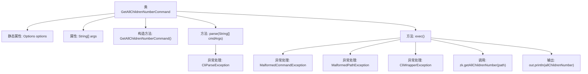

# 基础信息

|      |      |
|------|------|
| 名称 | GetAllChildrenNumberCommand |
| 编码语言 | .java |
| 代码路径 | zookeeper/zookeeper-server/src/main/java/org/apache/zookeeper/cli/GetAllChildrenNumberCommand.java |
| 包名 | org.apache.zookeeper.cli |
| 依赖项 | ['org.apache.commons.cli.CommandLine', 'org.apache.commons.cli.DefaultParser', 'org.apache.commons.cli.Options', 'org.apache.commons.cli.ParseException', 'org.apache.zookeeper.KeeperException'] |
| 概述说明 | 这是一个Java类，继承自CliCommand，用于获取ZooKeeper路径下所有子节点数量。包含解析参数和执行命令的方法，处理异常并输出结果。 |

# 说明

这是一个名为GetAllChildrenNumberCommand的Java类，继承自CliCommand，用于实现获取ZooKeeper节点子节点数量的命令行功能。类中包含构造方法、解析命令行参数的parse方法以及执行命令的exec方法。parse方法使用DefaultParser解析参数，exec方法验证参数后调用zk服务获取指定路径的子节点数量并输出结果。处理过程中可能抛出参数异常、路径格式错误或ZooKeeper相关异常。

# 类列表 Class Summary

| 名称   | 类型  | 说明 |
|-------|------|-------------|
| GetAllChildrenNumberCommand | class | 这是一个Java类，继承自CliCommand，用于获取指定路径下所有子节点的数量。通过解析命令行参数执行操作，处理异常并输出结果。 |

## 类 GetAllChildrenNumberCommand

|      |      |
|------|------|
| 访问范围 | public |
| 类型 | class |
| 名称 | GetAllChildrenNumberCommand |
| 说明 | 这是一个Java类，继承自CliCommand，用于获取指定路径下所有子节点的数量。通过解析命令行参数执行操作，处理异常并输出结果。 |

### UML类图

这段代码展示了一个继承自CliCommand接口的GetAllChildrenNumberCommand类，用于获取ZooKeeper节点下所有子节点数量。该类通过DefaultParser解析命令行参数，处理各种异常情况（如参数解析错误、非法路径、ZooKeeper操作异常等），并将结果输出。类图清晰地呈现了命令解析执行流程及异常处理机制，体现了良好的分层设计和错误处理能力。

### 内部方法调用关系图

这段代码定义了一个继承自CliCommand的GetAllChildrenNumberCommand类，主要用于解析和执行获取子节点数量的CLI命令。类中包含构造方法初始化命令名称和路径参数，parse方法解析命令行参数并处理可能的解析异常，exec方法验证参数后调用zk服务获取子节点数量并输出结果，同时处理路径非法、ZK操作异常等多种错误情况。流程图清晰展示了类结构、方法调用关系和异常处理路径。

### 字段列表 Field List

| 名称  | 类型  | 说明 |
|-------|-------|------|
| options = new Options() | Options | 定义私有静态变量options，初始化为Options类的新实例。 |
| args | String[] | 私有字符串数组args。 |

### 方法列表 Method List

| 名称  | 类型  | 说明 |
|-------|-------|------|
| parse | CliCommand | 解析命令行参数，使用DefaultParser处理输入，捕获异常并返回当前实例。 |
| exec | boolean | 重写exec方法，检查参数后获取ZooKeeper路径的子节点数并输出。处理参数错误、路径异常及ZK异常，返回false。 |

