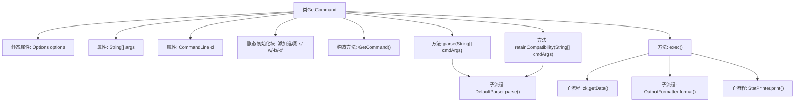
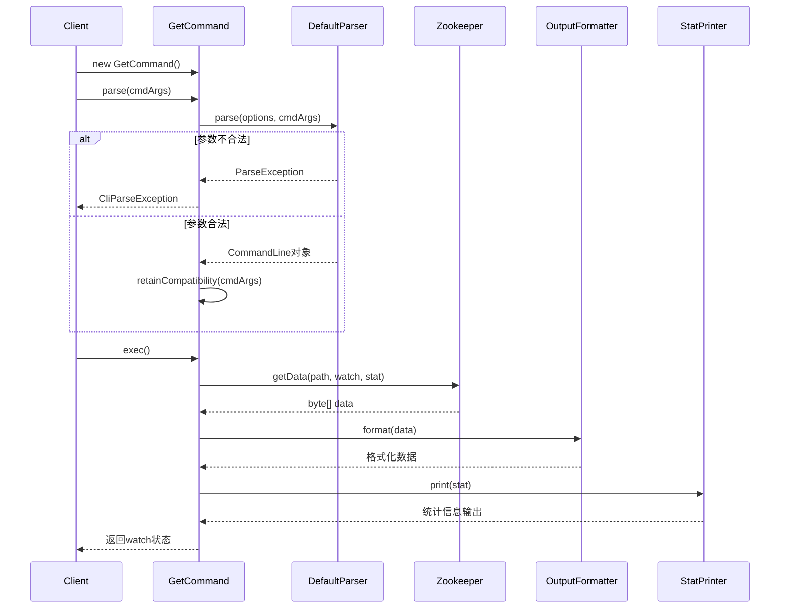

# 基础信息

|      |      |
|------|------|
| 名称 | GetCommand |
| 编码语言 | .java |
| 代码路径 | zookeeper/zookeeper-server/src/main/java/org/apache/zookeeper/cli/GetCommand.java |
| 包名 | org.apache.zookeeper.cli |
| 依赖项 | ['org.apache.commons.cli.CommandLine', 'org.apache.commons.cli.DefaultParser', 'org.apache.commons.cli.Options', 'org.apache.commons.cli.ParseException', 'org.apache.zookeeper.KeeperException', 'org.apache.zookeeper.data.Stat'] |
| 概述说明 | GetCommand类继承CliCommand，用于获取znode数据。支持选项：-s显示状态，-w监听变更，-b输出base64，-x输出hexdump。解析参数并处理兼容性问题，执行获取数据操作，按需格式化输出。 |

# 说明

这是一个名为GetCommand的Java类，继承自CliCommand，用于实现获取ZooKeeper节点数据的命令行功能。类中定义了四个选项：-s显示节点状态，-w监听节点变化，-b以Base64格式输出，-x以十六进制格式输出。构造函数初始化命令名称和选项。parse方法解析命令行参数，检查参数数量并处理兼容性问题。exec方法执行核心逻辑：获取节点数据，根据选项选择输出格式，可选打印节点状态信息。该方法会处理路径异常和ZooKeeper异常，返回是否监听了节点变化。

# 类列表 Class Summary

| 名称   | 类型  | 说明 |
|-------|------|-------------|
| GetCommand | class | GetCommand是CliCommand子类，用于获取znode数据。支持选项：-s显示状态，-w监听变更，-b输出base64，-x输出hexdump。解析参数后调用zk.getData获取数据，按选项格式化输出。兼容旧版get path [watch]语法。 |


## 类 GetCommand

|      |      |
|------|------|
| 访问范围 | public |
| 类型 | class |
| 名称 | GetCommand |
| 说明 | GetCommand是CliCommand子类，用于获取znode数据。支持选项：-s显示状态，-w监听变更，-b输出base64，-x输出hexdump。解析参数后调用zk.getData获取数据，按选项格式化输出。兼容旧版get path [watch]语法。 |


### UML类图

```mermaid
classDiagram
    class CliCommand {
        <<Abstract>>
        +CliCommand(String name, String usageStr, Options options)
        +CliCommand parse(String[] cmdArgs) CliParseException
        +boolean exec() CliException
    }
    
    class GetCommand {
        -Options options
        -String[] args
        -CommandLine cl
        +GetCommand()
        +CliCommand parse(String[] cmdArgs) CliParseException
        -void retainCompatibility(String[] cmdArgs) CliParseException
        +boolean exec() CliException
    }
    
    class Options {
        +addOption(String opt, boolean hasArg, String description)
    }
    
    class CommandLine {
        +getArgs() String[]
        +hasOption(String opt) boolean
    }
    
    class StatPrinter {
        +print(Stat stat)
    }
    
    interface OutputFormatter {
        <<Interface>>
        +format(byte[] data) String
    }
    
    class PlainOutputFormatter {
        +INSTANCE
        +format(byte[] data) String
    }
    
    class Base64OutputFormatter {
        +INSTANCE
        +format(byte[] data) String
    }
    
    class HexDumpOutputFormatter {
        +INSTANCE
        +format(byte[] data) String
    }
    
    CliCommand <|-- GetCommand
    GetCommand --> Options : 使用
    GetCommand --> CommandLine : 解析参数
    GetCommand --> StatPrinter : 输出统计信息
    OutputFormatter <|.. PlainOutputFormatter
    OutputFormatter <|.. Base64OutputFormatter
    OutputFormatter <|.. HexDumpOutputFormatter
    GetCommand --> OutputFormatter : 格式化输出
```

这段类图描述了GetCommand类的继承关系和依赖关系。GetCommand继承自抽象类CliCommand，实现了命令解析和执行功能。它依赖于Options和CommandLine类来处理命令行参数，使用StatPrinter输出统计信息，并通过OutputFormatter接口及其实现类（PlainOutputFormatter、Base64OutputFormatter、HexDumpOutputFormatter）来格式化输出数据。该设计展示了命令模式的应用，通过抽象基类和具体实现分离命令的解析和执行逻辑。


### 内部方法调用关系图





流程图描述：该流程图展示了GetCommand类的完整结构，包括静态初始化块、构造方法、核心方法parse()和exec()的内部调用关系。parse()方法通过DefaultParser解析命令行参数，exec()方法则调用Zookeeper获取数据并根据选项选择不同的输出格式化器。兼容性处理retainCompatibility()会在参数格式旧式时触发重解析流程。所有方法都通过异常处理机制保证错误可追溯。

时序图描述：该时序图详细描述了从客户端创建GetCommand实例到执行命令的完整交互过程。重点展示了参数解析阶段可能出现的异常路径，以及执行阶段与Zookeeper服务、输出格式化器和统计打印器的协作过程。整个过程严格遵循命令模式，各组件职责明确，异常处理机制完善。

### 字段列表 Field List

| 名称  | 类型  | 说明 |
|-------|-------|------|
| args | String[] | 私有字符串数组args。 |
| options = new Options() | Options | 定义私有静态变量options，初始化为Options类的新实例。 |
| cl | CommandLine | 私有命令行对象cl。 |

### 方法列表 Method List

| 名称  | 类型  | 说明 |
|-------|-------|------|
| parse | CliCommand | 重写parse方法，使用DefaultParser解析命令行参数，处理异常并检查参数数量，保留兼容性后返回当前对象。 |
| retainCompatibility | void | 该方法用于保持命令行兼容性，将旧格式"get path [watch]"转换为新格式"get [-s] [-w] path"，并提示用户弃用警告。转换后重新解析参数，处理可能的异常。 |
| exec | boolean | Java方法重写，从ZooKeeper获取节点数据，支持监视选项，处理异常，根据参数选择输出格式（纯文本、Base64或十六进制），可打印节点状态信息。 |


