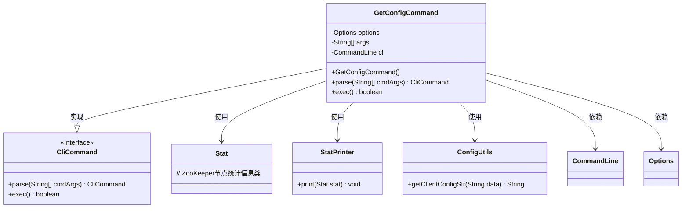
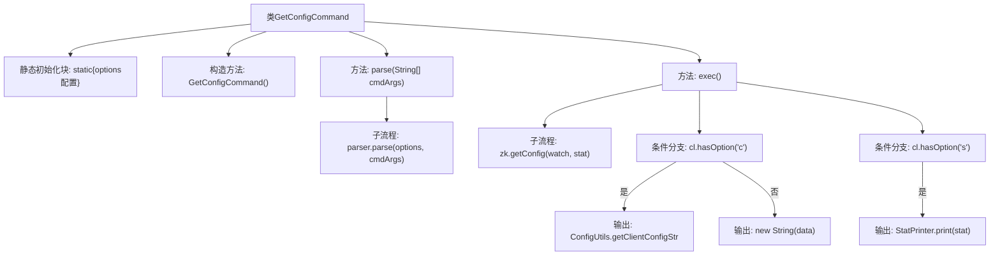
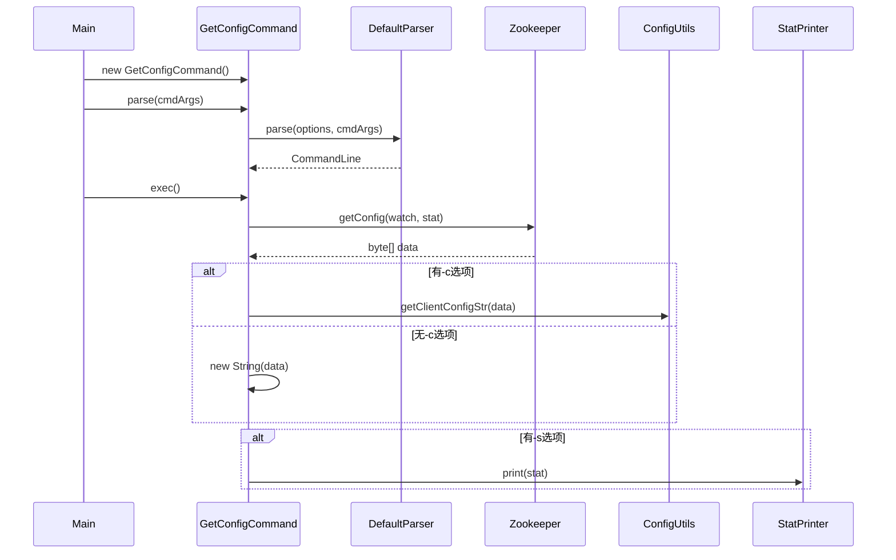

# 基础信息

|      |      |
|------|------|
| 名称 | GetConfigCommand |
| 编码语言 | .java |
| 代码路径 | zookeeper/zookeeper-server/src/main/java/org/apache/zookeeper/cli/GetConfigCommand.java |
| 包名 | org.apache.zookeeper.cli |
| 依赖项 | ['java.nio.charset.StandardCharsets.UTF_8', 'org.apache.commons.cli.CommandLine', 'org.apache.commons.cli.DefaultParser', 'org.apache.commons.cli.Options', 'org.apache.commons.cli.ParseException', 'org.apache.zookeeper.KeeperException', 'org.apache.zookeeper.data.Stat', 'org.apache.zookeeper.server.util.ConfigUtils'] |
| 概述说明 | GetConfigCommand是CLI命令类，支持选项s（统计）、w（监控）、c（客户端连接字符串）。解析参数后从zk获取配置数据，根据选项输出配置或统计信息。监控模式下返回true。 |

# 说明

这是一个名为GetConfigCommand的Java类，继承自CliCommand，用于处理获取配置的命令行操作。类中定义了三个选项：-s显示统计信息，-w启用监听模式，-c指定客户端连接字符串。构造函数设置命令名称为config并定义使用语法。parse方法解析命令行参数，验证参数数量，处理解析异常。exec方法执行核心逻辑：根据选项获取配置数据，处理异常情况，输出配置信息或客户端配置字符串，若启用-s选项则打印统计信息。返回值表示是否启用了监听模式。整个类封装了与ZooKeeper配置获取相关的命令行操作流程。

# 类列表 Class Summary

| 名称   | 类型  | 说明 |
|-------|------|-------------|
| GetConfigCommand | class | GetConfigCommand是CliCommand子类，用于获取配置。支持选项：-s显示统计，-w监听变更，-c输出客户端连接字符串。解析参数后从zk获取配置数据，按选项输出结果或统计信息。 |

## 类 GetConfigCommand

|      |      |
|------|------|
| 访问范围 | public |
| 类型 | class |
| 名称 | GetConfigCommand |
| 说明 | GetConfigCommand是CliCommand子类，用于获取配置。支持选项：-s显示统计，-w监听变更，-c输出客户端连接字符串。解析参数后从zk获取配置数据，按选项输出结果或统计信息。 |

### UML类图

这段代码展示了一个`GetConfigCommand`类，它继承自`CliCommand`接口，用于处理获取配置的命令行操作。该类通过静态初始化块定义命令行选项（-s、-w、-c），并实现了`parse`和`exec`方法。`parse`方法解析命令行参数，`exec`方法执行获取配置的核心逻辑，包括从ZooKeeper获取配置数据、处理客户端连接字符串选项以及打印统计信息。类图中清晰地展示了类之间的继承、实现和依赖关系，包括与`Stat`、`StatPrinter`、`ConfigUtils`等辅助类的交互。

### 内部方法调用关系图

流程图描述了GetConfigCommand类的完整执行逻辑，从静态初始化选项配置开始，经过命令解析和参数验证，到执行阶段分为三个功能分支：获取配置数据(-c)、监控模式(-w)和统计输出(-s)。时序图则展示了对象间的交互过程，重点呈现了参数解析、Zookeeper配置获取以及不同选项下的输出处理流程。该设计实现了灵活的配置获取功能，支持多种输出格式和监控模式。

### 字段列表 Field List

| 名称  | 类型  | 说明 |
|-------|-------|------|
| options = new Options() | Options | 私有静态选项对象初始化。 |
| cl | CommandLine | 私有命令行对象cl。 |
| args | String[] | 私有字符串数组args。 |

### 方法列表 Method List

| 名称  | 类型  | 说明 |
|-------|-------|------|
| exec | boolean | 重写exec方法，从zk获取配置数据，处理异常后输出数据或客户端配置字符串，可选打印状态信息，返回watch标志。 |
| parse | CliCommand | 解析命令行参数，失败抛出异常，参数不足时返回用法提示。 |

