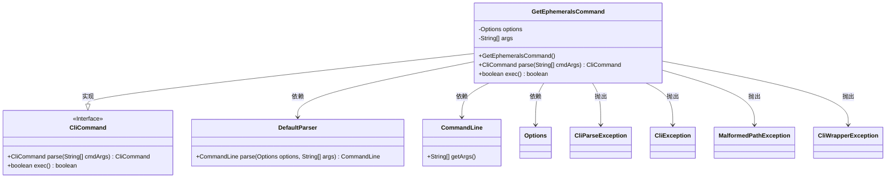
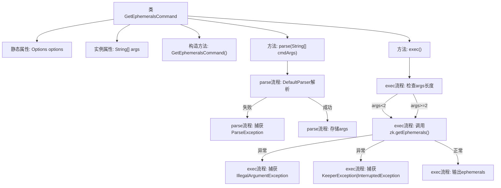

# 基础信息

|      |      |
|------|------|
| 名称 | GetEphemeralsCommand |
| 编码语言 | .java |
| 代码路径 | zookeeper/zookeeper-server/src/main/java/org/apache/zookeeper/cli/GetEphemeralsCommand.java |
| 包名 | org.apache.zookeeper.cli |
| 依赖项 | ['java.util.List', 'org.apache.commons.cli.CommandLine', 'org.apache.commons.cli.DefaultParser', 'org.apache.commons.cli.Options', 'org.apache.commons.cli.ParseException', 'org.apache.zookeeper.KeeperException'] |
| 概述说明 | GetEphemeralsCommand是CliCommand子类，用于获取ZooKeeper临时节点。解析参数后，若无路径参数则获取所有临时节点，否则获取指定路径下的临时节点。执行结果输出到控制台。 |

# 说明

这是一个名为GetEphemeralsCommand的Java类，继承自CliCommand，用于获取ZooKeeper中的临时节点。类包含构造方法和两个主要方法：parse用于解析命令行参数，exec执行获取临时节点的逻辑。exec方法根据参数数量决定获取所有临时节点或指定路径下的临时节点，处理可能出现的异常，并将结果输出。整个类封装了与ZooKeeper交互的临时节点查询功能。

# 类列表 Class Summary

| 名称   | 类型  | 说明 |
|-------|------|-------------|
| GetEphemeralsCommand | class | GetEphemeralsCommand是CliCommand子类，用于获取ZooKeeper临时节点。无参数时获取会话所有临时节点，有路径参数时获取指定路径下临时节点。解析参数后执行并输出结果。 |

## 类 GetEphemeralsCommand

|      |      |
|------|------|
| 访问范围 | public |
| 类型 | class |
| 名称 | GetEphemeralsCommand |
| 说明 | GetEphemeralsCommand是CliCommand子类，用于获取ZooKeeper临时节点。无参数时获取会话所有临时节点，有路径参数时获取指定路径下临时节点。解析参数后执行并输出结果。 |

### UML类图

这段代码展示了一个名为`GetEphemeralsCommand`的类，它继承自`CliCommand`接口，用于处理获取ZooKeeper临时节点的命令行操作。该类通过`DefaultParser`解析命令行参数，并根据参数数量决定获取所有临时节点或指定路径下的临时节点。执行过程中可能抛出多种异常，如`CliParseException`、`MalformedPathException`等。类图清晰地展示了继承关系、依赖关系和异常处理机制。

### 内部方法调用关系图

流程图描述了GetEphemeralsCommand类的完整执行逻辑。首先通过构造方法初始化命令，parse方法使用DefaultParser解析输入参数并存储到args数组。exec方法根据参数长度决定调用zk.getEphemerals()的不同形式，处理可能出现的路径异常或ZK服务异常，最后输出临时节点列表。整个过程体现了参数解析、条件分支和异常处理的完整控制流。

### 字段列表 Field List

| 名称  | 类型  | 说明 |
|-------|-------|------|
| options = new Options() | Options | 定义私有静态变量options，初始化为Options类的新实例。 |
| args | String[] | 私有字符串数组args。 |

### 方法列表 Method List

| 名称  | 类型  | 说明 |
|-------|-------|------|
| exec | boolean | 该方法重写exec()，根据参数获取ZooKeeper临时节点：无参时获取全部，有路径参数时获取指定路径下的节点。异常时抛出对应错误，最后输出节点列表并返回false。 |
| parse | CliCommand | 解析命令行参数，使用DefaultParser处理输入，捕获异常并返回自身实例。 |

