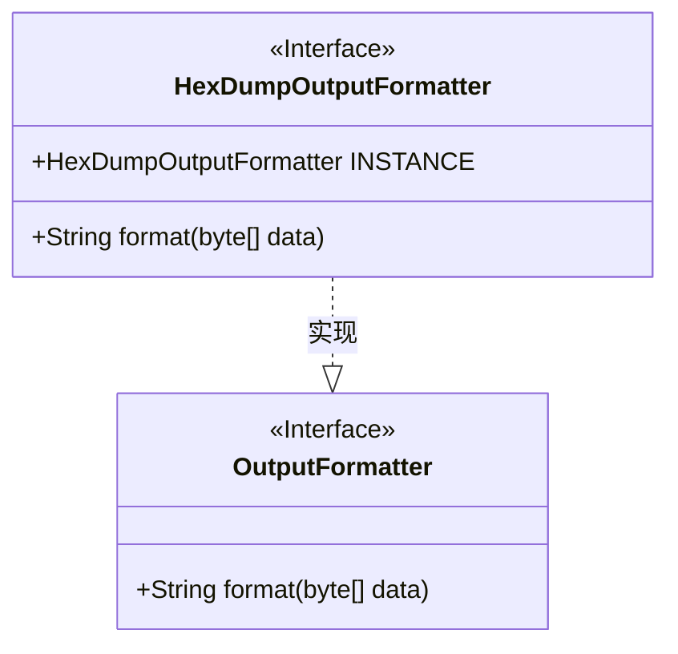
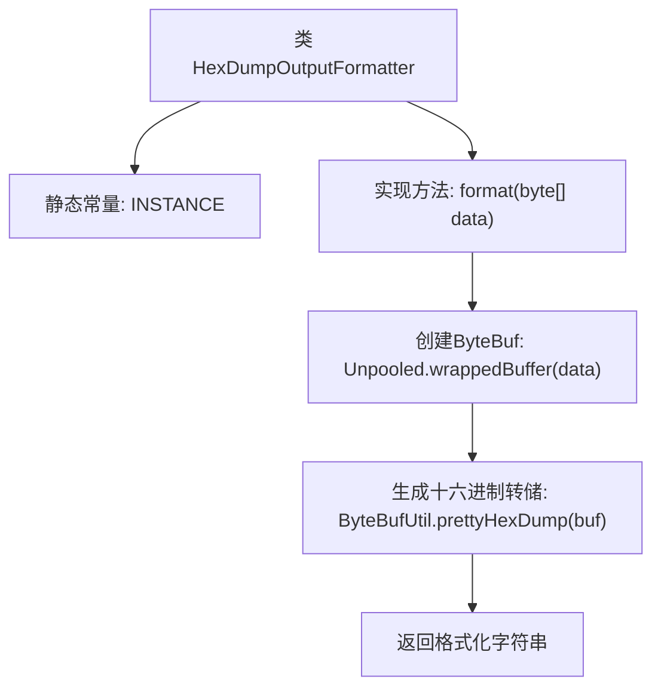

# 基础信息

|      |      |
|------|------|
| 名称 | HexDumpOutputFormatter |
| 编码语言 | .java |
| 代码路径 | zookeeper/zookeeper-server/src/main/java/org/apache/zookeeper/cli/HexDumpOutputFormatter.java |
| 包名 | org.apache.zookeeper.cli |
| 依赖项 | ['io.netty.buffer.ByteBuf', 'io.netty.buffer.ByteBufUtil', 'io.netty.buffer.Unpooled'] |
| 概述说明 | HexDumpOutputFormatter类实现OutputFormatter接口，提供字节数组的十六进制格式化输出，使用ByteBufUtil工具类转换数据。 |

# 说明

该内容描述了一个名为HexDumpOutputFormatter的Java类，实现了OutputFormatter接口。该类包含一个静态常量INSTANCE作为单例实例，并提供了format方法用于格式化字节数组数据。该方法使用ByteBuf工具将字节数组转换为十六进制转储格式的字符串输出。整个类功能专注于数据十六进制格式化展示。

# 类列表 Class Summary

| 名称   | 类型  | 说明 |
|-------|------|-------------|
| HexDumpOutputFormatter | class | HexDumpOutputFormatter类实现OutputFormatter接口，提供字节数组的十六进制格式化输出，使用ByteBufUtil工具生成易读的十六进制转储。 |

## 类 HexDumpOutputFormatter

|      |      |
|------|------|
| 访问范围 | public |
| 类型 | class |
| 名称 | HexDumpOutputFormatter |
| 说明 | HexDumpOutputFormatter类实现OutputFormatter接口，提供字节数组的十六进制格式化输出，使用ByteBufUtil工具生成易读的十六进制转储。 |

### UML类图

这段代码展示了一个实现OutputFormatter接口的HexDumpOutputFormatter类，用于将字节数组格式化为十六进制转储字符串。该类采用单例模式（通过INSTANCE字段提供全局访问点），核心功能是通过ByteBufUtil工具类实现数据的十六进制可视化。类图清晰地反映了接口与实现类的关系，以及格式化方法的输入输出类型，体现了数据转换的职责。

### 内部方法调用关系图

该流程图展示了HexDumpOutputFormatter类的核心结构和工作流程。该类通过静态常量INSTANCE提供单例访问，主要功能是通过format方法将字节数组转换为十六进制转储字符串。流程从接收字节数组开始，使用Netty的Unpooled工具类创建ByteBuf缓冲区，然后通过ByteBufUtil生成格式化的十六进制转储输出，最终返回可读的十六进制字符串表示。整个过程体现了数据从原始字节到可视化十六进制格式的转换过程。

### 字段列表 Field List

| 名称  | 类型  | 说明 |
|-------|-------|------|
| INSTANCE = new HexDumpOutputFormatter() | HexDumpOutputFormatter | 这是一个静态常量实例声明，类型为HexDumpOutputFormatter，使用final修饰确保不可变。 |

### 方法列表 Method List

| 名称  | 类型  | 说明 |
|-------|-------|------|
| format | String | 重写format方法，将字节数组包装为ByteBuf后返回格式化十六进制输出。 |

