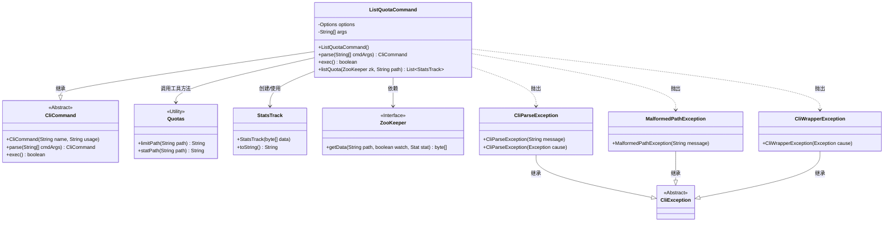
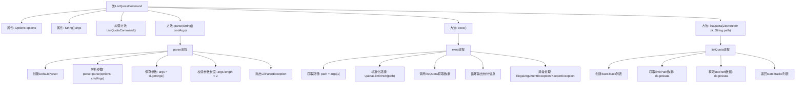

# 基础信息

|      |      |
|------|------|
| 名称 | ListQuotaCommand |
| 编码语言 | .java |
| 代码路径 | zookeeper/zookeeper-server/src/main/java/org/apache/zookeeper/cli/ListQuotaCommand.java |
| 包名 | org.apache.zookeeper.cli |
| 依赖项 | ['java.util.ArrayList', 'java.util.List', 'org.apache.commons.cli.CommandLine', 'org.apache.commons.cli.DefaultParser', 'org.apache.commons.cli.Options', 'org.apache.commons.cli.ParseException', 'org.apache.zookeeper.KeeperException', 'org.apache.zookeeper.Quotas', 'org.apache.zookeeper.StatsTrack', 'org.apache.zookeeper.ZooKeeper', 'org.apache.zookeeper.data.Stat'] |
| 概述说明 | ListQuotaCommand是用于查询ZooKeeper配额信息的命令行工具，解析路径参数后获取配额数据和统计信息并输出。处理异常包括路径错误、节点不存在及ZK异常。 |

# 说明

ListQuotaCommand是一个继承自CliCommand的类，用于处理列出配额的命令行操作。它包含解析命令行参数的parse方法，以及执行配额查询的exec方法。parse方法使用DefaultParser解析参数，验证参数数量是否足够。exec方法通过listQuota方法从ZooKeeper获取指定路径的配额和统计信息，并输出结果。listQuota方法从ZooKeeper节点读取数据并转换为StatsTrack对象。异常处理包括路径格式错误、节点不存在以及其他ZooKeeper异常。

# 类列表 Class Summary

| 名称   | 类型  | 说明 |
|-------|------|-------------|
| ListQuotaCommand | class | ListQuotaCommand是用于查询ZooKeeper配额信息的命令行工具，解析路径参数后获取配额数据和统计信息，处理异常并输出结果。 |

## 类 ListQuotaCommand

|      |      |
|------|------|
| 访问范围 | public |
| 类型 | class |
| 名称 | ListQuotaCommand |
| 说明 | ListQuotaCommand是用于查询ZooKeeper配额信息的命令行工具，解析路径参数后获取配额数据和统计信息，处理异常并输出结果。 |

### UML类图

这段代码描述了一个ZooKeeper配额管理系统的命令行工具实现。ListQuotaCommand继承自抽象类CliCommand，主要功能是解析用户输入参数并执行配额查询操作。它通过ZooKeeper接口获取配额数据，使用StatsTrack类处理统计信息，并依赖Quotas工具类处理路径转换。在执行过程中可能抛出多种异常，包括参数解析异常(CliParseException)、路径格式异常(MalformedPathException)和ZooKeeper操作异常(CliWrapperException)。整个设计体现了命令模式的思想，将命令解析与执行逻辑封装在同一个类中。

### 内部方法调用关系图

该流程图展示了ListQuotaCommand类的完整执行逻辑，包含三个核心方法：parse用于解析命令行参数并校验格式，exec负责执行配额查询并处理结果输出，listQuota则是实际与ZooKeeper交互获取配额数据的方法。流程中特别标注了异常处理路径，包括参数校验失败、路径格式错误和ZK连接异常等情况，体现了完整的错误处理机制。各方法间通过args数组和返回值进行数据传递，形成清晰的调用链。

### 字段列表 Field List

| 名称  | 类型  | 说明 |
|-------|-------|------|
| args | String[] | 声明一个私有字符串数组变量args。 |
| options = new Options() | Options | 定义私有静态变量options，初始化为Options类的新实例。 |

### 方法列表 Method List

| 名称  | 类型  | 说明 |
|-------|-------|------|
| exec | boolean | 重写exec方法，处理路径配额查询。输出绝对路径和配额信息，捕获异常并处理，包括路径错误、节点不存在及ZK异常。返回false。 |
| listQuota | List<StatsTrack> | 该方法通过ZooKeeper获取指定路径的配额数据和统计信息，封装为StatsTrack对象并返回列表。参数为ZooKeeper实例和路径字符串，可能抛出KeeperException和InterruptedException异常。 |
| parse | CliCommand | 解析命令行参数，处理异常，检查参数数量，返回当前对象。 |

