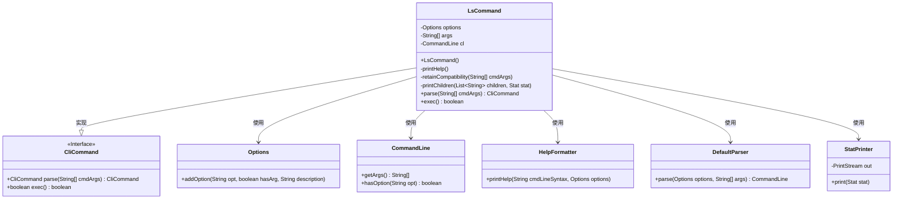
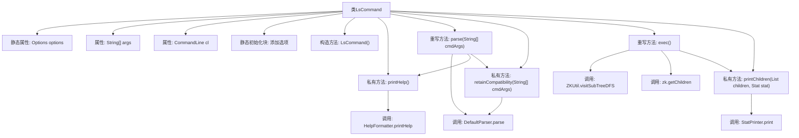

# 基础信息

|      |      |
|------|------|
| 名称 | LsCommand |
| 编码语言 | .java |
| 代码路径 | zookeeper/zookeeper-server/src/main/java/org/apache/zookeeper/cli/LsCommand.java |
| 包名 | org.apache.zookeeper.cli |
| 依赖项 | ['java.util.Collections', 'java.util.List', 'org.apache.commons.cli.CommandLine', 'org.apache.commons.cli.DefaultParser', 'org.apache.commons.cli.HelpFormatter', 'org.apache.commons.cli.Options', 'org.apache.commons.cli.ParseException', 'org.apache.zookeeper.KeeperException', 'org.apache.zookeeper.ZKUtil', 'org.apache.zookeeper.data.Stat'] |
| 概述说明 | LsCommand类实现ls命令，支持选项-s（统计）、-w（监视）、-R（递归），解析参数并执行对应操作，包括列出子节点、递归遍历等，兼容旧版命令格式。 |

# 说明

LsCommand是一个继承自CliCommand的类，用于实现ls命令行功能。它支持选项包括帮助（?）、状态显示（s）、监听（w）和递归（R）。构造函数初始化命令名和用法格式。parse方法解析命令行参数，处理兼容性问题并打印帮助信息。exec方法执行命令，根据参数调用不同功能：递归遍历子目录、获取子节点列表或显示状态信息。printChildren方法格式化输出子节点列表和状态信息。异常处理包括路径格式错误和ZK操作异常。

# 类列表 Class Summary

| 名称   | 类型  | 说明 |
|-------|------|-------------|
| LsCommand | class | LsCommand类实现ls命令，支持选项-s（状态）、-w（监视）、-R（递归），解析参数并执行对应操作，包括列出子节点或递归遍历路径。 |

## 类 LsCommand

|      |      |
|------|------|
| 访问范围 | public |
| 类型 | class |
| 名称 | LsCommand |
| 说明 | LsCommand类实现ls命令，支持选项-s（状态）、-w（监视）、-R（递归），解析参数并执行对应操作，包括列出子节点或递归遍历路径。 |

### UML类图

该代码实现了一个`ls`命令行工具，继承自`CliCommand`接口，用于列出ZooKeeper节点内容。主要功能包括解析参数（-s统计信息、-w监听、-R递归）、兼容旧版命令格式、遍历子节点并输出。类图中展示了核心类关系：`LsCommand`通过`Options`和`DefaultParser`解析参数，使用`HelpFormatter`显示帮助，依赖`CommandLine`存储解析结果，并通过`StatPrinter`输出节点状态。执行时可能抛出多种异常，包括路径格式错误和ZooKeeper操作异常。

### 内部方法调用关系图

流程图描述：该流程图展示了LsCommand类的完整结构，从静态初始化选项开始，到构造方法和关键方法调用链。核心流程包括解析命令行参数(parse)、执行命令(exec)和打印结果(printChildren)，其中涉及参数兼容性处理(retainCompatibility)和多种ZooKeeper操作。异常处理路径通过不同异常类型区分，同时保留了旧版命令格式的兼容性支持。

### 字段列表 Field List

| 名称  | 类型  | 说明 |
|-------|-------|------|
| args | String[] | 私有字符串数组args。 |
| options = new Options() | Options | 私有静态选项对象初始化。 |
| cl | CommandLine | 私有命令行对象cl。 |

### 方法列表 Method List

| 名称  | 类型  | 说明 |
|-------|-------|------|
| printHelp | void | 私有方法printHelp使用HelpFormatter打印帮助信息，格式为"ls [options] path"和选项参数。 |
| parse | CliCommand | 解析命令行参数，处理异常，检查帮助选项并保留兼容性，返回当前对象。 |
| retainCompatibility | void | 方法`retainCompatibility`处理旧版命令兼容性，将`ls path [watch]`格式转为`ls [-w] path`，解析后更新参数，若失败抛出异常。 |
| exec | boolean | 重写exec方法，检查参数后根据递归选项遍历ZK子树或获取子节点，处理异常并返回watch状态。 |
| printChildren | void | 排序子节点列表并输出为逗号分隔的字符串，附带可选统计信息打印。 |

