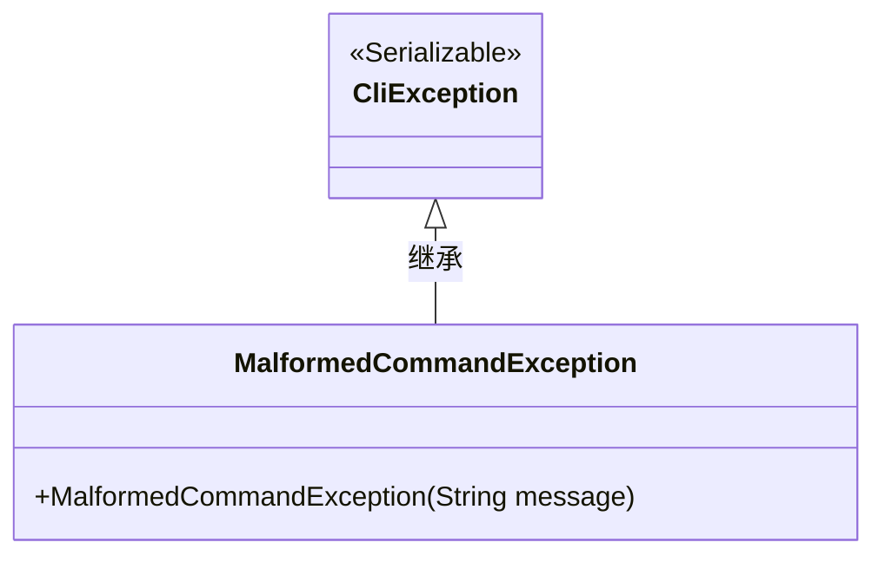
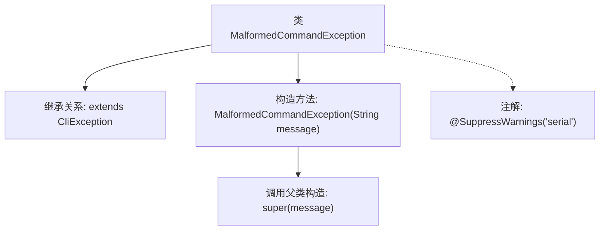

# 基础信息

|      |      |
|------|------|
| 名称 | MalformedCommandException |
| 编码语言 | .java |
| 代码路径 | zookeeper/zookeeper-server/src/main/java/org/apache/zookeeper/cli/MalformedCommandException.java |
| 包名 | org.apache.zookeeper.cli |
| 依赖项 | [] |
| 概述说明 | 定义MalformedCommandException类，继承CliException，通过构造函数传递错误信息。 |

# 说明

该内容定义了一个名为MalformedCommandException的Java异常类，继承自CliException。该类标记了@SuppressWarnings("serial")注解，表示抑制序列化相关警告。它包含一个构造函数，接收字符串参数message并传递给父类构造函数。这是一个典型的自定义异常实现，用于处理命令行接口中的格式错误情况。

# 类列表 Class Summary

| 名称   | 类型  | 说明 |
|-------|------|-------------|
| MalformedCommandException | class | 定义MalformedCommandException类，继承CliException，通过构造函数传递错误信息。 |

## 类 MalformedCommandException

|      |      |
|------|------|
| 访问范围 | @SuppressWarnings("serial");public |
| 类型 | class |
| 名称 | MalformedCommandException |
| 说明 | 定义MalformedCommandException类，继承CliException，通过构造函数传递错误信息。 |

### UML类图

这段类图展示了异常处理的继承关系。MalformedCommandException继承自CliException基类，表明这是一个特定类型的命令行异常。CliException实现了Serializable接口，使其支持序列化操作。MalformedCommandException通过构造函数接收错误信息，用于处理命令格式错误的情况，这种设计符合Java异常处理的最佳实践。

### 内部方法调用关系图

该流程图展示了MalformedCommandException类的结构，它是一个继承自CliException的异常类，带有@SuppressWarnings注解抑制序列化警告。主要包含一个构造方法，该方法接收字符串参数并通过super调用父类构造器。图中清晰呈现了类继承关系、构造方法实现和注解修饰关系，层级结构简洁明确。

### 字段列表 Field List

| 名称  | 类型  | 说明 |
|-------|-------|------|

### 方法列表 Method List

| 名称  | 类型  | 说明 |
|-------|-------|------|

