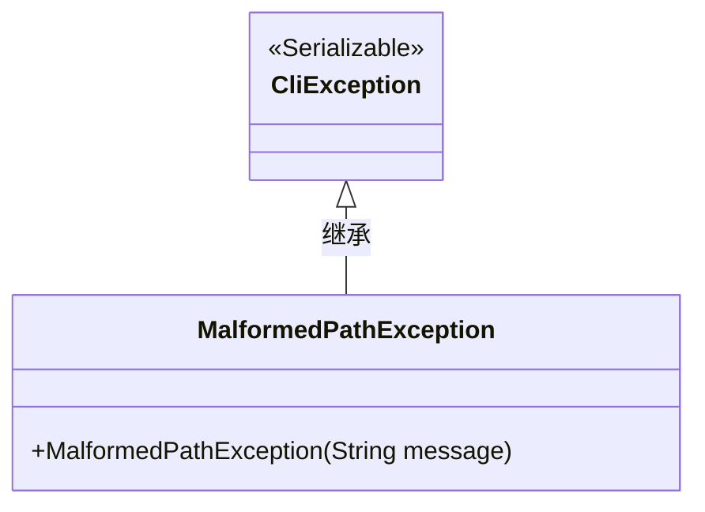
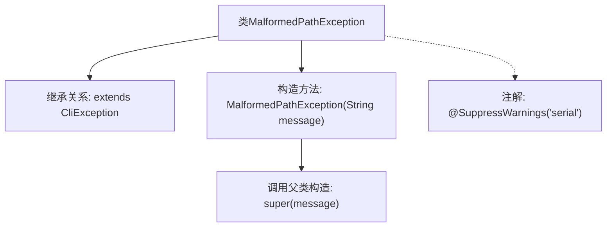

# 基础信息

|      |      |
|------|------|
| 名称 | MalformedPathException |
| 编码语言 | .java |
| 代码路径 | zookeeper/zookeeper-server/src/main/java/org/apache/zookeeper/cli/MalformedPathException.java |
| 包名 | org.apache.zookeeper.cli |
| 依赖项 | [] |
| 概述说明 | 定义MalformedPathException类，继承CliException，通过构造函数传递错误信息。 |

# 说明

这是一个名为MalformedPathException的自定义异常类，继承自CliException。它用于表示路径格式错误的异常情况。该类包含一个构造函数，接受字符串类型的message参数，并将该参数传递给父类构造函数。该异常被标记为可序列化，并通过@SuppressWarnings注解抑制了关于serialVersionUID的警告。这个异常设计简洁，专注于处理路径格式问题。

# 类列表 Class Summary

| 名称   | 类型  | 说明 |
|-------|------|-------------|
| MalformedPathException | class | 定义MalformedPathException类，继承CliException，用于处理路径格式错误，提供带消息的构造函数。 |

## 类 MalformedPathException

|      |      |
|------|------|
| 访问范围 | @SuppressWarnings("serial");public |
| 类型 | class |
| 名称 | MalformedPathException |
| 说明 | 定义MalformedPathException类，继承CliException，用于处理路径格式错误，提供带消息的构造函数。 |

### UML类图

这段类图展示了MalformedPathException继承自CliException的关系。CliException实现了Serializable接口，表明这是一个可序列化的异常基类。MalformedPathException作为其子类，通过构造函数接收错误消息并传递给父类。该设计用于处理命令行接口中的路径格式错误场景，符合Java异常处理的最佳实践，通过继承实现了异常类型的层次化分类。

### 内部方法调用关系图

这段代码定义了一个继承自CliException的自定义异常类MalformedPathException，主要用于处理路径格式错误的场景。类结构包含一个带message参数的构造函数，通过super调用父类构造函数传递错误信息，并使用@SuppressWarnings注解抑制序列化警告。该异常类作为Checked Exception，适用于需要显式处理的路径校验场景。

### 字段列表 Field List

| 名称  | 类型  | 说明 |
|-------|-------|------|

### 方法列表 Method List

| 名称  | 类型  | 说明 |
|-------|-------|------|

