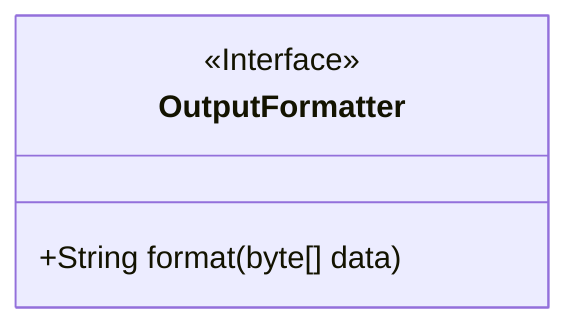
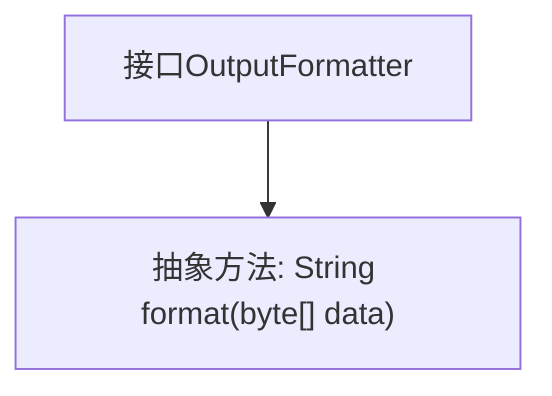

# 基础信息

|      |      |
|------|------|
| 名称 | OutputFormatter |
| 编码语言 | .java |
| 代码路径 | zookeeper/zookeeper-server/src/main/java/org/apache/zookeeper/cli/OutputFormatter.java |
| 包名 | org.apache.zookeeper.cli |
| 依赖项 | [] |
| 概述说明 | 接口OutputFormatter定义格式化方法，输入字节数组返回字符串。 |

# 说明

该内容定义了一个名为OutputFormatter的公共接口，包含一个名为format的方法。该方法接收一个byte数组作为输入参数，并返回一个String类型的结果。接口的主要功能是将字节数组数据格式化为字符串形式。该设计适用于需要将二进制数据转换为可读字符串的场景，具体实现由实现该接口的类完成。

# 类列表 Class Summary

| 名称   | 类型  | 说明 |
|-------|------|-------------|
| OutputFormatter | interface | 接口OutputFormatter定义格式化方法，输入字节数组返回字符串。 |

## 类 OutputFormatter

|      |      |
|------|------|
| 访问范围 | public |
| 类型 | interface |
| 名称 | OutputFormatter |
| 说明 | 接口OutputFormatter定义格式化方法，输入字节数组返回字符串。 |

### UML类图

这段代码定义了一个名为`OutputFormatter`的接口，其中包含一个抽象方法`format`，该方法接收一个`byte[]`类型参数并返回`String`类型结果。接口用于规范数据格式化行为，任何实现该接口的类都必须提供`format`方法的具体实现。该设计允许不同格式化逻辑的灵活替换，符合开闭原则，适用于需要多种输出格式的场景（如JSON、XML等）。接口作为抽象层，解耦了数据生成与格式化的依赖关系。

### 内部方法调用关系图

这段代码定义了一个名为OutputFormatter的接口，其中包含一个抽象方法format，该方法接收一个byte数组作为参数并返回一个String类型的结果。流程图清晰地展示了接口与其唯一方法之间的层级关系，表明任何实现该接口的类都必须提供format方法的具体实现。这种设计常用于数据格式化处理的解耦场景，允许不同的格式化策略通过实现该接口来灵活替换。

### 字段列表 Field List

| 名称  | 类型  | 说明 |
|-------|-------|------|

### 方法列表 Method List

| 名称  | 类型  | 说明 |
|-------|-------|------|
| format | String | 将字节数组转换为字符串。 |

