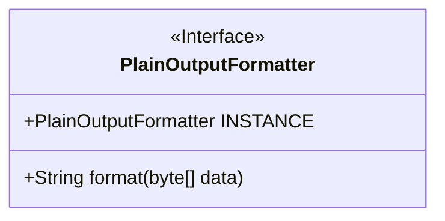
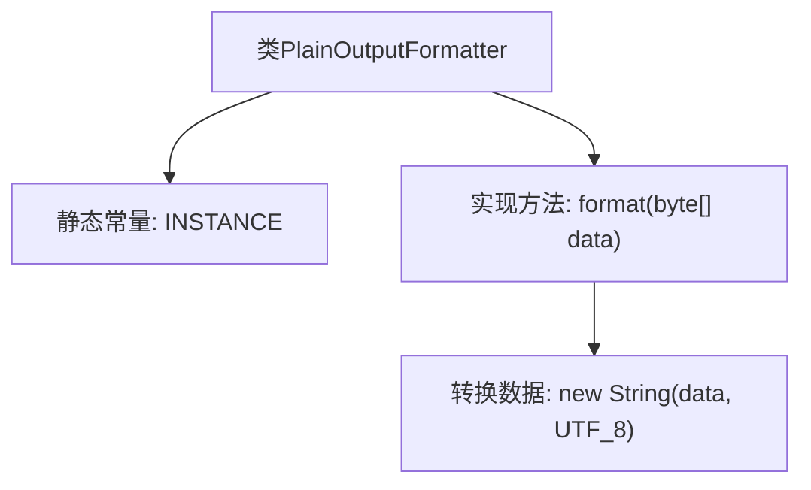

# 基础信息

|      |      |
|------|------|
| 名称 | PlainOutputFormatter |
| 编码语言 | .java |
| 代码路径 | zookeeper/zookeeper-server/src/main/java/org/apache/zookeeper/cli/PlainOutputFormatter.java |
| 包名 | org.apache.zookeeper.cli |
| 依赖项 | ['java.nio.charset.StandardCharsets.UTF_8'] |
| 概述说明 | PlainOutputFormatter类实现OutputFormatter接口，提供字节数组到UTF-8字符串的简单格式化功能，并通过单例模式提供全局实例。 |

# 说明

这是一个名为PlainOutputFormatter的公开类，实现了OutputFormatter接口。该类包含一个静态常量INSTANCE，用于持有该类的单例实例。它重写了format方法，接收字节数组数据作为输入，使用UTF-8字符集将其转换为字符串并返回。这个类的主要功能是将字节数据以纯文本形式格式化输出。

# 类列表 Class Summary

| 名称   | 类型  | 说明 |
|-------|------|-------------|
| PlainOutputFormatter | class | PlainOutputFormatter类实现OutputFormatter接口，提供字节数组转UTF-8字符串的格式化方法，含单例实例INSTANCE。 |

## 类 PlainOutputFormatter

|      |      |
|------|------|
| 访问范围 | public |
| 类型 | class |
| 名称 | PlainOutputFormatter |
| 说明 | PlainOutputFormatter类实现OutputFormatter接口，提供字节数组转UTF-8字符串的格式化方法，含单例实例INSTANCE。 |

### UML类图

这段代码展示了一个实现了输出格式化功能的PlainOutputFormatter类，它包含一个静态常量INSTANCE和format方法。该类设计为单例模式，通过INSTANCE提供全局访问点，format方法将字节数组按UTF-8编码转换为字符串。作为基础输出格式化器，它提供了简单的字节到字符串的转换功能，适用于需要原始数据输出的场景。类图清晰地展示了其结构和关键方法，符合单一职责原则。

### 内部方法调用关系图

这段流程图描述了PlainOutputFormatter类的结构及其核心功能。该类实现了OutputFormatter接口，包含一个静态常量INSTANCE和一个format方法。format方法接收字节数组数据，使用UTF-8字符集将其转换为字符串并返回。该设计模式常用于提供线程安全的单例实例，并统一处理二进制数据的文本格式化输出，适用于日志记录或网络传输等场景。

### 字段列表 Field List

| 名称  | 类型  | 说明 |
|-------|-------|------|
| INSTANCE = new PlainOutputFormatter() | PlainOutputFormatter | 这是一个静态常量实例声明，使用final修饰确保不可变，创建了PlainOutputFormatter类的单例对象。 |

### 方法列表 Method List

| 名称  | 类型  | 说明 |
|-------|-------|------|
| format | String | 重写format方法，将字节数组按UTF-8编码转为字符串并返回。 |

