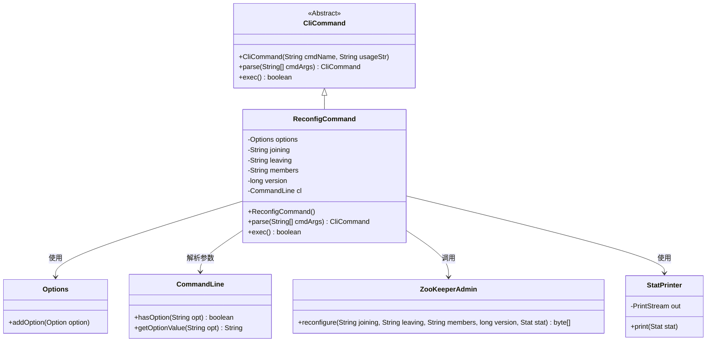
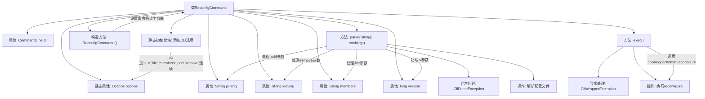

# 基础信息

|      |      |
|------|------|
| 名称 | ReconfigCommand |
| 编码语言 | .java |
| 代码路径 | zookeeper/zookeeper-server/src/main/java/org/apache/zookeeper/cli/ReconfigCommand.java |
| 包名 | org.apache.zookeeper.cli |
| 依赖项 | ['java.nio.charset.StandardCharsets.UTF_8', 'java.io.FileInputStream', 'java.util.Properties', 'org.apache.commons.cli.CommandLine', 'org.apache.commons.cli.DefaultParser', 'org.apache.commons.cli.Options', 'org.apache.commons.cli.ParseException', 'org.apache.zookeeper.KeeperException', 'org.apache.zookeeper.admin.ZooKeeperAdmin', 'org.apache.zookeeper.data.Stat', 'org.apache.zookeeper.server.quorum.QuorumPeerConfig'] |
| 概述说明 | ReconfigCommand是用于ZooKeeper集群动态重配置的CLI命令类，支持增量和非增量模式，通过选项控制添加、移除服务器或指定新成员列表，同时校验配置版本以确保一致性。 |

# 说明

ReconfigCommand是一个用于集群动态重配置的CLI命令类，支持增量和全量两种模式。增量模式通过-add/-remove参数分别指定待添加服务器的配置字符串和待移除服务器ID列表；全量模式通过-file/-members参数指定配置文件路径或直接输入新集群成员配置。命令包含版本校验机制（-v参数），确保基于指定配置版本进行变更。执行时会检查参数冲突（如禁止混用增量与全量模式），并通过ZooKeeperAdmin接口提交配置变更。结果输出新配置内容，可选显示统计信息（-s参数）。异常处理涵盖参数解析错误、文件读取错误及ZK操作异常。

# 类列表 Class Summary

| 名称   | 类型  | 说明 |
|-------|------|-------------|
| ReconfigCommand | class | ReconfigCommand是用于集群动态重配置的CLI命令，支持增量和全量模式。增量模式通过-add/-remove修改成员，全量模式通过-file/-members指定新配置。可选参数包括版本检查(-v)和统计输出(-s)。执行时调用ZooKeeperAdmin的reconfigure接口更新配置。 |

## 类 ReconfigCommand

|      |      |
|------|------|
| 访问范围 | public |
| 类型 | class |
| 名称 | ReconfigCommand |
| 说明 | ReconfigCommand是用于集群动态重配置的CLI命令，支持增量和全量模式。增量模式通过-add/-remove修改成员，全量模式通过-file/-members指定新配置。可选参数包括版本检查(-v)和统计输出(-s)。执行时调用ZooKeeperAdmin的reconfigure接口更新配置。 |

### UML类图

这段类图展示了`ReconfigCommand`类继承自抽象类`CliCommand`，并实现了命令行参数解析和执行的逻辑。它通过`Options`和`CommandLine`处理命令行参数，依赖`ZooKeeperAdmin`执行重新配置操作，并使用`StatPrinter`打印统计信息。类图清晰地反映了各个类之间的关系和职责划分，包括继承、依赖和使用关系。

### 内部方法调用关系图

这段代码实现了一个ZooKeeper集群重配置命令，通过命令行参数支持增量/非增量两种配置模式。静态初始化块定义了6个CLI选项，parse()方法负责解析参数并校验模式冲突，exec()方法通过ZooKeeperAdmin接口执行实际的重配置操作。代码包含完整的参数校验、异常处理和配置文件解析逻辑，支持通过文件或直接参数指定新集群配置，并能验证配置版本一致性。

### 字段列表 Field List

| 名称  | 类型  | 说明 |
|-------|-------|------|
| leaving | String | 私有字符串变量leaving。 |
| members | String | 私有字符串类型成员变量。 |
| version = -1 | long | 参数long version被设置为-1。 |
| cl | CommandLine | 私有命令行对象cl。 |
| options = new Options() | Options | 定义静态私有变量options，初始化为Options类的新实例。 |
| joining | String | 声明一个私有字符串变量joining。 |

### 方法列表 Method List

| 名称  | 类型  | 说明 |
|-------|-------|------|
| parse | CliCommand | 解析命令行参数，处理成员增减及文件配置，检查参数冲突，返回处理结果。 |
| exec | boolean | 方法重写exec()，检查zk是否为ZooKeeperAdmin实例，否则返回false。调用reconfigure更新配置并打印新配置。若带-s选项则打印状态信息。异常时抛出CliWrapperException。最终返回false。 |

