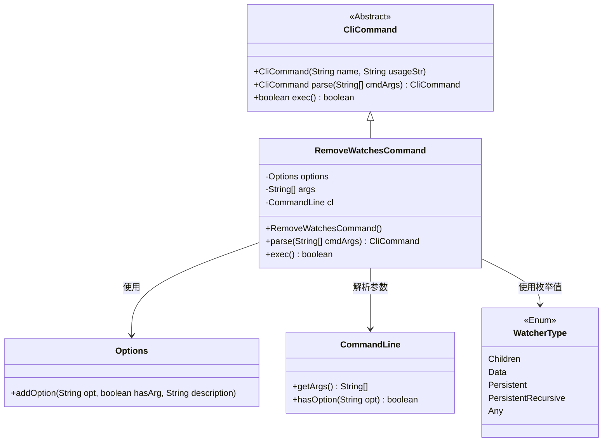
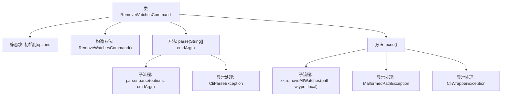

# 基础信息

|      |      |
|------|------|
| 名称 | RemoveWatchesCommand |
| 编码语言 | .java |
| 代码路径 | zookeeper/zookeeper-server/src/main/java/org/apache/zookeeper/cli/RemoveWatchesCommand.java |
| 包名 | org.apache.zookeeper.cli |
| 依赖项 | ['org.apache.commons.cli.CommandLine', 'org.apache.commons.cli.DefaultParser', 'org.apache.commons.cli.Options', 'org.apache.commons.cli.ParseException', 'org.apache.zookeeper.KeeperException', 'org.apache.zookeeper.Watcher.WatcherType'] |
| 概述说明 | RemoveWatchesCommand是用于移除ZooKeeper节点监听的命令行工具，支持多种监听类型选项（-c子节点、-d数据、-p持久等）和本地移除选项-l。 |

# 说明

RemoveWatchesCommand是一个继承自CliCommand的类，用于移除ZooKeeper节点的监视器。它支持多种监视器类型选项：-c（子节点监视器）、-d（数据监视器）、-p（持久监视器）、-r（持久递归监视器）、-a（任意类型），以及-l（无服务器连接时本地移除）。类初始化时定义了这些选项，并设置命令格式为"removewatches path [-c|-d|-a] [-l]"。parse方法解析输入参数并验证路径是否存在，exec方法根据选项确定监视器类型并调用zk.removeAllWatches执行移除操作，处理可能出现的异常。

# 类列表 Class Summary

| 名称   | 类型  | 说明 |
|-------|------|-------------|
| RemoveWatchesCommand | class | RemoveWatchesCommand是用于移除ZooKeeper节点监听的CLI命令，支持多种监听类型选项（-c子节点、-d数据、-p持久、-r递归持久、-a任意）和本地移除选项（-l）。命令格式为"removewatches path [-c|-d|-a] [-l]"。 |

## 类 RemoveWatchesCommand

|      |      |
|------|------|
| 访问范围 | public |
| 类型 | class |
| 名称 | RemoveWatchesCommand |
| 说明 | RemoveWatchesCommand是用于移除ZooKeeper节点监听的CLI命令，支持多种监听类型选项（-c子节点、-d数据、-p持久、-r递归持久、-a任意）和本地移除选项（-l）。命令格式为"removewatches path [-c|-d|-a] [-l]"。 |

### UML类图

该图展示了RemoveWatchesCommand继承自抽象类CliCommand，并依赖Options、CommandLine和WatcherType类。RemoveWatchesCommand用于解析命令行参数并执行移除监视器的操作，支持多种监视器类型选项。Options类用于定义命令行选项，CommandLine用于解析参数，WatcherType枚举定义了不同类型的监视器。整体结构清晰展示了命令模式在ZooKeeper客户端中的应用。

### 内部方法调用关系图

该流程图展示了RemoveWatchesCommand类的核心结构和执行流程。静态块初始化命令行选项，构造方法设置命令名称和用法。parse方法解析输入参数并验证参数数量，exec方法根据选项确定监视器类型并执行删除操作，同时处理可能出现的三种异常情况。整个流程体现了从参数解析到命令执行的完整链路。

### 字段列表 Field List

| 名称  | 类型  | 说明 |
|-------|-------|------|
| options = new Options() | Options | 私有静态选项对象初始化。 |
| cl | CommandLine | 私有命令行对象cl。 |
| args | String[] | 私有字符串数组args。 |

### 方法列表 Method List

| 名称  | 类型  | 说明 |
|-------|-------|------|
| parse | CliCommand | 解析命令行参数，失败时抛出异常，参数不足时提示用法。 |
| exec | boolean | 该方法根据命令行参数移除指定路径的监视器。若无选项默认移除所有类型监视器，支持本地移除选项。处理异常并返回成功。 |

