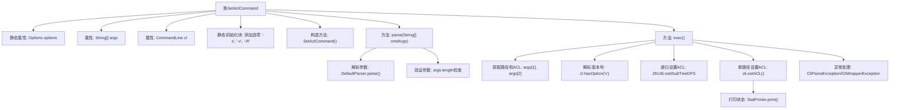

# 基础信息

|      |      |
|------|------|
| 名称 | SetAclCommand |
| 编码语言 | .java |
| 代码路径 | zookeeper/zookeeper-server/src/main/java/org/apache/zookeeper/cli/SetAclCommand.java |
| 包名 | org.apache.zookeeper.cli |
| 依赖项 | ['java.util.List', 'org.apache.commons.cli.CommandLine', 'org.apache.commons.cli.DefaultParser', 'org.apache.commons.cli.Options', 'org.apache.commons.cli.ParseException', 'org.apache.zookeeper.KeeperException', 'org.apache.zookeeper.ZKUtil', 'org.apache.zookeeper.data.ACL', 'org.apache.zookeeper.data.Stat'] |
| 概述说明 | SetAclCommand是用于设置ZooKeeper节点ACL权限的CLI命令，支持递归操作、版本控制和状态显示选项。 |

# 说明

SetAclCommand是一个CLI命令类，用于设置ZooKeeper节点的ACL权限。它支持三个选项：-s显示状态信息，-v指定版本号，-R递归设置子节点。命令格式为"setAcl [-s] [-v version] [-R] path acl"。执行时会解析参数并验证参数数量，然后根据选项设置单个节点或递归设置子节点的ACL。处理过程中会捕获并转换异常，返回执行结果。

# 类列表 Class Summary

| 名称   | 类型  | 说明 |
|-------|------|-------------|
| SetAclCommand | class | SetAclCommand是用于设置ZooKeeper节点ACL的命令行工具，支持递归操作、版本控制和状态显示。 |


## 类 SetAclCommand

|      |      |
|------|------|
| 访问范围 | public |
| 类型 | class |
| 名称 | SetAclCommand |
| 说明 | SetAclCommand是用于设置ZooKeeper节点ACL的命令行工具，支持递归操作、版本控制和状态显示。 |


### UML类图

```mermaid
classDiagram
    class SetAclCommand {
        -Options options
        -String[] args
        -CommandLine cl
        +SetAclCommand()
        +CliCommand parse(String[] cmdArgs) throws CliParseException
        +boolean exec() throws CliException
    }

    class Options {
        +addOption(String opt, boolean hasArg, String description)
    }

    class CommandLine {
        +getArgs() String[]
        +hasOption(String opt) boolean
        +getOptionValue(String opt) String
    }

    class DefaultParser {
        +parse(Options options, String[] args) throws ParseException
    }

    class AclParser {
        +parse(String aclStr) List~ACL~
    }

    class ZKUtil {
        +visitSubTreeDFS(ZooKeeper zk, String path, boolean watch, Visitor visitor)
    }

    class StatPrinter {
        -PrintStream out
        +print(Stat stat)
    }

    class ACL {
        // ACL相关属性和方法
    }

    class Stat {
        // Stat相关属性和方法
    }

    interface Visitor {
        <<Interface>>
        +visit(int rc, String path, Object ctx, String name)
    }

    SetAclCommand --> Options : 使用
    SetAclCommand --> CommandLine : 使用
    SetAclCommand --> DefaultParser : 创建
    SetAclCommand --> AclParser : 调用
    SetAclCommand --> ZKUtil : 调用
    SetAclCommand --> StatPrinter : 创建
    ZKUtil --> Visitor : 依赖
    StatPrinter --> Stat : 依赖
```

这段代码实现了一个设置ACL（访问控制列表）的命令行工具SetAclCommand，继承自CliCommand基类。它通过解析命令行参数（-s统计、-v版本、-R递归），调用ZooKeeper API来设置节点ACL权限，支持递归操作和结果统计输出。类图展示了与Options、CommandLine等参数解析类，以及ZKUtil、AclParser等ZooKeeper工具类的交互关系，体现了命令模式的设计结构。


### 内部方法调用关系图



这段代码实现了一个ZooKeeper ACL设置命令，主要包含参数解析和执行两大功能。静态初始化块定义了-s(统计)、-v(版本)和-R(递归)三个选项，parse方法使用DefaultParser解析命令行参数并验证参数数量，exec方法根据参数决定递归或单路径设置ACL，并处理版本控制和统计输出。整个流程包含严格的异常处理机制，能有效应对路径格式错误和ZK操作异常等情况。

### 字段列表 Field List

| 名称  | 类型  | 说明 |
|-------|-------|------|
| cl | CommandLine | 私有命令行对象cl。 |
| args | String[] | 私有字符串数组args。 |
| options = new Options() | Options | 私有静态选项对象初始化。 |

### 方法列表 Method List

| 名称  | 类型  | 说明 |
|-------|-------|------|
| exec | boolean | 重写exec方法，处理路径和ACL设置，支持递归操作和版本控制，异常时抛出CliException。 |
| parse | CliCommand | 解析命令行参数，处理异常并验证参数数量，不足则抛出异常。 |


