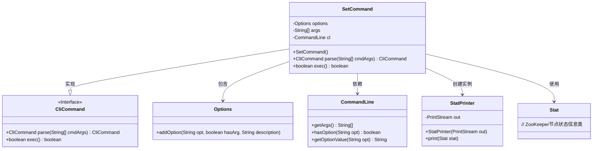
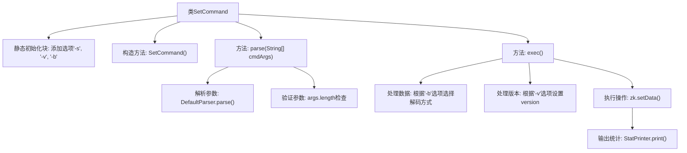
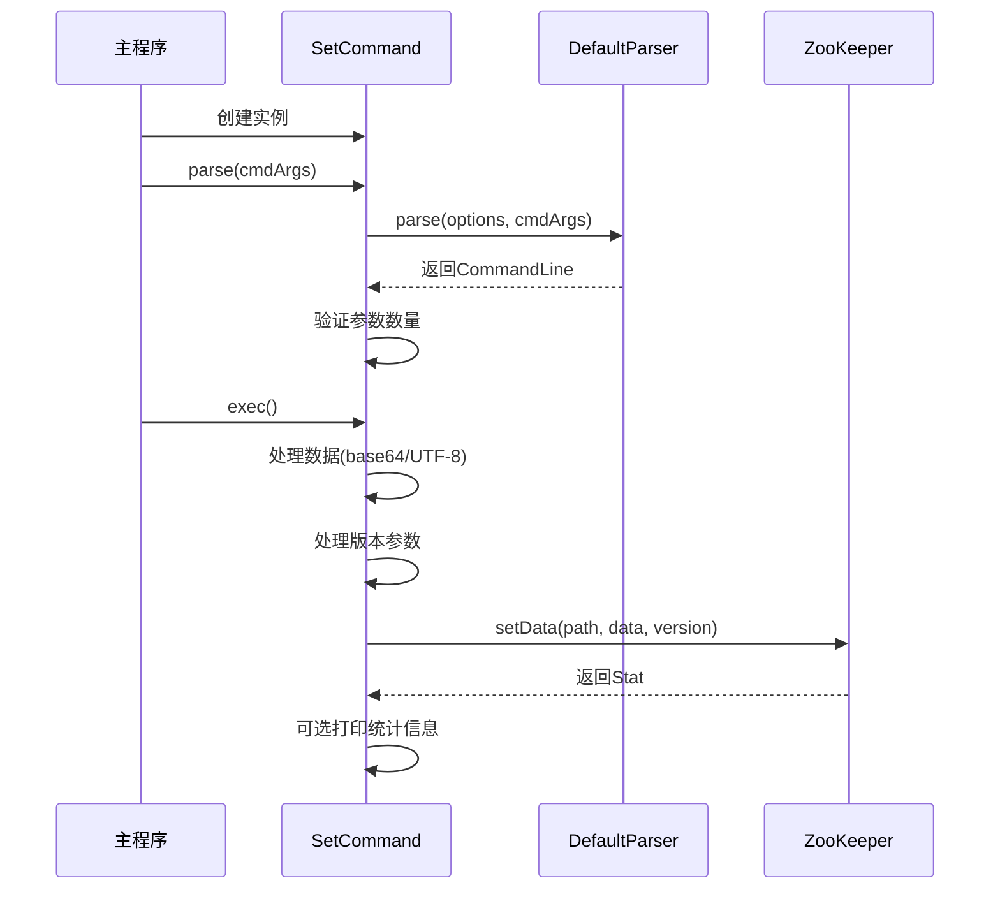

# 基础信息

|      |      |
|------|------|
| 名称 | SetCommand |
| 编码语言 | .java |
| 代码路径 | zookeeper/zookeeper-server/src/main/java/org/apache/zookeeper/cli/SetCommand.java |
| 包名 | org.apache.zookeeper.cli |
| 依赖项 | ['java.nio.charset.StandardCharsets.UTF_8', 'java.util.Base64', 'org.apache.commons.cli.CommandLine', 'org.apache.commons.cli.DefaultParser', 'org.apache.commons.cli.Options', 'org.apache.commons.cli.ParseException', 'org.apache.zookeeper.KeeperException', 'org.apache.zookeeper.data.Stat'] |
| 概述说明 | SetCommand类继承CliCommand，用于设置znode数据。支持选项：-s打印状态，-v指定版本，-b base64数据。解析参数并执行setData操作，处理异常。 |

# 说明

这是一个名为SetCommand的Java类，继承自CliCommand，用于实现设置ZooKeeper节点数据的命令行功能。类中定义了三个选项：-s用于打印节点状态，-v指定期望版本号，-b表示数据采用base64格式。构造函数设置了命令名称、用法说明和选项。parse方法解析命令行参数并验证参数数量，exec方法执行核心逻辑：处理输入数据（支持base64解码）、设置节点数据（可指定版本号），并根据选项决定是否输出节点状态信息。执行过程中会处理路径格式错误和ZooKeeper操作异常。

# 类列表 Class Summary

| 名称   | 类型  | 说明 |
|-------|------|-------------|
| SetCommand | class | SetCommand是CliCommand子类，用于设置znode数据。支持选项：-s打印状态，-v指定版本，-b base64数据。需提供路径和数据，可选参数控制输出和版本校验。 |

## 类 SetCommand

|      |      |
|------|------|
| 访问范围 | public |
| 类型 | class |
| 名称 | SetCommand |
| 说明 | SetCommand是CliCommand子类，用于设置znode数据。支持选项：-s打印状态，-v指定版本，-b base64数据。需提供路径和数据，可选参数控制输出和版本校验。 |

### UML类图

这段类图展示了SetCommand类的结构及其与相关组件的关系。SetCommand继承自CliCommand接口，实现了parse和exec方法，用于解析命令行参数和执行设置操作。它内部使用Options类定义命令行选项，通过CommandLine解析参数，并可能创建StatPrinter来输出节点状态信息。整个设计体现了命令模式，通过参数解析和数据转换实现ZooKeeper节点的数据设置功能，同时处理版本控制和数据格式转换等边缘情况。

### 内部方法调用关系图

这段代码实现了一个ZooKeeper的set命令处理器，主要功能是设置指定路径节点的数据。流程图展示了类结构和关键方法调用关系，时序图则详细描述了从命令解析到数据设置的全过程。代码通过选项处理支持base64编码数据、版本控制和统计信息输出等功能，具有完善的参数验证和异常处理机制。

### 字段列表 Field List

| 名称  | 类型  | 说明 |
|-------|-------|------|
| options = new Options() | Options | 定义静态私有变量options，初始化为Options类的新实例。 |
| args | String[] | 声明一个私有字符串数组变量args。 |
| cl | CommandLine | 私有命令行对象cl。 |

### 方法列表 Method List

| 名称  | 类型  | 说明 |
|-------|-------|------|
| exec | boolean | 重写exec方法，处理路径和数据设置。若含-b选项则解码Base64数据，否则用UTF-8编码。支持-v指定版本号，-s打印状态。异常时抛出对应错误，最终返回false。 |
| parse | CliCommand | 重写parse方法，使用DefaultParser解析命令行参数，捕获异常并转换，检查参数数量，不足则抛出异常，最后返回当前对象。 |

