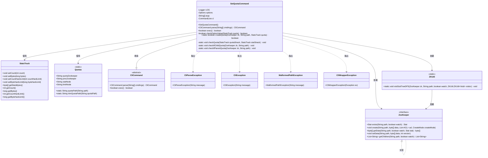
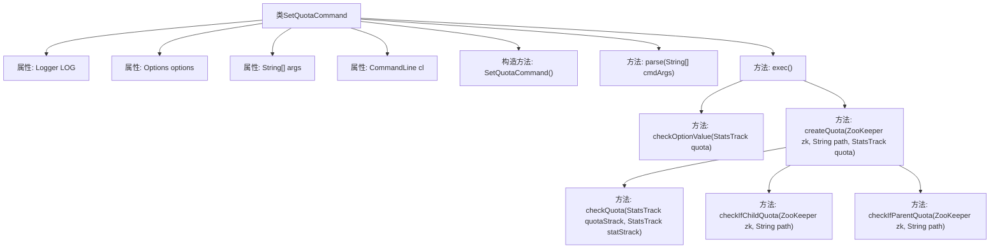
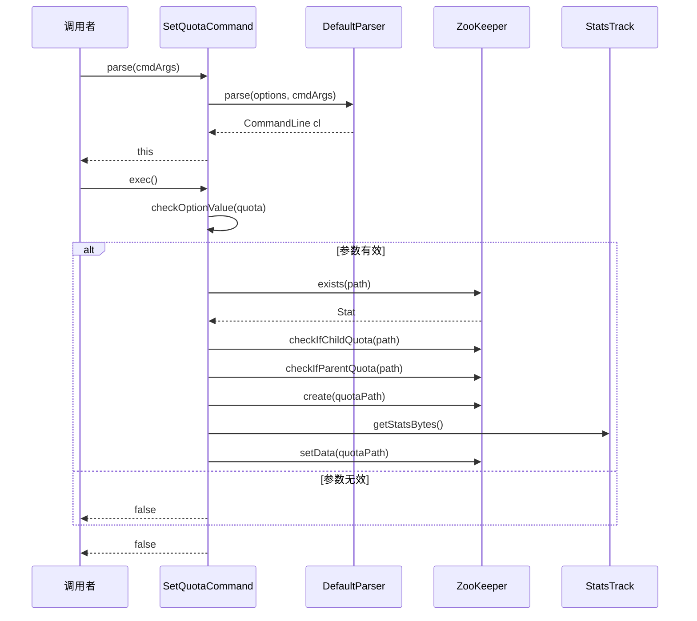

# 基础信息

|      |      |
|------|------|
| 名称 | SetQuotaCommand |
| 编码语言 | .java |
| 代码路径 | zookeeper/zookeeper-server/src/main/java/org/apache/zookeeper/cli/SetQuotaCommand.java |
| 包名 | org.apache.zookeeper.cli |
| 依赖项 | ['java.util.ArrayList', 'java.util.List', 'org.apache.commons.cli.CommandLine', 'org.apache.commons.cli.DefaultParser', 'org.apache.commons.cli.Option', 'org.apache.commons.cli.OptionGroup', 'org.apache.commons.cli.Options', 'org.apache.commons.cli.ParseException', 'org.apache.zookeeper.CreateMode', 'org.apache.zookeeper.KeeperException', 'org.apache.zookeeper.Quotas', 'org.apache.zookeeper.StatsTrack', 'org.apache.zookeeper.ZKUtil', 'org.apache.zookeeper.ZooDefs', 'org.apache.zookeeper.ZooKeeper', 'org.apache.zookeeper.data.Stat', 'org.slf4j.Logger', 'org.slf4j.LoggerFactory'] |
| 概述说明 | SetQuotaCommand是ZooKeeper CLI命令，用于设置路径配额，支持软硬限制和字节数限制，检查父子节点配额冲突并创建配额节点。 |

# 说明

SetQuotaCommand是一个用于设置ZooKeeper配额管理的命令行工具类。它支持四种配额类型：数量软配额、字节软配额、数量硬配额和字节硬配额。类中包含解析命令行参数、验证输入值、检查父子节点配额冲突等功能。主要逻辑包括创建配额节点、更新配额数据、检查配额限制是否低于当前使用量等。执行过程中会验证路径有效性，确保不会在系统保留路径下设置配额，并防止重复设置或冲突配额。所有操作都通过ZooKeeper客户端API实现，包含完整的错误处理和日志记录机制。

# 类列表 Class Summary

| 名称   | 类型  | 说明 |
|-------|------|-------------|
| SetQuotaCommand | class | SetQuotaCommand是用于设置ZooKeeper路径配额的CLI命令，支持软硬配额设置，检查父子节点配额冲突，并验证数值有效性。 |

## 类 SetQuotaCommand

|      |      |
|------|------|
| 访问范围 | public |
| 类型 | class |
| 名称 | SetQuotaCommand |
| 说明 | SetQuotaCommand是用于设置ZooKeeper路径配额的CLI命令，支持软硬配额设置，检查父子节点配额冲突，并验证数值有效性。 |

### UML类图

这段代码实现了一个设置ZooKeeper配额（quota）的命令行工具。SetQuotaCommand继承自CliCommand，主要功能包括解析命令行参数、验证配额值、检查父子节点配额冲突，并通过ZooKeeper API创建/更新配额节点。核心类包括处理配额数据的StatsTrack、存储路径常量的Quotas，以及与ZooKeeper服务交互的ZKUtil工具类。该实现严格校验配额值的有效性和路径合法性，确保不会在系统保留路径下设置配额，并防止配额设置的层级冲突。

### 内部方法调用关系图

这段代码实现了一个ZooKeeper配额设置命令，主要功能包括解析命令行参数、验证配额值、检查父子节点配额冲突、创建配额节点等。流程图展示了类结构和内部方法调用关系，时序图则详细描述了从命令解析到配额创建的全过程。该命令支持四种配额类型设置（数量软/硬限制、字节软/硬限制），并通过严格的路径检查和配额验证确保数据一致性。

### 字段列表 Field List

| 名称  | 类型  | 说明 |
|-------|-------|------|
| args | String[] | 私有字符串数组args。 |
| cl | CommandLine | 私有命令行对象cl。 |
| options = new Options() | Options | 初始化私有选项对象options。 |
| LOG = LoggerFactory.getLogger(SetQuotaCommand.class) | Logger | 声明SetQuotaCommand类的私有静态日志常量LOG，使用LoggerFactory获取日志实例。 |

### 方法列表 Method List

| 名称  | 类型  | 说明 |
|-------|-------|------|
| checkOptionValue | boolean | 检查选项值有效性：验证输入参数n、b、N、B是否为有效数值，设置配额并返回结果。无效时打印错误信息。 |
| parse | CliCommand | 解析命令行参数，失败抛出异常，参数不足时提示用法并返回当前对象。 |
| checkQuota | void | 检查配额是否低于现有值，若数量或字节配额不足则发出警告。 |
| createQuota | boolean | 方法createQuota用于在ZooKeeper中创建配额。首先检查路径是否存在，确保无父/子配额冲突。创建配额路径和节点，设置配额数据并验证。若配额已存在则更新数据。 |
| exec | boolean | 该方法检查路径是否合法，设置配额参数并验证，根据选项创建配额或返回错误信息。 |
| checkIfChildQuota | void | 检查ZooKeeper路径下子节点配额，遍历子树，若发现非配额路径的子节点有限额则抛出异常。忽略无节点异常。 |
| checkIfParentQuota | void | 检查路径的父节点是否设置了配额。遍历路径的每一级父节点，若发现配额限制则抛出异常。无配额或节点不存在时直接返回。 |

