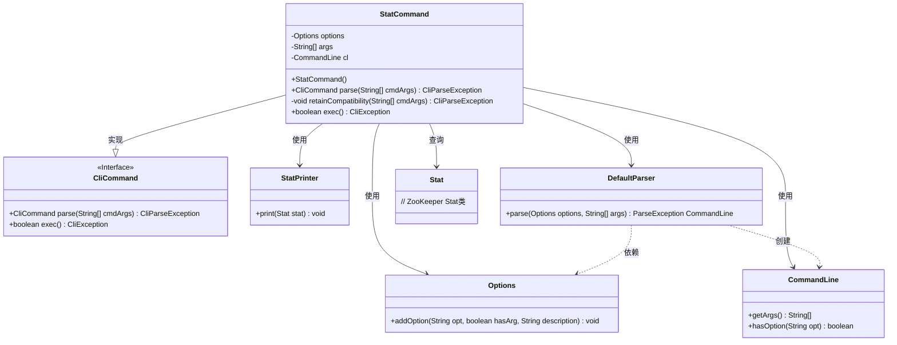
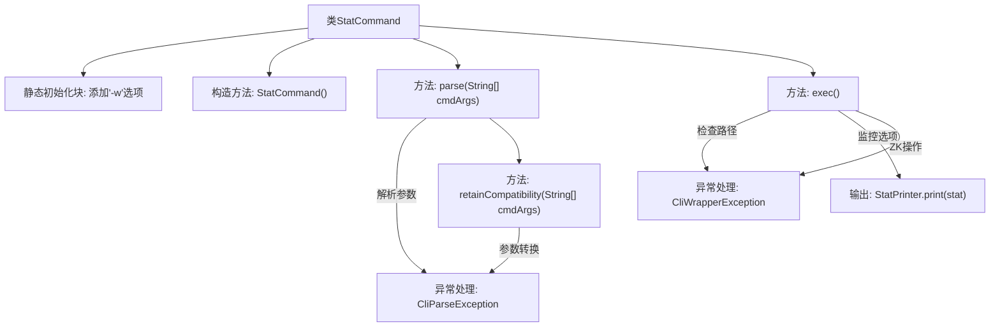

# 基础信息

|      |      |
|------|------|
| 名称 | StatCommand |
| 编码语言 | .java |
| 代码路径 | zookeeper/zookeeper-server/src/main/java/org/apache/zookeeper/cli/StatCommand.java |
| 包名 | org.apache.zookeeper.cli |
| 依赖项 | ['org.apache.commons.cli.CommandLine', 'org.apache.commons.cli.DefaultParser', 'org.apache.commons.cli.Options', 'org.apache.commons.cli.ParseException', 'org.apache.zookeeper.KeeperException', 'org.apache.zookeeper.data.Stat'] |
| 概述说明 | StatCommand是CLI命令类，支持-w选项监控路径状态，兼容旧版语法，执行时检查路径是否存在并打印状态信息。 |

# 说明

该代码定义了一个名为StatCommand的CLI命令类，继承自CliCommand。主要功能是检查ZooKeeper节点状态并支持监听模式。类包含静态选项配置，支持-w参数表示监听模式。构造函数设置命令名称为stat，语法为"[-w] path"。parse方法解析命令行参数，处理兼容性（旧格式"stat path [watch]"会被转换为新格式）。exec方法执行核心逻辑：检查指定路径节点是否存在，若存在则打印节点状态信息，支持监听模式时会返回true。异常处理包括路径格式错误、节点不存在及ZooKeeper操作异常等。

# 类列表 Class Summary

| 名称   | 类型  | 说明 |
|-------|------|-------------|
| StatCommand | class | StatCommand是CLI命令类，支持-w选项监控路径状态，兼容旧版语法，执行时检查路径是否存在并打印状态信息。 |

## 类 StatCommand

|      |      |
|------|------|
| 访问范围 | public |
| 类型 | class |
| 名称 | StatCommand |
| 说明 | StatCommand是CLI命令类，支持-w选项监控路径状态，兼容旧版语法，执行时检查路径是否存在并打印状态信息。 |

### UML类图

这段代码展示了一个`StatCommand`类，它继承自`CliCommand`接口，用于处理命令行统计操作。该类通过Apache Commons CLI库解析参数，支持`-w`监视选项和路径参数，并兼容旧版语法。核心功能是通过ZooKeeper检查节点状态，使用`StatPrinter`输出结果。类图清晰地展示了与命令行解析组件、ZooKeeper状态类的交互关系，体现了命令模式的设计。

### 内部方法调用关系图

流程图描述：该流程图展示了StatCommand类的完整执行流程。从静态初始化添加-w监控选项开始，经过构造函数初始化命令格式，parse方法解析参数时可能抛出CliParseException。保留兼容性处理会将旧参数格式转换为新格式。exec方法执行核心逻辑：检查路径有效性、处理ZK节点状态查询、根据-w选项决定是否持续监控，最后通过StatPrinter输出节点状态信息。整个过程涉及多种异常处理，包括参数解析异常和ZK操作异常。

### 字段列表 Field List

| 名称  | 类型  | 说明 |
|-------|-------|------|
| cl | CommandLine | 私有命令行对象cl。 |
| args | String[] | 私有字符串数组args。 |
| options = new Options() | Options | 私有静态常量options初始化为Options类实例。 |

### 方法列表 Method List

| 名称  | 类型  | 说明 |
|-------|-------|------|
| parse | CliCommand | 解析命令行参数，处理异常并检查参数数量，保留兼容性后返回当前对象。 |
| retainCompatibility | void | 该方法用于保持命令行参数兼容性，将旧格式"stat path [watch]"转换为新格式"stat [-w] path"，并提示用户弃用旧格式。转换后重新解析参数，异常时抛出CliParseException。 |
| exec | boolean | 检查ZooKeeper节点路径是否存在，支持监听选项，捕获异常并打印节点状态信息。 |

