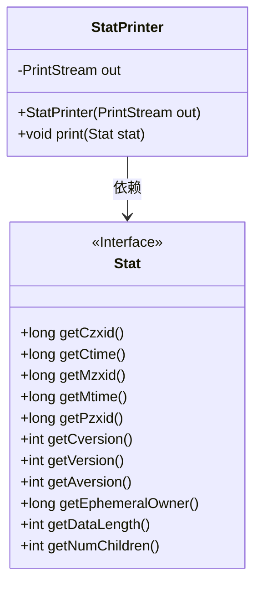
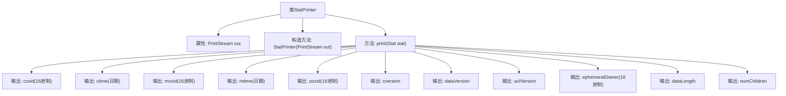

# 基础信息

|      |      |
|------|------|
| 名称 | StatPrinter |
| 编码语言 | .java |
| 代码路径 | zookeeper/zookeeper-server/src/main/java/org/apache/zookeeper/cli/StatPrinter.java |
| 包名 | org.apache.zookeeper.cli |
| 依赖项 | ['java.io.PrintStream', 'java.util.Date', 'org.apache.zookeeper.data.Stat'] |
| 概述说明 | StatPrinter类用于打印Stat对象属性，包括zxid、时间戳、版本号、数据长度和子节点数量等，输出到指定PrintStream。 |

# 说明

StatPrinter类是一个用于打印统计信息的工具类，通过PrintStream输出流进行输出。构造函数接收PrintStream参数并初始化输出流。print方法接收Stat对象作为参数，将其各项属性格式化输出，包括事务ID（czxid、mzxid、pzxid）、创建修改时间（ctime、mtime）、版本信息（cversion、dataVersion、aclVersion）、临时所有者ID（ephemeralOwner）、数据长度（dataLength）和子节点数量（numChildren）。所有数值型ID均以十六进制格式输出，时间戳转换为可读日期格式。

# 类列表 Class Summary

| 名称   | 类型  | 说明 |
|-------|------|-------------|
| StatPrinter | class | StatPrinter类用于打印Stat对象属性，包括zxid、时间戳、版本号、数据长度和子节点数等关键信息。 |

## 类 StatPrinter

|      |      |
|------|------|
| 访问范围 | public |
| 类型 | class |
| 名称 | StatPrinter |
| 说明 | StatPrinter类用于打印Stat对象属性，包括zxid、时间戳、版本号、数据长度和子节点数等关键信息。 |

### UML类图

这段代码展示了一个StatPrinter类，它通过PrintStream输出Stat接口的各种状态信息。StatPrinter包含一个受保护的PrintStream成员和一个构造函数，主要功能是通过print方法格式化输出Stat接口的11种不同状态值（包括zxid、时间戳、版本号等）。Stat接口定义了获取这些状态值的抽象方法，两者形成明确的依赖关系，体现了打印功能与数据源的分离。

### 内部方法调用关系图

这段代码定义了一个StatPrinter类，用于格式化输出Stat对象的各项属性值。通过构造方法传入PrintStream输出流，print方法将stat对象的16个不同属性（包括各种ID、时间戳、版本号和长度等）转换为特定格式后逐行输出。每个属性都有明确的标签和格式化处理，如ID转为16进制、时间戳转为日期字符串等。

### 字段列表 Field List

| 名称  | 类型  | 说明 |
|-------|-------|------|
| out | PrintStream | 保护类型的PrintStream输出流变量out。 |

### 方法列表 Method List

| 名称  | 类型  | 说明 |
|-------|-------|------|
| print | void | 打印ZooKeeper节点状态信息，包括事务ID、时间戳、版本号、数据长度和子节点数量等关键属性。 |

