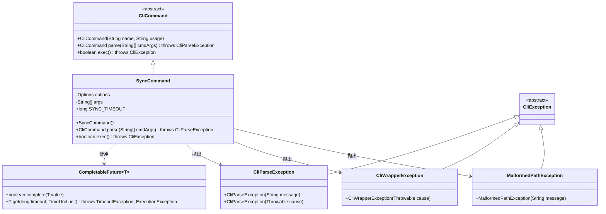
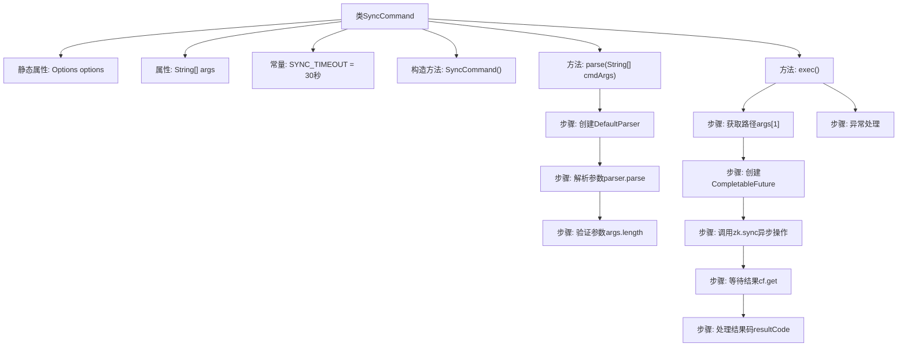

# 基础信息

|      |      |
|------|------|
| 名称 | SyncCommand |
| 编码语言 | .java |
| 代码路径 | zookeeper/zookeeper-server/src/main/java/org/apache/zookeeper/cli/SyncCommand.java |
| 包名 | org.apache.zookeeper.cli |
| 依赖项 | ['java.util.concurrent.CompletableFuture', 'java.util.concurrent.ExecutionException', 'java.util.concurrent.TimeUnit', 'java.util.concurrent.TimeoutException', 'org.apache.commons.cli.CommandLine', 'org.apache.commons.cli.DefaultParser', 'org.apache.commons.cli.Options', 'org.apache.commons.cli.ParseException'] |
| 概述说明 | SyncCommand是CLI命令类，用于同步路径，解析参数并调用zk.sync方法，超时30秒，处理成功或失败结果及异常。 |

# 说明

SyncCommand是一个继承自CliCommand的类，用于处理同步命令。它定义了30秒的超时时间SYNC_TIMEOUT，并通过构造函数初始化命令名称为"sync"和参数"path"。parse方法解析命令行参数，验证参数数量不少于2个，否则抛出异常。exec方法执行同步操作，通过zk.sync方法同步指定路径，使用CompletableFuture处理结果，成功时输出"Sync is OK"，失败时输出错误码。处理过程中可能抛出路径格式异常、中断异常、超时或执行异常，并相应转换为CliWrapperException或MalformedPathException。最终返回false表示命令执行结束。

# 类列表 Class Summary

| 名称   | 类型  | 说明 |
|-------|------|-------------|
| SyncCommand | class | SyncCommand是CLI命令类，用于同步路径。解析参数需至少2个，执行时调用zk.sync方法，超时30秒，返回结果码0成功否则失败，异常处理包括路径错误、中断和超时。 |

## 类 SyncCommand

|      |      |
|------|------|
| 访问范围 | public |
| 类型 | class |
| 名称 | SyncCommand |
| 说明 | SyncCommand是CLI命令类，用于同步路径。解析参数需至少2个，执行时调用zk.sync方法，超时30秒，返回结果码0成功否则失败，异常处理包括路径错误、中断和超时。 |

### UML类图

这段代码展示了一个同步命令的实现类`SyncCommand`，它继承自抽象类`CliCommand`。主要功能包括解析命令行参数和执行同步操作，通过`CompletableFuture`实现异步回调处理，并处理各种异常情况如超时、中断和路径格式错误等。类图中清晰地展示了继承关系和依赖关系，包括与异常类和处理异步结果的泛型类的交互。

### 内部方法调用关系图

这段代码实现了一个同步命令处理类SyncCommand，继承自CliCommand。主要功能包括：1) 通过parse方法解析命令行参数并验证参数有效性；2) 通过exec方法执行核心同步逻辑，使用CompletableFuture处理ZooKeeper的异步sync操作，设置30秒超时控制，并根据返回码输出成功/失败信息；3) 包含完善的异常处理机制，包括路径格式异常、中断异常、超时异常等。流程图清晰展示了从参数解析到异步操作执行的完整流程控制链。

### 字段列表 Field List

| 名称  | 类型  | 说明 |
|-------|-------|------|
| SYNC_TIMEOUT = TimeUnit.SECONDS.toMillis(30L) | long | 定义静态常量SYNC_TIMEOUT，值为30秒转换为毫秒。 |
| args | String[] | 私有字符串数组args。 |
| options = new Options() | Options | 定义私有静态变量options，初始化为Options类实例。 |

### 方法列表 Method List

| 名称  | 类型  | 说明 |
|-------|-------|------|
| parse | CliCommand | 解析命令行参数，若参数不足则抛出异常。 |
| exec | boolean | 覆盖exec方法，同步ZooKeeper路径，处理成功、失败及超时异常，返回false。 |

