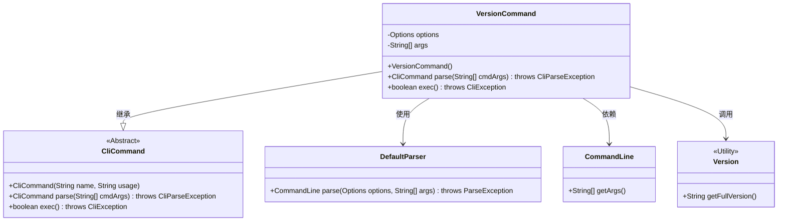
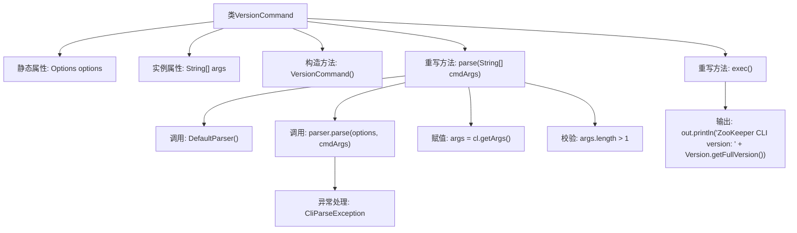

# 基础信息

|      |      |
|------|------|
| 名称 | VersionCommand |
| 编码语言 | .java |
| 代码路径 | zookeeper/zookeeper-server/src/main/java/org/apache/zookeeper/cli/VersionCommand.java |
| 包名 | org.apache.zookeeper.cli |
| 依赖项 | ['org.apache.commons.cli.CommandLine', 'org.apache.commons.cli.DefaultParser', 'org.apache.commons.cli.Options', 'org.apache.commons.cli.ParseException', 'org.apache.zookeeper.Version'] |
| 概述说明 | 这是一个ZooKeeper CLI的版本命令类，继承自CliCommand，用于解析并执行version命令，输出ZooKeeper的完整版本信息。 |

# 说明

这段代码描述了一个名为VersionCommand的类，继承自CliCommand，用于处理版本命令。类中定义了静态Options对象和字符串数组args。构造函数设置命令名称为"version"。parse方法使用DefaultParser解析命令行参数，检查参数数量是否超过限制，并返回当前对象。exec方法输出ZooKeeper CLI的完整版本信息。整个类实现了命令行参数的解析和版本信息的显示功能。

# 类列表 Class Summary

| 名称   | 类型  | 说明 |
|-------|------|-------------|
| VersionCommand | class | VersionCommand是CLI命令类，用于显示ZooKeeper版本信息。解析参数后输出完整版本号。 |

## 类 VersionCommand

|      |      |
|------|------|
| 访问范围 | public |
| 类型 | class |
| 名称 | VersionCommand |
| 说明 | VersionCommand是CLI命令类，用于显示ZooKeeper版本信息。解析参数后输出完整版本号。 |

### UML类图

这段类图展示了VersionCommand类继承自CliCommand抽象类，并实现了parse和exec方法。VersionCommand通过DefaultParser解析命令行参数，使用CommandLine获取参数，并调用Version工具类获取版本信息。该结构实现了CLI命令的版本查询功能，包含参数解析和版本信息输出两个主要操作，体现了命令模式的设计思想。

### 内部方法调用关系图

流程图描述：该流程图展示了VersionCommand类的结构和方法调用关系。类包含静态options属性和实例args属性，构造方法初始化命令名称。parse方法使用DefaultParser解析参数，处理异常并校验参数长度；exec方法输出ZooKeeper版本信息。流程清晰呈现了参数解析、异常处理和版本输出的完整逻辑链。

### 字段列表 Field List

| 名称  | 类型  | 说明 |
|-------|-------|------|
| args | String[] | 私有字符串数组args。 |
| options = new Options() | Options | 私有静态选项对象初始化。 |

### 方法列表 Method List

| 名称  | 类型  | 说明 |
|-------|-------|------|
| parse | CliCommand | 解析命令行参数，使用DefaultParser处理输入，捕获异常并转换为CliParseException。检查参数数量，超过1个则抛出异常。返回当前对象。 |
| exec | boolean | Java方法重写，打印ZooKeeper CLI版本信息并返回false。 |

