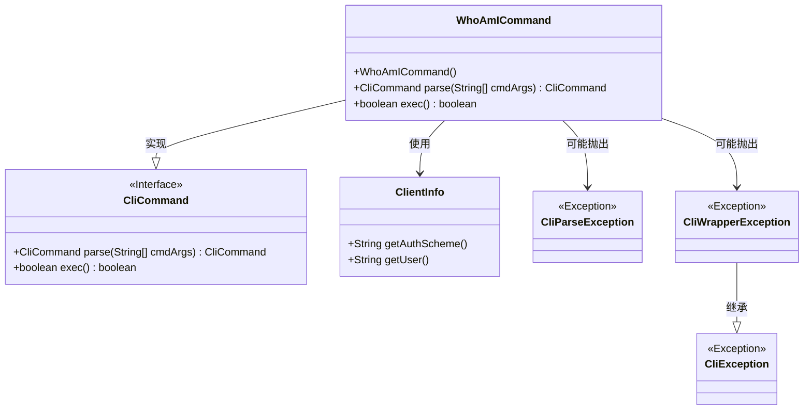
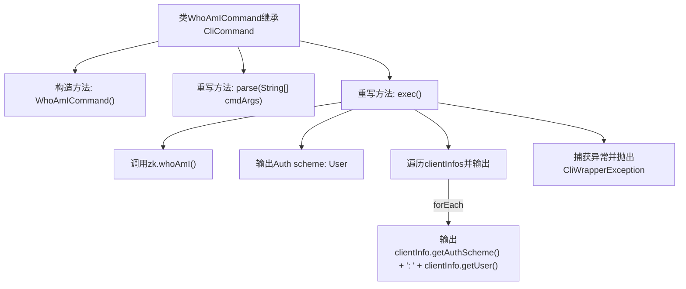

# 基础信息

|      |      |
|------|------|
| 名称 | WhoAmICommand |
| 编码语言 | .java |
| 代码路径 | zookeeper/zookeeper-server/src/main/java/org/apache/zookeeper/cli/WhoAmICommand.java |
| 包名 | org.apache.zookeeper.cli |
| 依赖项 | ['java.util.List', 'org.apache.zookeeper.data.ClientInfo'] |
| 概述说明 | 这是一个名为WhoAmICommand的Java类，继承自CliCommand，用于实现whoami命令行功能。它通过zk.whoAmI()获取客户端信息并输出认证方案和用户信息，异常时抛出CliWrapperException。 |

# 说明

该内容描述了一个名为WhoAmICommand的Java类，继承自CliCommand类，用于实现whoami命令行功能。构造函数设置命令名为whoami。parse方法直接返回当前实例，不处理参数。exec方法通过zk对象获取客户端认证信息，首先输出Auth scheme为User，然后遍历非空的clientInfos列表，输出每个客户端认证方案和用户信息。异常时抛出CliWrapperException。方法始终返回false。

# 类列表 Class Summary

| 名称   | 类型  | 说明 |
|-------|------|-------------|
| WhoAmICommand | class | WhoAmICommand是一个CLI命令类，用于查询并打印用户认证信息，包括认证方案和用户名。继承自CliCommand，实现parse和exec方法，处理异常并输出结果。 |

## 类 WhoAmICommand

|      |      |
|------|------|
| 访问范围 | public |
| 类型 | class |
| 名称 | WhoAmICommand |
| 说明 | WhoAmICommand是一个CLI命令类，用于查询并打印用户认证信息，包括认证方案和用户名。继承自CliCommand，实现parse和exec方法，处理异常并输出结果。 |

### UML类图

这段代码展示了一个`WhoAmICommand`类，它继承自`CliCommand`接口并实现了命令解析和执行功能。类图清晰地呈现了继承关系(`WhoAmICommand`实现`CliCommand`接口)、异常处理结构(`CliWrapperException`继承`CliException`)，以及`WhoAmICommand`对`ClientInfo`类的使用关系。该命令通过ZK客户端获取认证信息，输出用户身份验证方案和用户信息，体现了命令模式在CLI应用中的典型实现方式。

### 内部方法调用关系图

这段代码展示了一个WhoAmICommand类，继承自CliCommand基类。主要功能是通过exec()方法执行身份验证查询：首先调用zk.whoAmI()获取客户端信息列表，输出基础认证方案后，遍历并打印每个客户端的具体认证方案和用户名。整个过程包含异常处理，会将底层异常包装为CliWrapperException抛出。parse()方法直接返回当前实例，表明该命令无需额外参数解析。

### 字段列表 Field List

| 名称  | 类型  | 说明 |
|-------|-------|------|

### 方法列表 Method List

| 名称  | 类型  | 说明 |
|-------|-------|------|
| parse | CliCommand | 重写父类方法，解析命令行参数并返回当前对象，可能抛出解析异常。 |
| exec | boolean | Java方法重写，查询ZK客户端信息并打印认证方案和用户，异常时抛出CliWrapperException，默认返回false。 |

