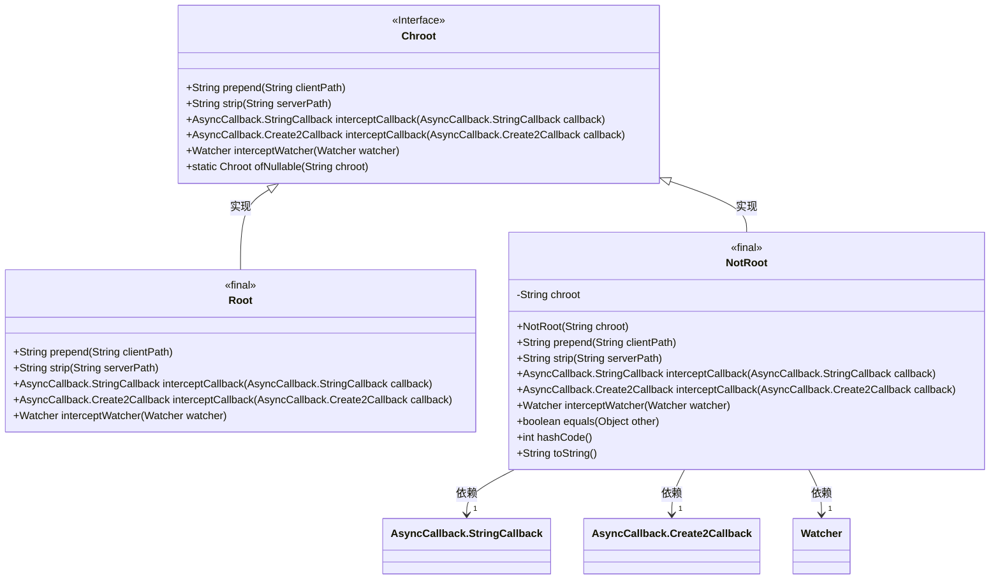
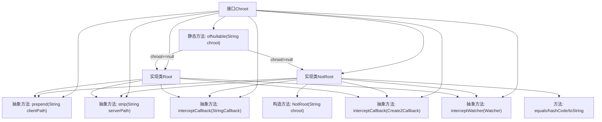
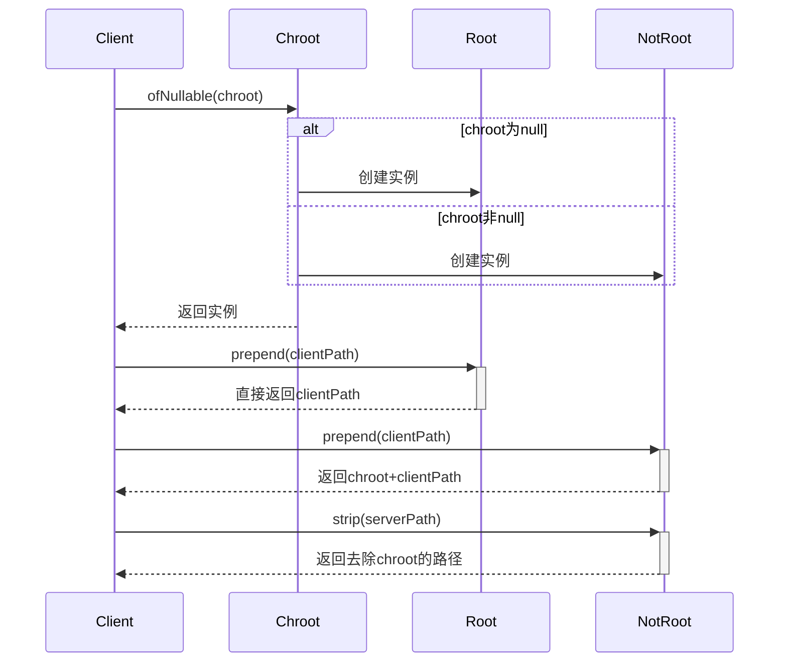

# 基础信息

|      |      |
|------|------|
| 名称 | Chroot |
| 编码语言 | .java |
| 代码路径 | zookeeper/zookeeper-server/src/main/java/org/apache/zookeeper/client/Chroot.java |
| 包名 | org.apache.zookeeper.client |
| 依赖项 | ['java.util.Objects', 'org.apache.yetus.audience.InterfaceAudience', 'org.apache.zookeeper.AsyncCallback', 'org.apache.zookeeper.WatchedEvent', 'org.apache.zookeeper.Watcher'] |
| 概述说明 | Chroot接口提供路径处理功能，包含Root和NotRoot两个实现类。Root类直接返回原路径，NotRoot类处理路径前缀添加和剥离，并支持回调拦截和观察器拦截。 |

# 说明

该内容描述了一个名为Chroot的私有接口，用于处理路径前缀操作。接口包含两个实现类：Root和NotRoot。Root类在无前缀时直接返回原路径，NotRoot类则处理带前缀的路径操作，包括添加前缀、移除前缀、拦截回调函数和监视器等。NotRoot类还实现了equals、hashCode和toString方法。接口提供了静态工厂方法ofNullable，根据输入参数返回Root或NotRoot实例。

# 类列表 Class Summary

| 名称   | 类型  | 说明 |
|-------|------|-------------|
| Chroot | interface | Chroot接口提供路径处理功能，包含Root和NotRoot实现类，支持路径添加、移除、回调拦截和监视器拦截。 |

## 类 Chroot

|      |      |
|------|------|
| 访问范围 | @InterfaceAudience.Private;public |
| 类型 | interface |
| 名称 | Chroot |
| 说明 | Chroot接口提供路径处理功能，包含Root和NotRoot实现类，支持路径添加、移除、回调拦截和监视器拦截。 |

### UML类图

这段代码描述了一个Chroot接口及其两个实现类Root和NotRoot，用于处理ZooKeeper路径的根目录操作。Chroot接口定义了路径预处理、剥离和回调拦截等方法，Root实现表示无根目录的默认处理，NotRoot实现包含具体根目录路径的逻辑，会校验路径合法性并处理路径拼接/截取。该设计通过工厂方法ofNullable动态选择实现类，体现了空对象模式和策略模式的结合。

### 内部方法调用关系图

这段代码定义了一个Chroot接口及其两个实现类Root和NotRoot，用于处理路径的添加和去除根路径操作。流程图展示了接口与实现类的关系，以及主要方法的调用路径。时序图则演示了客户端如何通过工厂方法获取实例，并调用不同实现类的方法处理路径。NotRoot类实现了完整的路径处理逻辑，包括路径拼接、截取和回调拦截等功能，而Root类则作为空实现直接返回原始路径。

### 字段列表 Field List

| 名称  | 类型  | 说明 |
|-------|-------|------|

### 方法列表 Method List

| 名称  | 类型  | 说明 |
|-------|-------|------|
| prepend | String | 方法功能：在字符串前添加指定路径。 |
| ofNullable | Chroot | 检查输入字符串，若为空返回Root对象，否则返回包含该字符串的NotRoot对象。 |
| interceptCallback | AsyncCallback.StringCallback | 拦截字符串回调的异步回调方法。 |
| interceptCallback | AsyncCallback.Create2Callback | 异步回调拦截方法，用于处理或修改传入的AsyncCallback.Create2Callback回调。 |
| strip | String | strip方法用于去除serverPath字符串中的多余字符，返回处理后的字符串。 |
| interceptWatcher | Watcher | 方法interceptWatcher接收一个Watcher对象并返回拦截后的Watcher对象。 |

