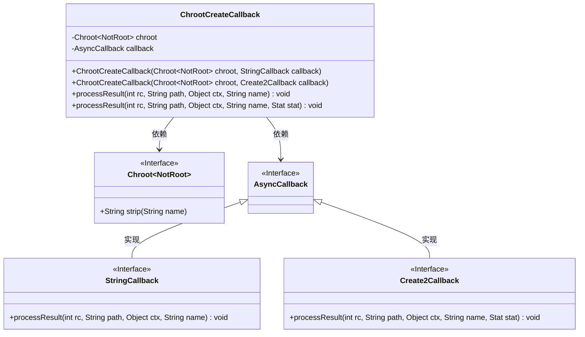
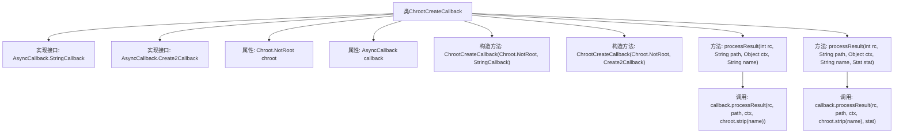

# 基础信息

|      |      |
|------|------|
| 名称 | ChrootCreateCallback |
| 编码语言 | .java |
| 代码路径 | zookeeper/zookeeper-server/src/main/java/org/apache/zookeeper/client/ChrootCreateCallback.java |
| 包名 | org.apache.zookeeper.client |
| 依赖项 | ['org.apache.yetus.audience.InterfaceAudience', 'org.apache.zookeeper.AsyncCallback', 'org.apache.zookeeper.data.Stat'] |
| 概述说明 | ChrootCreateCallback类实现两个回调接口，处理路径创建结果，通过chroot对象处理路径名称后转发给原始回调。 |

# 说明

这是一个私有类ChrootCreateCallback，实现了AsyncCallback.StringCallback和AsyncCallback.Create2Callback接口。它包含两个构造函数，分别接收Chroot.NotRoot对象和StringCallback或Create2Callback回调对象。类中重写了两个processResult方法，分别处理StringCallback和Create2Callback的回调结果，在调用原始回调前对name参数进行chroot.strip处理。该类主要用于在回调过程中对路径名称进行chroot相关的处理。

# 类列表 Class Summary

| 名称   | 类型  | 说明 |
|-------|------|-------------|
| ChrootCreateCallback | class | 私有类ChrootCreateCallback实现两个回调接口，处理路径剥离后转发结果。构造函数接收Chroot.NotRoot和回调对象，processResult方法分别处理两种回调类型。 |

## 类 ChrootCreateCallback

|      |      |
|------|------|
| 访问范围 | @InterfaceAudience.Private |
| 类型 | class |
| 名称 | ChrootCreateCallback |
| 说明 | 私有类ChrootCreateCallback实现两个回调接口，处理路径剥离后转发结果。构造函数接收Chroot.NotRoot和回调对象，processResult方法分别处理两种回调类型。 |

### UML类图

这段代码描述了一个ChrootCreateCallback类，它实现了StringCallback和Create2Callback两个接口，用于处理异步操作的结果回调。该类包含两个构造函数，分别接收不同的回调类型，并通过processResult方法处理结果，其中会调用chroot对象的strip方法处理路径名称。类图中清晰地展示了类与接口之间的继承和依赖关系，以及泛型的使用。

### 内部方法调用关系图

该流程图展示了ChrootCreateCallback类的结构和主要行为。该类实现了两个异步回调接口，包含两个构造方法和两个重写的processResult方法。核心功能是通过构造方法接收不同类型的回调对象，在处理结果时对路径名进行chroot剥离操作后转发给原始回调。流程图清晰地呈现了类成员、接口实现关系以及方法间的调用链，特别是展示了两种processResult方法如何分别处理StringCallback和Create2Callback的不同参数需求。

### 字段列表 Field List

| 名称  | 类型  | 说明 |
|-------|-------|------|
| chroot | Chroot.NotRoot | 私有不可变chroot非根实例。 |
| callback | AsyncCallback | 私有异步回调对象callback。 |

### 方法列表 Method List

| 名称  | 类型  | 说明 |
|-------|-------|------|
| processResult | void | 重写方法处理结果，调用回调函数并处理路径名，若为空则设为null。 |
| processResult | void | 重写方法processResult，将参数处理后传递给回调对象cb，处理包括路径检查和空值处理。 |

