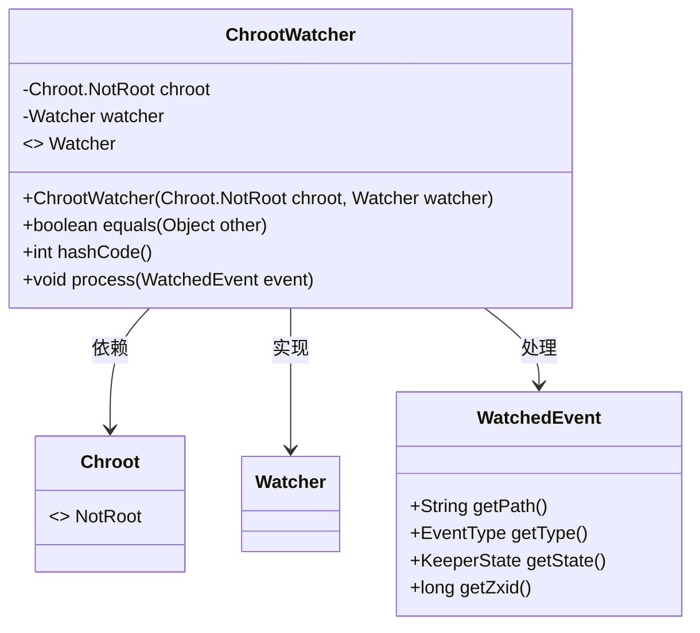
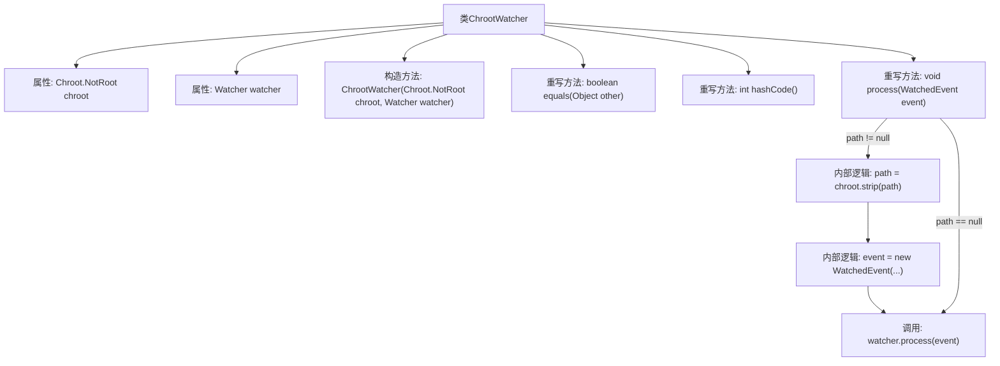

# 基础信息

|      |      |
|------|------|
| 名称 | ChrootWatcher |
| 编码语言 | .java |
| 代码路径 | zookeeper/zookeeper-server/src/main/java/org/apache/zookeeper/client/ChrootWatcher.java |
| 包名 | org.apache.zookeeper.client |
| 依赖项 | ['java.util.Objects', 'org.apache.yetus.audience.InterfaceAudience', 'org.apache.zookeeper.WatchedEvent', 'org.apache.zookeeper.Watcher'] |
| 概述说明 | ChrootWatcher是私有类，封装了Chroot.NotRoot和Watcher，重写equals、hashCode和process方法，处理路径转换后转发事件。 |

# 说明

ChrootWatcher是一个私有类，实现了Watcher接口，用于处理路径转换后的监视事件。它包含两个成员变量：Chroot.NotRoot类型的chroot和Watcher类型的watcher。构造函数接收这两个参数并初始化。equals方法比较两个ChrootWatcher对象的chroot和watcher是否相同。hashCode方法基于chroot和watcher生成哈希值。process方法处理监视事件，若事件路径非空，则通过chroot.strip转换路径后创建新事件，并调用watcher的process方法处理。

# 类列表 Class Summary

| 名称   | 类型  | 说明 |
|-------|------|-------------|
| ChrootWatcher | class | ChrootWatcher类实现Watcher接口，封装chroot路径处理和事件转发逻辑，重写equals、hashCode和process方法，确保事件路径正确转换后传递给底层watcher处理。 |

## 类 ChrootWatcher

|      |      |
|------|------|
| 访问范围 | @InterfaceAudience.Private |
| 类型 | class |
| 名称 | ChrootWatcher |
| 说明 | ChrootWatcher类实现Watcher接口，封装chroot路径处理和事件转发逻辑，重写equals、hashCode和process方法，确保事件路径正确转换后传递给底层watcher处理。 |

### UML类图

这段代码展示了一个ChrootWatcher类，它实现了Watcher接口，用于在ZooKeeper路径监控中处理chroot（根目录重定向）场景。类中包含两个私有成员：Chroot.NotRoot对象用于路径处理，Watcher对象用于实际事件处理。主要逻辑在process方法中，会对事件路径进行chroot剥离后转发给底层watcher。类图清晰地体现了ChrootWatcher与Watcher接口的实现关系，以及与Chroot、WatchedEvent类的依赖关系。

### 内部方法调用关系图

这段代码描述了一个ChrootWatcher类，它实现了Watcher接口，用于处理路径转换后的监视事件。主要功能包括构造方法初始化、重写equals和hashCode方法进行对象比较，以及process方法处理事件路径转换。流程图展示了类结构、属性、方法调用关系，特别是process方法中根据路径是否存在进行不同处理的逻辑分支。该类核心作用是在事件处理前对路径进行chroot转换，再委托给原始watcher处理。

### 字段列表 Field List

| 名称  | 类型  | 说明 |
|-------|-------|------|
| chroot | Chroot.NotRoot | 私有不可变的Chroot非根实例。 |
| watcher | Watcher | 私有不可变的监视器实例。 |

### 方法列表 Method List

| 名称  | 类型  | 说明 |
|-------|-------|------|
| hashCode | int | 重写hashCode方法，使用Objects.hash计算chroot和watcher的哈希值。 |
| equals | boolean | 重写equals方法，比较ChrootWatcher对象的chroot和watcher属性是否相等，否则返回false。 |
| process | void | 重写process方法：若事件路径非空，去除chroot前缀后重建事件对象，最终调用watcher处理事件。 |

