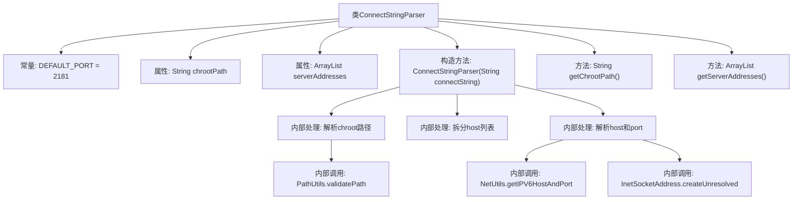

# 基础信息

|      |      |
|------|------|
| 名称 | ConnectStringParser |
| 编码语言 | .java |
| 代码路径 | zookeeper/zookeeper-server/src/main/java/org/apache/zookeeper/client/ConnectStringParser.java |
| 包名 | org.apache.zookeeper.client |
| 依赖项 | ['org.apache.zookeeper.common.StringUtils.split', 'java.net.InetSocketAddress', 'java.util.ArrayList', 'java.util.List', 'org.apache.zookeeper.common.NetUtils', 'org.apache.zookeeper.common.PathUtils'] |
| 概述说明 | ConnectStringParser解析ZooKeeper连接字符串，提取chroot路径和服务器地址列表，支持IPv6和默认端口2181。 |

# 说明

ConnectStringParser类用于解析ZooKeeper连接字符串，包含主机地址和可选端口及chroot路径。构造函数处理连接字符串，支持IPv6地址和默认端口2181。首先解析chroot路径并验证其有效性，然后拆分多个主机地址，处理每个主机的端口信息，支持显式端口和默认端口。最终生成未解析的InetSocketAddress列表。提供获取chroot路径和服务器地址列表的方法。

# 类列表 Class Summary

| 名称   | 类型  | 说明 |
|-------|------|-------------|
| ConnectStringParser | class | ConnectStringParser解析ZooKeeper连接字符串，提取chroot路径和服务器地址列表，支持IPv6和默认端口2181。 |


## 类 ConnectStringParser

|      |      |
|------|------|
| 访问范围 | public final |
| 类型 | class |
| 名称 | ConnectStringParser |
| 说明 | ConnectStringParser解析ZooKeeper连接字符串，提取chroot路径和服务器地址列表，支持IPv6和默认端口2181。 |


### UML类图

```mermaid
classDiagram
    class ConnectStringParser {
        -DEFAULT_PORT: int = 2181
        -chrootPath: String
        -serverAddresses: ArrayList~InetSocketAddress~
        +ConnectStringParser(String connectString)
        +getChrootPath() String
        +getServerAddresses() ArrayList~InetSocketAddress~
    }

    class InetSocketAddress {
        <<Interface>>
    }

    class PathUtils {
        <<Interface>>
        +validatePath(String path) void
    }

    class NetUtils {
        <<Interface>>
        +getIPV6HostAndPort(String host) String[]
    }

    ConnectStringParser --> InetSocketAddress : 包含
    ConnectStringParser --> PathUtils : 依赖 : 调用validatePath
    ConnectStringParser --> NetUtils : 依赖 : 调用getIPV6HostAndPort
```

类图描述：
ConnectStringParser是一个用于解析ZooKeeper连接字符串的最终类，主要功能是解析包含多个服务器地址和可选chroot路径的连接字符串。它依赖PathUtils进行路径验证，依赖NetUtils处理IPv6地址解析，内部维护一个InetSocketAddress列表存储服务器地址。该类通过构造函数完成核心解析逻辑，提供获取chroot路径和服务器地址的方法，默认端口号为2181。


### 内部方法调用关系图



这段代码是ZooKeeper客户端连接字符串解析器的实现，主要功能包括解析包含多个服务器地址和可选chroot路径的连接字符串。流程图展示了类结构、常量定义、属性声明、公共方法以及构造方法内部的详细处理流程，包括chroot路径验证、IPv6地址解析、端口号提取等关键步骤，最终生成可用的服务器地址列表。该解析器支持标准格式和IPv6字面量，具有严格的路径验证机制。

### 字段列表 Field List

| 名称  | 类型  | 说明 |
|-------|-------|------|
| chrootPath | String | 私有字符串变量chrootPath，用于存储根目录路径。 |
| DEFAULT_PORT = 2181 | int | 定义默认端口2181的私有静态常量。 |
| serverAddresses = new ArrayList<>() | ArrayList<InetSocketAddress> | 私有成员变量serverAddresses，类型为ArrayList<InetSocketAddress>，初始化为空列表。 |

### 方法列表 Method List

| 名称  | 类型  | 说明 |
|-------|-------|------|
| getChrootPath | String | 方法返回私有变量chrootPath的值。 |
| getServerAddresses | ArrayList<InetSocketAddress> | 方法返回服务器地址列表。 |


