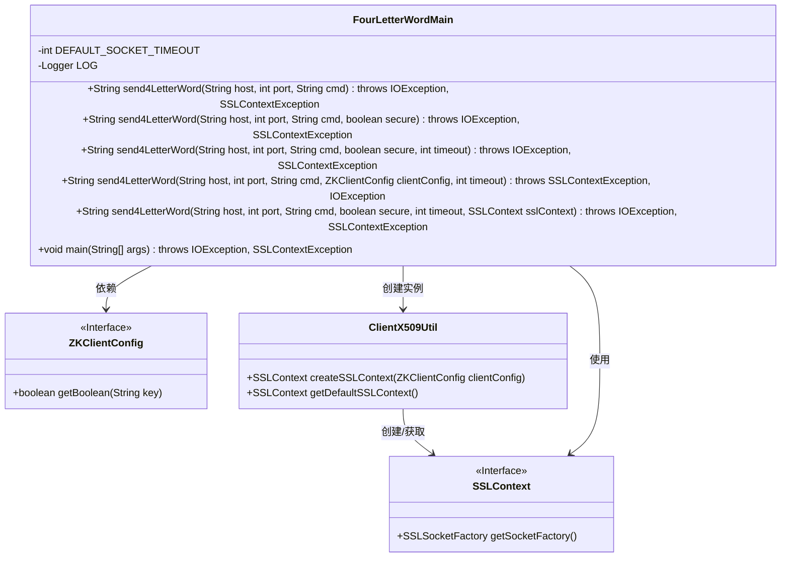

# 基础信息

|      |      |
|------|------|
| 名称 | FourLetterWordMain |
| 编码语言 | .java |
| 代码路径 | zookeeper/zookeeper-server/src/main/java/org/apache/zookeeper/client/FourLetterWordMain.java |
| 包名 | org.apache.zookeeper.client |
| 依赖项 | ['java.nio.charset.StandardCharsets.UTF_8', 'java.io.BufferedReader', 'java.io.IOException', 'java.io.InputStreamReader', 'java.io.OutputStream', 'java.net.InetAddress', 'java.net.InetSocketAddress', 'java.net.Socket', 'java.net.SocketTimeoutException', 'javax.net.ssl.SSLContext', 'javax.net.ssl.SSLSocket', 'javax.net.ssl.SSLSocketFactory', 'org.apache.yetus.audience.InterfaceAudience', 'org.apache.zookeeper.common.ClientX509Util', 'org.apache.zookeeper.common.X509Exception.SSLContextException', 'org.apache.zookeeper.common.X509Util', 'org.slf4j.Logger', 'org.slf4j.LoggerFactory'] |
| 概述说明 | FourLetterWordMain类提供发送四字母命令到指定主机和端口的功能，支持SSL和超时设置，返回服务器响应。 |

# 说明

FourLetterWordMain是一个公开类，提供发送四字母命令到指定主机和端口的功能。主要方法send4LetterWord支持多种参数组合，包括主机、端口、命令、是否使用SSL、超时时间和SSL上下文。默认超时时间为5000毫秒。方法内部处理Socket连接，支持普通和SSL加密通信，读取服务器响应并返回。若参数不足，主方法会提示使用方式。异常处理包括IO和SSLContext异常。

# 类列表 Class Summary

| 名称   | 类型  | 说明 |
|-------|------|-------------|
| FourLetterWordMain | class | 公开类FourLetterWordMain提供发送四字母命令功能，支持SSL和超时设置，返回服务器响应。 |

## 类 FourLetterWordMain

|      |      |
|------|------|
| 访问范围 | @InterfaceAudience.Public;public |
| 类型 | class |
| 名称 | FourLetterWordMain |
| 说明 | 公开类FourLetterWordMain提供发送四字母命令功能，支持SSL和超时设置，返回服务器响应。 |

### UML类图

这段代码描述了一个用于发送四字母命令的工具类FourLetterWordMain，主要用于与ZooKeeper服务器进行简单通信。该类提供多个重载方法，支持普通/SSL加密连接、超时设置和自定义SSL配置，核心功能是通过Socket发送命令并获取响应。通过ZKClientConfig接口和ClientX509Util类实现SSL安全连接配置，最终使用SSLContext建立加密通道。代码结构清晰展示了网络通信、安全配置和异常处理的完整流程。

### 内部方法调用关系图

```mermaid
graph TD
    A["类FourLetterWordMain"]
    B["常量: DEFAULT_SOCKET_TIMEOUT = 5000"]
    C["Logger: LOG"]
    D["方法: send4LetterWord(host,port,cmd) --> 调用send4LetterWord(host,port,cmd,false,DEFAULT_SOCKET_TIMEOUT)"]
    E["方法: send4LetterWord(host,port,cmd,secure) --> 调用send4LetterWord(host,port,cmd,secure,DEFAULT_SOCKET_TIMEOUT)"]
    F["方法: send4LetterWord(host,port,cmd,secure,timeout) --> 调用send4LetterWord(host,port,cmd,secure,timeout,null)"]
    G["方法: send4LetterWord(host,port,cmd,clientConfig,timeout) --> 处理SSL配置并调用send4LetterWord(host,port,cmd,useSecure,timeout,sslContext)"]
    H["核心方法: send4LetterWord(host,port,cmd,secure,timeout,sslContext) --> 实现网络连接、数据发送/接收和异常处理"]
    I["main方法: 处理命令行参数并调用对应send4LetterWord方法"]

    A --> B
    A --> C
    A --> D
    A --> E
    A --> F
    A --> G
    A --> H
    A -.-> I
    H --> J["创建Socket连接"]
    H --> K["配置SSL/TLS(如需要)"]
    H --> L["设置Socket参数"]
    H --> M["发送命令数据"]
    H --> N["读取服务器响应"]
    H --> O["异常处理和资源释放"]
```

该流程图展示了FourLetterWordMain类的完整结构，重点描述了多个重载的send4LetterWord方法之间的调用关系。核心方法实现了网络连接建立（支持普通和SSL两种模式）、四字母命令发送、服务器响应接收以及完善的异常处理机制。所有方法最终都会路由到包含完整参数的核心实现方法，体现了良好的代码复用设计。main方法作为入口点，根据参数数量选择不同的重载方法进行调用。

### 字段列表 Field List

| 名称  | 类型  | 说明 |
|-------|-------|------|
| LOG = LoggerFactory.getLogger(FourLetterWordMain.class) | Logger | 声明一个受保护的静态常量日志记录器，用于FourLetterWordMain类的日志输出。 |
| DEFAULT_SOCKET_TIMEOUT = 5000 | int | 定义默认Socket超时时间为5000毫秒。 |

### 方法列表 Method List

| 名称  | 类型  | 说明 |
|-------|-------|------|
| send4LetterWord | String | 这是一个Java静态方法，用于发送四字母命令到指定主机和端口，支持安全连接和超时设置，可能抛出IO和SSL异常。 |
| send4LetterWord | String | 静态方法send4LetterWord通过指定主机、端口和命令发送四字母指令，默认无SSL且使用默认超时，可能抛出IO或SSL异常。 |
| send4LetterWord | String | 静态方法send4LetterWord通过指定主机、端口、命令和安全标志发送四字母命令，默认超时，可能抛出IO和SSL异常。 |
| send4LetterWord | String | 发送四字母命令到指定主机和端口，支持安全连接配置，包含超时和SSL处理。 |
| send4LetterWord | String | 发送四字命令到指定主机端口，支持安全连接和超时设置，返回响应数据。处理异常并确保资源释放。 |
| main | void | Java主方法，根据参数数量调用send4LetterWord方法，参数不足时输出用法提示。 |

