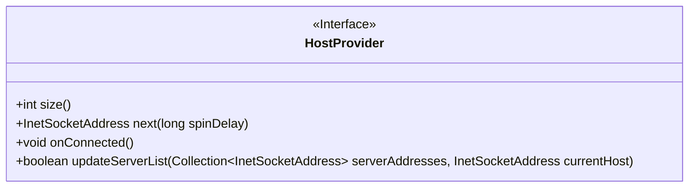
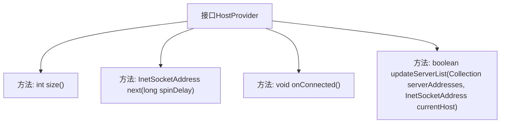

# 基础信息

|      |      |
|------|------|
| 名称 | HostProvider |
| 编码语言 | .java |
| 代码路径 | zookeeper/zookeeper-server/src/main/java/org/apache/zookeeper/client/HostProvider.java |
| 包名 | org.apache.zookeeper.client |
| 依赖项 | ['java.net.InetSocketAddress', 'java.util.Collection', 'org.apache.yetus.audience.InterfaceAudience'] |
| 概述说明 | 公共接口HostProvider提供主机连接管理功能，包括获取主机数量、轮询下一个主机地址（支持延迟控制）、通知连接成功及更新主机列表（返回负载均衡需求）。 |

# 说明

这是一个公开的HostProvider接口，定义了主机连接管理的核心功能。接口包含四个方法：size()返回主机数量；next(long spinDelay)获取下一个连接地址，支持延迟参数；onConnected()通知连接成功以重置内部状态；updateServerList()更新主机列表并返回是否需要重新平衡负载。该接口用于管理分布式系统中的主机连接策略。

# 类列表 Class Summary

| 名称   | 类型  | 说明 |
|-------|------|-------------|
| HostProvider | interface | 公共接口HostProvider提供主机连接管理功能，包括获取主机数量、轮询下一个主机地址（支持延迟控制）、通知连接成功及更新主机列表（返回负载均衡是否需要切换连接）。 |

## 类 HostProvider

|      |      |
|------|------|
| 访问范围 | @InterfaceAudience.Public;public |
| 类型 | interface |
| 名称 | HostProvider |
| 说明 | 公共接口HostProvider提供主机连接管理功能，包括获取主机数量、轮询下一个主机地址（支持延迟控制）、通知连接成功及更新主机列表（返回负载均衡是否需要切换连接）。 |

### UML类图

该类图展示了一个名为`HostProvider`的公共接口，定义了主机提供者的核心功能。接口包含四个方法：`size()`获取主机数量，`next()`获取下一个连接地址（支持延迟参数），`onConnected()`在连接成功时重置内部状态，`updateServerList()`更新服务器列表并返回是否需要重新负载均衡。该接口主要用于管理分布式系统中主机的连接和负载均衡策略。

### 内部方法调用关系图

该流程图展示了HostProvider接口的结构及其方法关系。接口定义了四个核心方法：size()获取主机数量，next()获取下一个连接地址，onConnected()通知连接成功，updateServerList()更新服务器列表。箭头表示接口与方法间的从属关系，清晰呈现了该接口作为服务发现和负载均衡组件的核心功能，适用于分布式系统中主机连接管理的场景。

### 字段列表 Field List

| 名称  | 类型  | 说明 |
|-------|-------|------|

### 方法列表 Method List

| 名称  | 类型  | 说明 |
|-------|-------|------|
| next | InetSocketAddress | 方法next(long spinDelay)返回InetSocketAddress，用于获取下一个地址，spinDelay为延迟参数。 |
| size | int | 获取容器大小 |
| onConnected | void | 连接成功回调函数。 |
| updateServerList | boolean | 更新服务器列表方法，参数为服务器地址集合和当前主机地址，返回布尔值表示操作结果。 |

