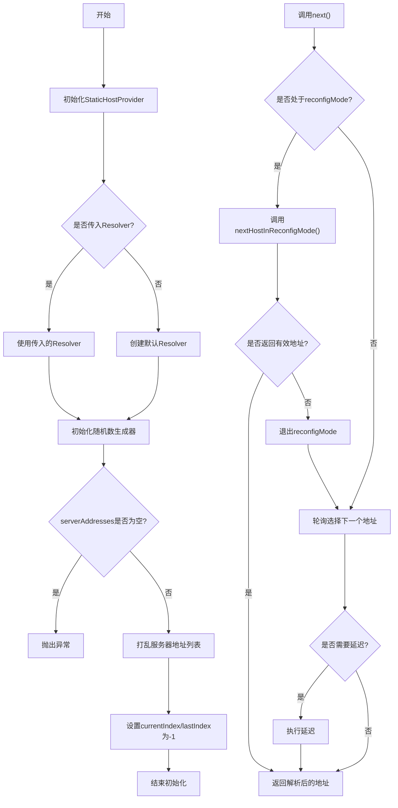
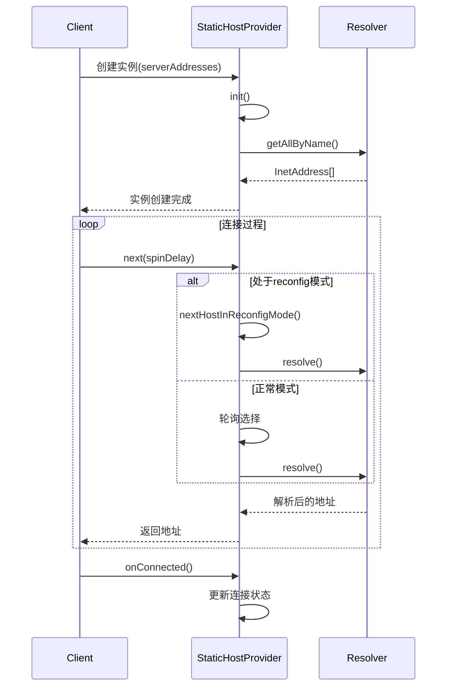
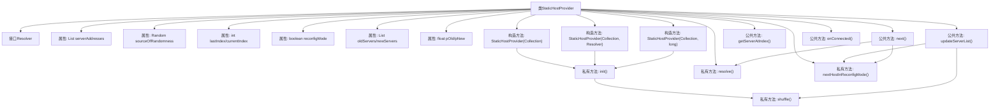

# 基础信息

|      |      |
|------|------|
| 名称 | StaticHostProvider |
| 编码语言 | .java |
| 代码路径 | zookeeper/zookeeper-server/src/main/java/org/apache/zookeeper/client/StaticHostProvider.java |
| 包名 | org.apache.zookeeper.client |
| 依赖项 | ['java.net.InetAddress', 'java.net.InetSocketAddress', 'java.net.UnknownHostException', 'java.util.ArrayList', 'java.util.Arrays', 'java.util.Collection', 'java.util.Collections', 'java.util.List', 'java.util.Random', 'org.apache.yetus.audience.InterfaceAudience', 'org.slf4j.Logger', 'org.slf4j.LoggerFactory'] |
| 概述说明 | StaticHostProvider是ZooKeeper的公共类，用于管理服务器地址列表，支持随机化和重配置模式下的负载均衡。包含地址解析、服务器列表更新及连接迁移逻辑。 |

# 说明

StaticHostProvider是一个公共的最终类，实现了HostProvider接口，用于管理ZooKeeper服务器地址列表。它包含一个内部Resolver接口用于解析主机名。类维护了服务器地址列表、随机源、当前和最后索引等状态。支持服务器列表的动态更新，通过重新配置模式实现负载均衡。提供了多个构造函数，支持自定义解析器和随机种子。核心功能包括解析地址、随机打乱服务器列表、获取下一个服务器地址等。在重新配置模式下，根据概率选择新旧服务器，确保负载均衡。当连接成功后，会退出重新配置模式。

# 类列表 Class Summary

| 名称   | 类型  | 说明 |
|-------|------|-------------|
| StaticHostProvider | class | StaticHostProvider是ZooKeeper的公共类，用于管理服务器地址列表，支持随机化、重新配置和负载均衡。包含地址解析、服务器列表更新及连接迁移功能。 |


## 类 StaticHostProvider

|      |      |
|------|------|
| 访问范围 | @InterfaceAudience.Public;public final |
| 类型 | class |
| 名称 | StaticHostProvider |
| 说明 | StaticHostProvider是ZooKeeper的公共类，用于管理服务器地址列表，支持随机化、重新配置和负载均衡。包含地址解析、服务器列表更新及连接迁移功能。 |


### UML类图

```mermaid
classDiagram
    class StaticHostProvider {
        -List~InetSocketAddress~ serverAddresses
        -Random sourceOfRandomness
        -int lastIndex
        -int currentIndex
        -boolean reconfigMode
        -List~InetSocketAddress~ oldServers
        -List~InetSocketAddress~ newServers
        -int currentIndexOld
        -int currentIndexNew
        -float pOld
        -float pNew
        -Resolver resolver
        -Logger LOG
        +StaticHostProvider(Collection~InetSocketAddress~ serverAddresses)
        +StaticHostProvider(Collection~InetSocketAddress~ serverAddresses, Resolver resolver)
        +StaticHostProvider(Collection~InetSocketAddress~ serverAddresses, long randomnessSeed)
        -init(Collection~InetSocketAddress~ serverAddresses, long randomnessSeed, Resolver resolver)
        -resolve(InetSocketAddress address) InetSocketAddress
        -shuffle(Collection~InetSocketAddress~ serverAddresses) List~InetSocketAddress~
        +updateServerList(Collection~InetSocketAddress~ serverAddresses, InetSocketAddress currentHost) boolean
        +getServerAtIndex(int i) InetSocketAddress
        +getServerAtCurrentIndex() InetSocketAddress
        +size() int
        -nextHostInReconfigMode() InetSocketAddress
        +next(long spinDelay) InetSocketAddress
        +onConnected() void
    }

    <<Interface>> StaticHostProvider.Resolver {
        +getAllByName(String name) InetAddress[]
    }
```





StaticHostProvider是一个ZooKeeper客户端使用的静态主机提供器实现，主要功能是管理服务器地址列表并提供负载均衡能力。它通过三种构造函数初始化，核心功能包括：维护服务器地址列表、在重新配置时智能切换服务器、解析主机地址以及提供轮询访问机制。类中包含Resolver接口用于解耦DNS解析逻辑，支持测试注入。特别值得注意的是其重新配置模式下的概率迁移算法，能平滑处理集群扩容/缩容时的负载均衡问题。流程图展示了初始化过程和next()方法的决策逻辑，时序图则描述了客户端交互过程。


### 内部方法调用关系图



该流程图展示了StaticHostProvider类的完整结构，包含3个构造方法、7个核心属性和8个关键方法。重点逻辑体现在updateServerList()的服务器列表更新策略和next()的主机选择算法，其中涉及reconfigMode状态切换、概率迁移计算(pOld/pNew)以及新旧服务器列表的动态管理。通过Resolver接口实现DNS解析的抽象化，整体设计支持ZooKeeper客户端的动态负载均衡和配置热更新。

### 字段列表 Field List

| 名称  | 类型  | 说明 |
|-------|-------|------|
| sourceOfRandomness | Random | 声明一个私有随机数生成器变量sourceOfRandomness。 |
| resolver | Resolver | 私有解析器实例变量resolver。 |
| LOG = LoggerFactory.getLogger(StaticHostProvider.class) | Logger | 静态主机提供者类的日志记录器声明。 |
| pNew | float | 声明两个私有浮点变量pOld和pNew。 |
| lastIndex = -1 | int | 私有整型变量lastIndex初始值为-1。 |
| currentIndexNew = -1 | int | 声明一个私有整型变量currentIndexNew，初始值为-1。 |
| currentIndex = -1 | int | 私有整型变量currentIndex初始值为-1。 |
| serverAddresses = new ArrayList<>(5) | List<InetSocketAddress> | 声明一个私有列表变量serverAddresses，初始容量为5，用于存储InetSocketAddress对象。 |
| currentIndexOld = -1 | int | 私有整型变量currentIndexOld初始值为-1。 |
| oldServers = new ArrayList<>(5) | List<InetSocketAddress> | 声明一个私有不可变的列表oldServers，初始容量为5，存储InetSocketAddress对象。 |
| newServers = new ArrayList<>(5) | List<InetSocketAddress> | 声明一个私有不可变的列表变量newServers，初始化为容量5的ArrayList，存储InetSocketAddress类型元素。 |
| reconfigMode = false | boolean | 私有布尔变量reconfigMode初始值为false。 |

### 方法列表 Method List

| 名称  | 类型  | 说明 |
|-------|-------|------|
| size | int | 同步方法返回服务器地址数量。 |
| onConnected | void | 方法onConnected同步执行，更新lastIndex为currentIndex，并关闭reconfigMode。 |
| nextHostInReconfigMode | InetSocketAddress | 方法在重新配置模式下选择下一个主机：优先按概率选新服务器，若无可选则选旧服务器，无可用时返回null。 |
| getServerAtCurrentIndex | InetSocketAddress | 方法getServerAtCurrentIndex同步返回当前索引对应的服务器地址，调用getServerAtIndex实现。 |
| shuffle | List<InetSocketAddress> | 该方法将输入的服务器地址集合打乱顺序后返回新列表。先创建新列表并复制原数据，再用随机源打乱顺序，最后返回乱序列表。 |
| resolve | InetSocketAddress | 解析InetSocketAddress地址，若解析失败返回原地址；成功则随机返回解析后的地址列表中的一项，保持端口不变。异常时记录错误日志。 |
| init | void | 初始化方法，设置随机源和解析器，检查服务器地址非空后打乱顺序，初始化当前和最后索引为-1。 |
| getServerAtIndex | InetSocketAddress | 同步方法获取指定索引的服务器地址，索引无效返回null。 |
| updateServerList | boolean | 同步方法updateServerList更新服务器列表，处理客户端重连逻辑。检查当前服务器是否在新列表中，根据新旧服务器数量调整连接策略，返回是否处于重配置模式。 |
| next | InetSocketAddress | 方法next在同步块中轮询服务器地址列表，处理重配置模式下的地址选择，必要时休眠spinDelay毫秒，最后返回解析后的地址。 |


