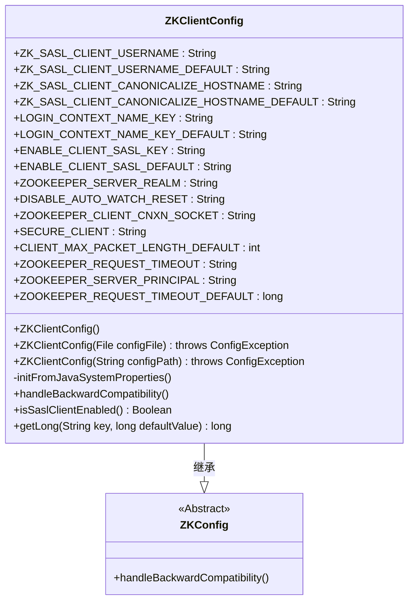
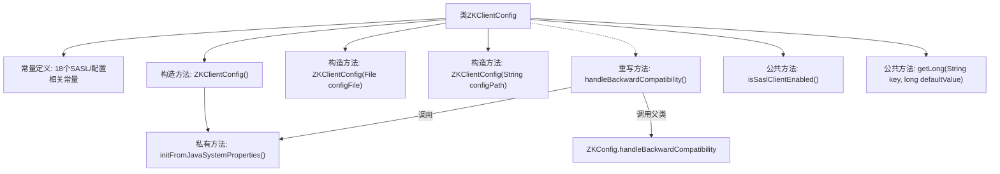

# 基础信息

|      |      |
|------|------|
| 名称 | ZKClientConfig |
| 编码语言 | .java |
| 代码路径 | zookeeper/zookeeper-server/src/main/java/org/apache/zookeeper/client/ZKClientConfig.java |
| 包名 | org.apache.zookeeper.client |
| 依赖项 | ['java.io.File', 'org.apache.yetus.audience.InterfaceAudience', 'org.apache.zookeeper.ZooKeeper', 'org.apache.zookeeper.common.ZKConfig', 'org.apache.zookeeper.server.quorum.QuorumPeerConfig.ConfigException'] |
| 概述说明 | ZKClientConfig类扩展ZKConfig，提供ZooKeeper客户端配置，包括SASL认证、超时设置、安全通信等参数，支持系统属性初始化和向后兼容处理。 |

# 说明

ZKClientConfig是ZooKeeper客户端配置类，继承自ZKConfig。它定义了多个客户端相关属性，包括SASL认证参数（如用户名、主机名规范化）、登录上下文名称、自动重置监视开关、安全连接标志等。类提供三种构造方式：默认构造、基于文件或路径加载配置。初始化时会从系统属性读取ZOOKEEPER_REQUEST_TIMEOUT等参数，并处理向后兼容性。包含isSaslClientEnabled方法检查SASL是否启用，以及getLong方法获取长整型配置值。默认请求超时为0，客户端最大数据包限制为1MB。

# 类列表 Class Summary

| 名称   | 类型  | 说明 |
|-------|------|-------------|
| ZKClientConfig | class | ZKClientConfig类扩展ZKConfig，管理ZooKeeper客户端配置，包括SASL认证、超时设置、安全连接等，支持系统属性初始化和向后兼容。 |

## 类 ZKClientConfig

|      |      |
|------|------|
| 访问范围 | @InterfaceAudience.Public;public |
| 类型 | class |
| 名称 | ZKClientConfig |
| 说明 | ZKClientConfig类扩展ZKConfig，管理ZooKeeper客户端配置，包括SASL认证、超时设置、安全连接等，支持系统属性初始化和向后兼容。 |

### UML类图

这段代码展示了一个ZooKeeper客户端配置类ZKClientConfig，它继承自抽象基类ZKConfig。该类主要处理与ZooKeeper客户端相关的各种配置参数，包括SASL认证、连接超时、安全设置等。通过常量定义了多个配置键及其默认值，提供了三种构造函数来初始化配置（默认、文件路径、配置文件对象），并实现了从系统属性初始化配置的方法。特别值得注意的是它处理了向后兼容性，并提供了获取长整型配置值的实用方法。这个类在ZooKeeper客户端中扮演着集中管理所有客户端配置参数的角色。

### 内部方法调用关系图

该流程图展示了ZKClientConfig类的完整结构，包含18个SASL认证和客户端配置相关的常量定义，3个不同参数的构造方法，以及初始化系统属性、处理向后兼容性、检查SASL启用状态和获取长整型配置值等核心方法。特别值得注意的是handleBackwardCompatibility方法同时调用了父类方法和本地的属性初始化方法，体现了配置参数的继承体系。所有方法都围绕ZooKeeper客户端配置管理这一核心职责展开。

### 字段列表 Field List

| 名称  | 类型  | 说明 |
|-------|-------|------|
| CLIENT_MAX_PACKET_LENGTH_DEFAULT = 0xfffff | int | 客户端默认最大数据包长度为1,048,575字节。 |
| ZOOKEEPER_REQUEST_TIMEOUT = "zookeeper.request.timeout" | String | ZOOKEEPER_REQUEST_TIMEOUT是定义ZooKeeper请求超时的静态常量字符串。 |
| ENABLE_CLIENT_SASL_DEFAULT = ZooKeeperSaslClient.ENABLE_CLIENT_SASL_DEFAULT | String | 代码定义了一个弃用警告的静态常量，其默认值来自ZooKeeperSaslClient的同名常量。 |
| LOGIN_CONTEXT_NAME_KEY = ZooKeeperSaslClient.LOGIN_CONTEXT_NAME_KEY | String | 弃用警告的静态常量LOGIN_CONTEXT_NAME_KEY，引用自ZooKeeperSaslClient的同名字段。 |
| ENABLE_CLIENT_SASL_KEY = ZooKeeperSaslClient.ENABLE_CLIENT_SASL_KEY | String | 废弃警告的静态常量，引用ZooKeeperSaslClient的ENABLE_CLIENT_SASL_KEY。 |
| ZK_SASL_CLIENT_CANONICALIZE_HOSTNAME_DEFAULT = "true" | String | ZK客户端SASL默认启用主机名规范化，值为"true"。 |
| ZK_SASL_CLIENT_USERNAME = "zookeeper.sasl.client.username" | String | ZK客户端SASL认证用户名配置项。 |
| LOGIN_CONTEXT_NAME_KEY_DEFAULT = "Client" | String | 静态常量LOGIN_CONTEXT_NAME_KEY_DEFAULT值为"Client"，用于默认登录上下文名称。 |
| ZOOKEEPER_CLIENT_CNXN_SOCKET = ZooKeeper.ZOOKEEPER_CLIENT_CNXN_SOCKET | String | 废弃警告的静态常量ZOOKEEPER_CLIENT_CNXN_SOCKET，引用自ZooKeeper类。 |
| ZOOKEEPER_SERVER_REALM = "zookeeper.server.realm" | String | 这是一个Java静态常量，定义ZooKeeper服务器的认证域配置键，值为"zookeeper.server.realm"。 |
| ZK_SASL_CLIENT_CANONICALIZE_HOSTNAME = "zookeeper.sasl.client.canonicalize.hostname" | String | ZK客户端SASL主机名规范化配置键。 |
| DISABLE_AUTO_WATCH_RESET = "zookeeper.disableAutoWatchReset" | String | 该代码定义了一个静态常量字符串，用于标识ZooKeeper中禁用自动监视重置的配置项。 |
| ZK_SASL_CLIENT_USERNAME_DEFAULT = "zookeeper" | String | ZK默认SASL客户端用户名为"zookeeper"。 |
| SECURE_CLIENT = ZooKeeper.SECURE_CLIENT | String | 废弃警告的静态常量SECURE_CLIENT，引用自ZooKeeper.SECURE_CLIENT。 |
| ZOOKEEPER_REQUEST_TIMEOUT_DEFAULT = 0 | long | 默认ZooKeeper请求超时时间为0。 |
| ZOOKEEPER_SERVER_PRINCIPAL = "zookeeper.server.principal" | String | ZK服务器主体配置键 |

### 方法列表 Method List

| 名称  | 类型  | 说明 |
|-------|-------|------|
| handleBackwardCompatibility | void | 处理客户端和服务端共用属性的向后兼容性，并设置客户端特定属性如SASL认证、主机名规范化等系统属性。 |
| isSaslClientEnabled | boolean | 方法检查SASL客户端是否启用，返回布尔值，默认值由属性决定。 |
| getLong | long | 获取指定键的长整型值，若不存在则返回默认值。 |
| initFromJavaSystemProperties | void | 从Java系统属性初始化Zookeeper配置，设置请求超时和服务主体参数。 |

