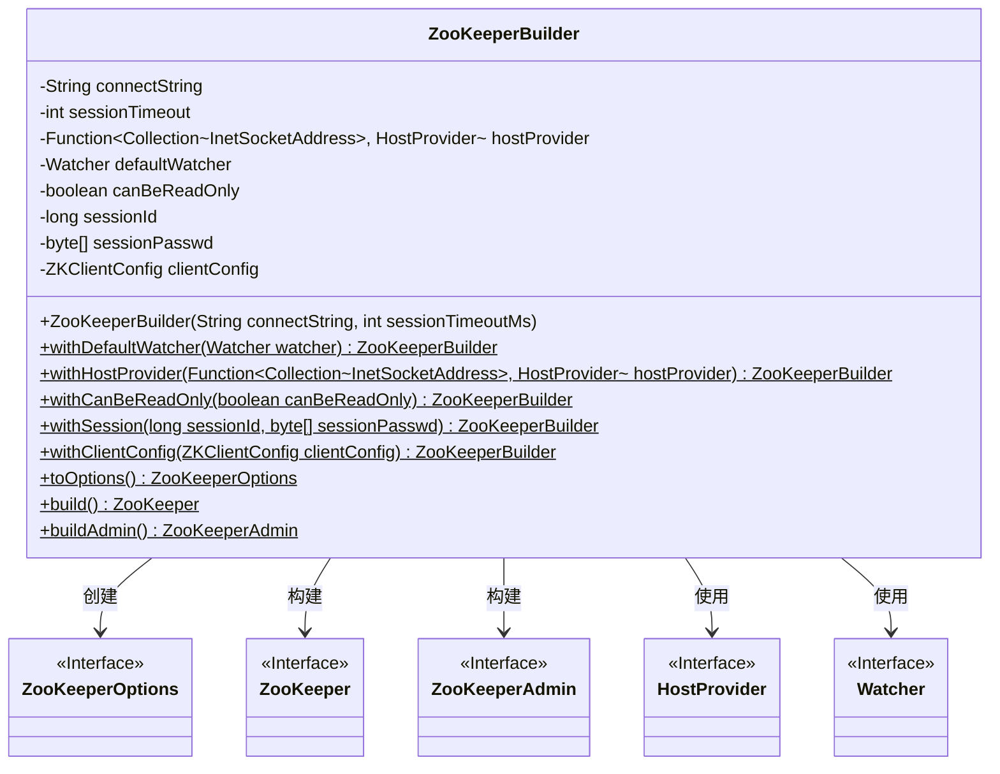

# 基础信息

|      |      |
|------|------|
| 名称 | ZooKeeperBuilder |
| 编码语言 | .java |
| 代码路径 | zookeeper/zookeeper-server/src/main/java/org/apache/zookeeper/client/ZooKeeperBuilder.java |
| 包名 | org.apache.zookeeper.client |
| 依赖项 | ['edu.umd.cs.findbugs.annotations.SuppressFBWarnings', 'java.io.IOException', 'java.net.InetSocketAddress', 'java.util.Collection', 'java.util.function.Function', 'org.apache.yetus.audience.InterfaceAudience', 'org.apache.yetus.audience.InterfaceStability', 'org.apache.zookeeper.Watcher', 'org.apache.zookeeper.ZooKeeper', 'org.apache.zookeeper.admin.ZooKeeperAdmin'] |
| 概述说明 | ZooKeeperBuilder类用于构建ZooKeeper客户端，支持设置连接字符串、会话超时、默认监视器、主机提供者、只读模式、会话ID和密码、客户端配置等选项，并提供构建ZooKeeper和ZooKeeperAdmin实例的方法。 |

# 说明

ZooKeeperBuilder是一个公开且接口可能变化的类，用于构建ZooKeeper客户端实例。它通过连接字符串和会话超时时间初始化，支持设置默认监视器、自定义主机提供者、只读模式选项、会话ID和密码以及客户端配置。提供toOptions方法生成配置对象，并可通过build和buildAdmin方法分别创建ZooKeeper和ZooKeeperAdmin实例。

# 类列表 Class Summary

| 名称   | 类型  | 说明 |
|-------|------|-------------|
| ZooKeeperBuilder | class | ZooKeeperBuilder类用于构建ZooKeeper客户端，支持设置连接字符串、会话超时、监视器、主机提供者、只读模式、会话ID和密码、客户端配置等参数，可生成ZooKeeper或ZooKeeperAdmin实例。 |

## 类 ZooKeeperBuilder

|      |      |
|------|------|
| 访问范围 | @InterfaceAudience.Public;@InterfaceStability.Evolving;public |
| 类型 | class |
| 名称 | ZooKeeperBuilder |
| 说明 | ZooKeeperBuilder类用于构建ZooKeeper客户端，支持设置连接字符串、会话超时、监视器、主机提供者、只读模式、会话ID和密码、客户端配置等参数，可生成ZooKeeper或ZooKeeperAdmin实例。 |

### UML类图

这段代码展示了一个ZooKeeperBuilder类，用于构建ZooKeeper和ZooKeeperAdmin实例。该类通过链式方法配置连接字符串、会话超时、默认监视器、主机提供者等参数，最终生成ZooKeeperOptions对象或直接构建ZooKeeper实例。类图中清晰地展示了ZooKeeperBuilder与多个接口（ZooKeeperOptions、ZooKeeper、ZooKeeperAdmin、HostProvider、Watcher）之间的依赖关系，体现了建造者模式在ZooKeeper客户端构造中的应用。

### 内部方法调用关系图

```mermaid
graph TD
    A["类ZooKeeperBuilder"]
    B["属性: String connectString"]
    C["属性: int sessionTimeout"]
    D["属性: Function<Collection<InetSocketAddress>, HostProvider> hostProvider"]
    E["属性: Watcher defaultWatcher"]
    F["属性: boolean canBeReadOnly"]
    G["属性: long sessionId"]
    H["属性: byte[] sessionPasswd"]
    I["属性: ZKClientConfig clientConfig"]
    J["构造方法: ZooKeeperBuilder(String connectString, int sessionTimeoutMs)"]
    K["方法: withDefaultWatcher(Watcher watcher)"]
    L["方法: withHostProvider(Function<Collection<InetSocketAddress>, HostProvider> hostProvider)"]
    M["方法: withCanBeReadOnly(boolean canBeReadOnly)"]
    N["方法: withSession(long sessionId, byte[] sessionPasswd)"]
    O["方法: withClientConfig(ZKClientConfig clientConfig)"]
    P["私有方法: toOptions()"]
    Q["方法: build()"]
    R["方法: buildAdmin()"]
    S["输出: new ZooKeeper(toOptions())"]
    T["输出: new ZooKeeperAdmin(toOptions())"]

    A --> B
    A --> C
    A --> D
    A --> E
    A --> F
    A --> G
    A --> H
    A --> I
    A --> J
    A --> K
    A --> L
    A --> M
    A --> N
    A --> O
    A -.-> P
    A --> Q
    A --> R
    Q --> S
    R --> T
    S --> P
    T --> P
```

这段代码定义了一个ZooKeeperBuilder类，用于构建ZooKeeper和ZooKeeperAdmin实例。通过链式调用配置连接字符串、会话超时、监视器、主机提供者等参数，最终通过toOptions()方法生成配置对象，并调用build()或buildAdmin()创建对应实例。流程图展示了类属性、构造方法、配置方法和构建方法之间的调用关系。

### 字段列表 Field List

| 名称  | 类型  | 说明 |
|-------|-------|------|
| canBeReadOnly = false | boolean | 私有布尔变量canBeReadOnly初始值为false。 |
| sessionId = 0 | long | 私有长整型变量sessionId，初始值为0。 |
| clientConfig | ZKClientConfig | 私有ZKClient配置对象。 |
| defaultWatcher | Watcher | 私有观察者默认实例变量。 |
| sessionTimeout | int | 私有整型变量sessionTimeout，用于存储会话超时时间。 |
| hostProvider | Function<Collection<InetSocketAddress>, HostProvider> | 私有函数，将InetSocketAddress集合转换为HostProvider。 |
| sessionPasswd | byte[] | 私有字节数组，存储会话密码。 |
| connectString | String | 私有字符串变量connectString，用于存储连接信息。 |

### 方法列表 Method List

| 名称  | 类型  | 说明 |
|-------|-------|------|
| withSession | ZooKeeperBuilder | ZooKeeperBuilder方法withSession设置会话ID和密码，返回自身实例。注意存在EI_EXPOSE_REP警告。 |
| withHostProvider | ZooKeeperBuilder | 公开方法ZooKeeperBuilder.withHostProvider，接受函数参数设置HostProvider，返回当前构建器实例。 |
| withCanBeReadOnly | ZooKeeperBuilder | 公开方法ZooKeeperBuilder设置可读性参数，返回自身实例。 |
| withClientConfig | ZooKeeperBuilder | 公开方法ZooKeeperBuilder withClientConfig设置客户端配置并返回当前对象实例。 |
| toOptions | ZooKeeperOptions | 私有方法toOptions返回ZooKeeperOptions对象，包含连接字符串、会话超时等配置参数。 |
| withDefaultWatcher | ZooKeeperBuilder | 公开方法ZooKeeperBuilder.withDefaultWatcher接收Watcher参数，设置默认观察器并返回当前构建器实例。 |
| build | ZooKeeper | 构建ZooKeeper实例，使用toOptions配置，可能抛出IOException异常。 |
| buildAdmin | ZooKeeperAdmin | 该方法构建并返回一个ZooKeeperAdmin实例，使用toOptions()方法生成配置选项。可能抛出IOException异常。 |

