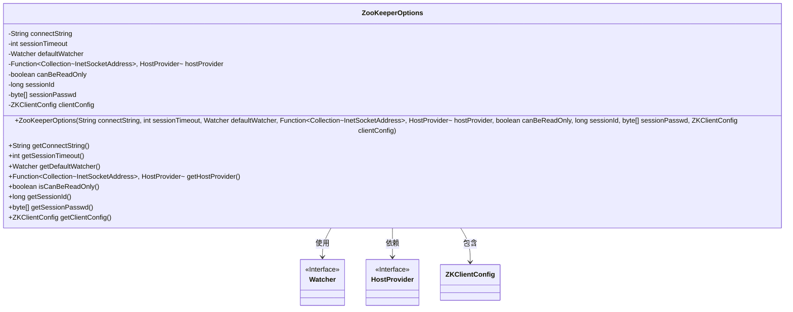

# 基础信息

|      |      |
|------|------|
| 名称 | ZooKeeperOptions |
| 编码语言 | .java |
| 代码路径 | zookeeper/zookeeper-server/src/main/java/org/apache/zookeeper/client/ZooKeeperOptions.java |
| 包名 | org.apache.zookeeper.client |
| 依赖项 | ['edu.umd.cs.findbugs.annotations.SuppressFBWarnings', 'java.net.InetSocketAddress', 'java.util.Collection', 'java.util.function.Function', 'org.apache.yetus.audience.InterfaceAudience', 'org.apache.zookeeper.Watcher'] |
| 概述说明 | ZooKeeperOptions类封装了ZooKeeper客户端的配置参数，包括连接字符串、会话超时、监视器、主机提供者、只读模式、会话ID和密码及客户端配置。 |

# 说明

ZooKeeperOptions是一个私有类，用于封装ZooKeeper客户端的配置选项。它包含连接字符串、会话超时时间、默认监视器、主机提供者函数、只读模式标志、会话ID、会话密码和客户端配置等属性。类提供了对应的getter方法以访问这些属性。构造方法接收所有配置参数并初始化内部状态。该类标记为私有，仅供内部使用。

# 类列表 Class Summary

| 名称   | 类型  | 说明 |
|-------|------|-------------|
| ZooKeeperOptions | class | ZooKeeperOptions类封装ZooKeeper客户端配置，包括连接字符串、会话超时、监视器、主机提供者、只读模式、会话ID和密码及客户端配置。提供各字段的getter方法。 |

## 类 ZooKeeperOptions

|      |      |
|------|------|
| 访问范围 | @InterfaceAudience.Private;public |
| 类型 | class |
| 名称 | ZooKeeperOptions |
| 说明 | ZooKeeperOptions类封装ZooKeeper客户端配置，包括连接字符串、会话超时、监视器、主机提供者、只读模式、会话ID和密码及客户端配置。提供各字段的getter方法。 |

### UML类图

这段代码展示了一个ZooKeeperOptions类，用于配置ZooKeeper客户端的连接参数。该类包含连接字符串、会话超时时间、默认监视器、主机提供者函数等关键配置项，通过私有字段存储并通过公有方法暴露这些配置。类图中清晰地展示了与Watcher接口、HostProvider接口以及ZKClientConfig类的关系，体现了配置参数的封装性和扩展性。

### 内部方法调用关系图

```mermaid
graph TD
    A["类ZooKeeperOptions"]
    B["属性: String connectString"]
    C["属性: int sessionTimeout"]
    D["属性: Watcher defaultWatcher"]
    E["属性: Function<Collection<InetSocketAddress>, HostProvider> hostProvider"]
    F["属性: boolean canBeReadOnly"]
    G["属性: long sessionId"]
    H["属性: byte[] sessionPasswd"]
    I["属性: ZKClientConfig clientConfig"]
    J["构造方法: ZooKeeperOptions(8参数)"]
    K["方法: getConnectString()"]
    L["方法: getSessionTimeout()"]
    M["方法: getDefaultWatcher()"]
    N["方法: getHostProvider()"]
    O["方法: isCanBeReadOnly()"]
    P["方法: getSessionId()"]
    Q["方法: getSessionPasswd()"]
    R["方法: getClientConfig()"]

    A --> B
    A --> C
    A --> D
    A --> E
    A --> F
    A --> G
    A --> H
    A --> I
    A --> J
    A --> K
    A --> L
    A --> M
    A --> N
    A --> O
    A --> P
    A --> Q
    A --> R
```

该流程图展示了ZooKeeperOptions类的完整结构，包含8个私有属性和对应的getter方法。类通过构造方法初始化所有属性，每个属性都有对应的访问方法。特别注意sessionPasswd方法带有安全警告注解，表明直接返回数组引用可能存在风险。该类设计用于封装ZooKeeper客户端的配置选项，所有属性均为final确保线程安全，典型的使用场景是构建ZooKeeper客户端连接时的参数传递。

### 字段列表 Field List

| 名称  | 类型  | 说明 |
|-------|-------|------|
| sessionTimeout | int | 私有整型变量sessionTimeout，用于存储会话超时时间。 |
| defaultWatcher | Watcher | 私有常量默认监视器实例。 |
| canBeReadOnly | boolean | 私有布尔变量，标识是否只读。 |
| clientConfig | ZKClientConfig | 私有ZKClientConfig类型的clientConfig变量。 |
| sessionId | long | 私有长整型会话ID变量。 |
| sessionPasswd | byte[] | 私有字节数组，存储会话密码。 |
| hostProvider | Function<Collection<InetSocketAddress>, HostProvider> | 私有成员hostProvider，类型为函数，输入为InetSocketAddress集合，输出HostProvider实例。 |
| connectString | String | 私有字符串变量connectString，用于存储连接信息。 |

### 方法列表 Method List

| 名称  | 类型  | 说明 |
|-------|-------|------|
| getClientConfig | ZKClientConfig | 方法getClientConfig返回ZKClientConfig对象clientConfig。 |
| isCanBeReadOnly | boolean | 该方法返回布尔值canBeReadOnly，表示对象是否可设为只读。 |
| getDefaultWatcher | Watcher | 方法返回默认监视器对象defaultWatcher。 |
| getSessionTimeout | int | 方法getSessionTimeout返回sessionTimeout的整数值。 |
| getSessionPasswd | byte[] | 代码片段定义了一个公共方法getSessionPasswd，返回字节数组sessionPasswd。方法带有SuppressFBWarnings注解，忽略EI_EXPOSE_REP和EI_EXPOSE_REP2警告。 |
| getConnectString | String | 方法返回连接字符串。 |
| getSessionId | long | 获取当前会话ID的方法，返回长整型数值sessionId。 |
| getHostProvider | Function<Collection<InetSocketAddress>, HostProvider> | 方法getHostProvider返回一个函数，该函数将InetSocketAddress集合转换为HostProvider对象。 |

