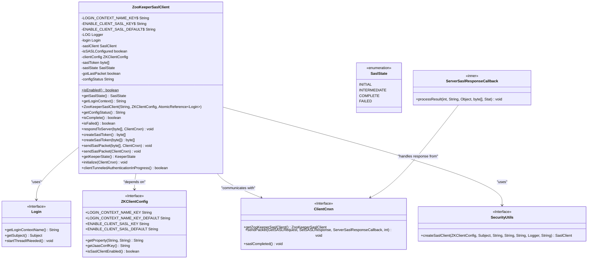
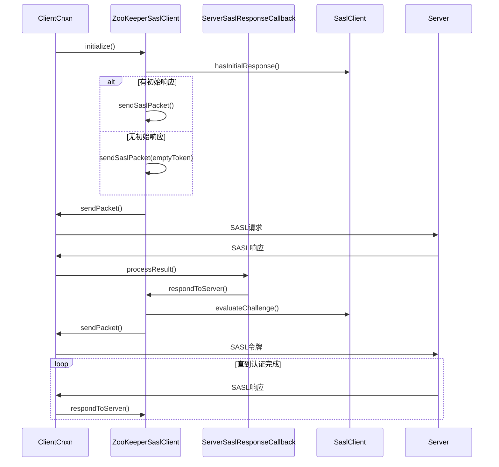

# 基础信息

|      |      |
|------|------|
| 名称 | ZooKeeperSaslClient |
| 编码语言 | .java |
| 代码路径 | zookeeper/zookeeper-server/src/main/java/org/apache/zookeeper/client/ZooKeeperSaslClient.java |
| 包名 | org.apache.zookeeper.client |
| 依赖项 | ['java.io.IOException', 'java.security.PrivilegedActionException', 'java.security.PrivilegedExceptionAction', 'java.util.concurrent.atomic.AtomicReference', 'java.util.function.Supplier', 'javax.security.auth.Subject', 'javax.security.auth.callback.CallbackHandler', 'javax.security.auth.login.AppConfigurationEntry', 'javax.security.auth.login.Configuration', 'javax.security.auth.login.LoginException', 'javax.security.sasl.SaslClient', 'javax.security.sasl.SaslException', 'org.apache.zookeeper.AsyncCallback', 'org.apache.zookeeper.ClientCnxn', 'org.apache.zookeeper.Login', 'org.apache.zookeeper.SaslClientCallbackHandler', 'org.apache.zookeeper.Watcher.Event.KeeperState', 'org.apache.zookeeper.ZooDefs', 'org.apache.zookeeper.data.Stat', 'org.apache.zookeeper.proto.GetSASLRequest', 'org.apache.zookeeper.proto.SetSASLResponse', 'org.apache.zookeeper.util.SecurityUtils', 'org.slf4j.Logger', 'org.slf4j.LoggerFactory'] |
| 概述说明 | ZooKeeperSaslClient类处理ZooKeeper客户端的SASL认证，包含状态管理、认证流程及错误处理。已弃用部分配置项，推荐使用ZKClientConfig替代。支持JAAS配置，提供认证状态查询和响应服务器功能。 |

# 说明

ZooKeeperSaslClient类实现了ZooKeeper客户端SASL认证功能。它包含多个已弃用的静态常量，建议改用ZKClientConfig中的对应配置项。主要功能包括：通过JAAS配置创建SaslClient，处理与服务器的SASL令牌交换，管理认证状态（INITIAL/INTERMEDIATE/COMPLETE/FAILED）。类中定义了ServerSaslResponseCallback回调处理服务器响应，提供方法检查认证状态（isComplete/isFailed）。初始化时会读取JAAS配置，若未找到配置且用户未显式指定则视为非错误状态。支持GSSAPI等机制，处理认证过程中的异常，并通过ClientCnxn发送SASL数据包。

# 类列表 Class Summary

| 名称   | 类型  | 说明 |
|-------|------|-------------|
| ZooKeeperSaslClient | class | ZooKeeperSaslClient类用于处理ZooKeeper客户端的SASL认证，包含状态管理、令牌生成和通信逻辑。已弃用部分常量，推荐使用ZKClientConfig类。支持JAAS配置，处理认证流程中的异常和状态转换。 |

## 类 ZooKeeperSaslClient

|      |      |
|------|------|
| 访问范围 | public |
| 类型 | class |
| 名称 | ZooKeeperSaslClient |
| 说明 | ZooKeeperSaslClient类用于处理ZooKeeper客户端的SASL认证，包含状态管理、令牌生成和通信逻辑。已弃用部分常量，推荐使用ZKClientConfig类。支持JAAS配置，处理认证流程中的异常和状态转换。 |

### UML类图

这段代码描述了一个ZooKeeper SASL客户端实现，用于处理ZooKeeper服务器的SASL认证流程。主要类ZooKeeperSaslClient包含认证状态管理、令牌生成和通信逻辑，通过ZKClientConfig获取配置，与ClientCnxn交互发送认证数据，使用SecurityUtils创建SASL客户端。该实现支持多种认证状态（INITIAL/INTERMEDIATE/COMPLETE/FAILED），并处理JAAS配置异常和Kerberos认证等复杂场景。

### 内部方法调用关系图

```mermaid
graph TD
    A["类ZooKeeperSaslClient"]
    B["常量: LOGIN_CONTEXT_NAME_KEY"]
    C["常量: ENABLE_CLIENT_SASL_KEY"]
    D["常量: ENABLE_CLIENT_SASL_DEFAULT"]
    E["方法: isEnabled()"]
    F["方法: getSaslState()"]
    G["方法: getLoginContext()"]
    H["构造方法: ZooKeeperSaslClient()"]
    I["方法: getConfigStatus()"]
    J["方法: isComplete()"]
    K["方法: isFailed()"]
    L["内部类: ServerSaslResponseCallback"]
    M["方法: createSaslClient()"]
    N["方法: respondToServer()"]
    O["方法: createSaslToken()"]
    P["方法: sendSaslPacket()"]
    Q["方法: getKeeperState()"]
    R["方法: initialize()"]
    S["方法: clientTunneledAuthenticationInProgress()"]

    A --> B
    A --> C
    A --> D
    A --> E
    A --> F
    A --> G
    A --> H
    A --> I
    A --> J
    A --> K
    A --> L
    A --> M
    A --> N
    N --> O
    N --> P
    A --> Q
    A --> R
    A --> S
```

这段代码实现了ZooKeeper客户端的SASL认证功能，包含完整的认证状态机处理、异常处理机制和与服务器的交互流程。流程图展示了类的主要结构和内部调用关系，时序图详细描述了从初始化到完成认证的完整过程，包括条件分支和循环交互。代码通过多种状态（INITIAL/INTERMEDIATE/COMPLETE/FAILED）管理认证流程，并处理JAAS配置、令牌生成、网络通信等关键环节，同时考虑了各种异常情况和日志记录。

### 字段列表 Field List

| 名称  | 类型  | 说明 |
|-------|-------|------|
| LOG = LoggerFactory.getLogger(ZooKeeperSaslClient.class) | Logger | ZooKeeperSaslClient类中定义了一个私有静态日志记录器LOG，用于记录日志信息。 |
| saslToken = new byte[0] | byte[] | 声明一个私有字节数组saslToken，初始化为空数组。 |
| ENABLE_CLIENT_SASL_KEY = "zookeeper.sasl.client" | String | 废弃的静态常量：ENABLE_CLIENT_SASL_KEY，用于ZooKeeper客户端SASL配置。 |
| ENABLE_CLIENT_SASL_DEFAULT = "true" | String | 
已弃用的公共静态常量，默认启用客户端SASL认证，值为"true"。 |
| saslState = SaslState.INITIAL | SaslState | 私有变量saslState初始化为SaslState.INITIAL状态。 |
| gotLastPacket = false | boolean | 私有布尔变量gotLastPacket初始值为false，用于标记是否收到最后的数据包。 |
| LOGIN_CONTEXT_NAME_KEY = "zookeeper.sasl.clientconfig" | String | 废弃的静态常量，原用于ZooKeeper SASL客户端配置的登录上下文名称键。 |
| isSASLConfigured = true | boolean | 私有布尔变量isSASLConfigured初始值为true，表示SASL已配置。 |
| login = null | Login | 声明一个私有Login类型变量login，初始值为null。 |
| clientConfig | ZKClientConfig | 私有不可变的ZKClientConfig客户端配置对象。 |
| configStatus | String | 私有字符串变量configStatus，用于存储配置状态。 |
| saslClient | SaslClient | 私有SaslClient实例变量saslClient。 |

### 方法列表 Method List

| 名称  | 类型  | 说明 |
|-------|-------|------|
| isComplete | boolean | 检查SASL状态是否完成，返回布尔值。 |
| isEnabled | boolean | 废弃方法isEnabled，通过系统属性ZKClientConfig.ENABLE_CLIENT_SASL_KEY获取布尔值，默认使用ZKClientConfig.ENABLE_CLIENT_SASL_DEFAULT。 |
| sendSaslPacket | void | 方法sendSaslPacket发送SASL认证包，包含令牌创建、请求响应设置及异常处理，失败时抛出SaslException。 |
| createSaslClient | SaslClient | 创建SASL客户端方法，检查登录状态，初始化JAAS登录并启动线程，处理异常返回SASL客户端或null。 |
| getSaslState | SaslState | 方法getSaslState返回当前SASL状态saslState。 |
| clientTunneledAuthenticationInProgress | boolean | 方法检查客户端是否正在进行SASL认证：若未配置SASL返回false；若配置有效且认证未完成或未收到最后数据包返回true；其他情况或异常返回false。 |
| initialize | void | 方法initialize初始化SASL客户端，检查saslClient非空且状态为INITIAL时发送空令牌或SASL包，状态转为INTERMEDIATE，失败则抛出异常。 |
| createSaslToken | byte[] | 方法createSaslToken生成SASL令牌，更新状态为INTERMEDIATE，返回处理后的令牌。 |
| getLoginContext | String | 方法getLoginContext检查login对象是否非空，非空则返回其登录上下文名称，否则返回null。 |
| respondToServer | void | 方法响应服务器SASL认证请求。若saslClient为空则报错返回。未完成认证时尝试生成并发送令牌，失败则记录错误并标记状态。认证完成后根据机制类型处理最终包，并启用套接字可写标志。 |
| sendSaslPacket | void | 发送SASL认证包，包含令牌处理、请求响应设置及异常捕获。 |
| getConfigStatus | String | 获取配置状态的方法，返回字符串类型的状态值。 |
| isFailed | boolean | 方法isFailed检查saslState是否为FAILED状态，返回布尔值。 |
| createSaslToken | byte[] | 方法`createSaslToken`处理SASL认证：若输入令牌为空则抛出异常；使用`Subject.doAs`执行认证，失败时提供诊断提示并设置状态为`FAILED`；未定义`subject`时直接报错。 |
| getKeeperState | KeeperState | 方法getKeeperState检查SASL认证状态：若失败返回AuthFailed；若完成且状态为INTERMEDIATE则更新为COMPLETE并返回SaslAuthenticated；否则返回null。 |

