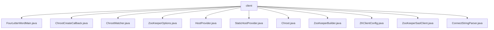

# 基础信息

|      |      |
|------|------|
| 名称 | client |
| 编码语言 | .java |
| 代码路径 | zookeeper/zookeeper-server/src/main/java/org/apache/zookeeper/client |
| 包名 | zookeeper.docs.zookeeper-server.src.main.java.org.apache.zookeeper.client |
| 概述说明 | FourLetterWordMain类发送四字母命令到主机端口。ChrootCreateCallback处理回调路径。ChrootWatcher转换监视事件路径。ZooKeeperOptions封装客户端配置。HostProvider管理主机连接。StaticHostProvider实现主机列表管理。Chroot处理路径前缀。ZooKeeperBuilder构建客户端实例。ZKClientConfig配置客户端参数。ZooKeeperSaslClient实现SASL认证。ConnectStringParser解析连接字符串。 |

# 说明

## 概述  
1. 该模块是ZooKeeper客户端核心组件，负责分布式协调服务的连接管理、路径处理和命令交互。  
2. 主要接口包括HostProvider（主机选择策略）、Chroot（路径前缀处理）和AsyncCallback（异步回调），例如StaticHostProvider实现轮询式主机选择。  
3. 关键数据结构包含ConnectStringParser解析的连接地址列表、ZKClientConfig存储的客户端配置项，以及ZooKeeperOptions封装的会话参数。  
4. 依赖Java原生Socket和SSL库实现网络通信，例如FourLetterWordMain通过SSLContext支持加密命令传输。  

## 主要业务场景  
1. 支持客户端初始化流程，例如ZooKeeperBuilder通过链式调用构建会话参数，最终创建ZooKeeperAdmin实例。  
2. 采用异步回调机制处理节点操作，如ChrootCreateCallback在回调前自动处理路径前缀，类似文件系统的挂载点转换。  
3. 功能覆盖基础连接、SASL认证（ZooKeeperSaslClient）、监控事件转发（ChrootWatcher）等，但部分接口标记为@Unstable表明尚在演进。  
4. 典型场景包括集群连接管理（HostProvider）、运维指令发送（FourLetterWordMain），以及IDE插件通过ClientConfig集成。

### 包内部结构视图

该流程图展示了Zookeeper客户端模块下的文件结构关系，所有Java文件都直接隶属于client节点，共包含11个具体实现类文件，涉及客户端连接、配置、回调处理等核心功能组件。

# 文件列表 File List

| 名称   | 类型  | 说明 |
|-------|------|-------------|
| [FourLetterWordMain.java](FourLetterWordMain.md) | file | FourLetterWordMain类提供发送四字母命令到指定主机和端口的功能，支持SSL和超时设置，返回服务器响应。 |
| [ZooKeeperBuilder.java](ZooKeeperBuilder.md) | file | ZooKeeperBuilder类用于构建ZooKeeper客户端，支持设置连接字符串、会话超时、默认监视器、主机提供者、只读模式、会话ID和密码、客户端配置等选项，并提供构建ZooKeeper和ZooKeeperAdmin实例的方法。 |
| [Chroot.java](Chroot.md) | file | Chroot接口提供路径处理功能，包含Root和NotRoot两个实现类。Root类直接返回原路径，NotRoot类处理路径前缀添加和剥离，并支持回调拦截和观察器拦截。 |
| [HostProvider.java](HostProvider.md) | file | 公共接口HostProvider提供主机连接管理功能，包括获取主机数量、轮询下一个主机地址（支持延迟控制）、通知连接成功及更新主机列表（返回负载均衡需求）。 |
| [ZooKeeperOptions.java](ZooKeeperOptions.md) | file | ZooKeeperOptions类封装了ZooKeeper客户端的配置参数，包括连接字符串、会话超时、监视器、主机提供者、只读模式、会话ID和密码及客户端配置。 |
| [ChrootWatcher.java](ChrootWatcher.md) | file | ChrootWatcher是私有类，封装了Chroot.NotRoot和Watcher，重写equals、hashCode和process方法，处理路径转换后转发事件。 |
| [ChrootCreateCallback.java](ChrootCreateCallback.md) | file | ChrootCreateCallback类实现两个回调接口，处理路径创建结果，通过chroot对象处理路径名称后转发给原始回调。 |
| [ConnectStringParser.java](ConnectStringParser.md) | file | ConnectStringParser解析ZooKeeper连接字符串，提取chroot路径和服务器地址列表，支持IPv6和默认端口2181。 |
| [ZooKeeperSaslClient.java](ZooKeeperSaslClient.md) | file | ZooKeeperSaslClient类处理ZooKeeper客户端的SASL认证，包含状态管理、认证流程及错误处理。已弃用部分配置项，推荐使用ZKClientConfig替代。支持JAAS配置，提供认证状态查询和响应服务器功能。 |
| [ZKClientConfig.java](ZKClientConfig.md) | file | ZKClientConfig类扩展ZKConfig，提供ZooKeeper客户端配置，包括SASL认证、超时设置、安全通信等参数，支持系统属性初始化和向后兼容处理。 |
| [StaticHostProvider.java](StaticHostProvider.md) | file | StaticHostProvider是ZooKeeper的公共类，用于管理服务器地址列表，支持随机化和重配置模式下的负载均衡。包含地址解析、服务器列表更新及连接迁移逻辑。 |

