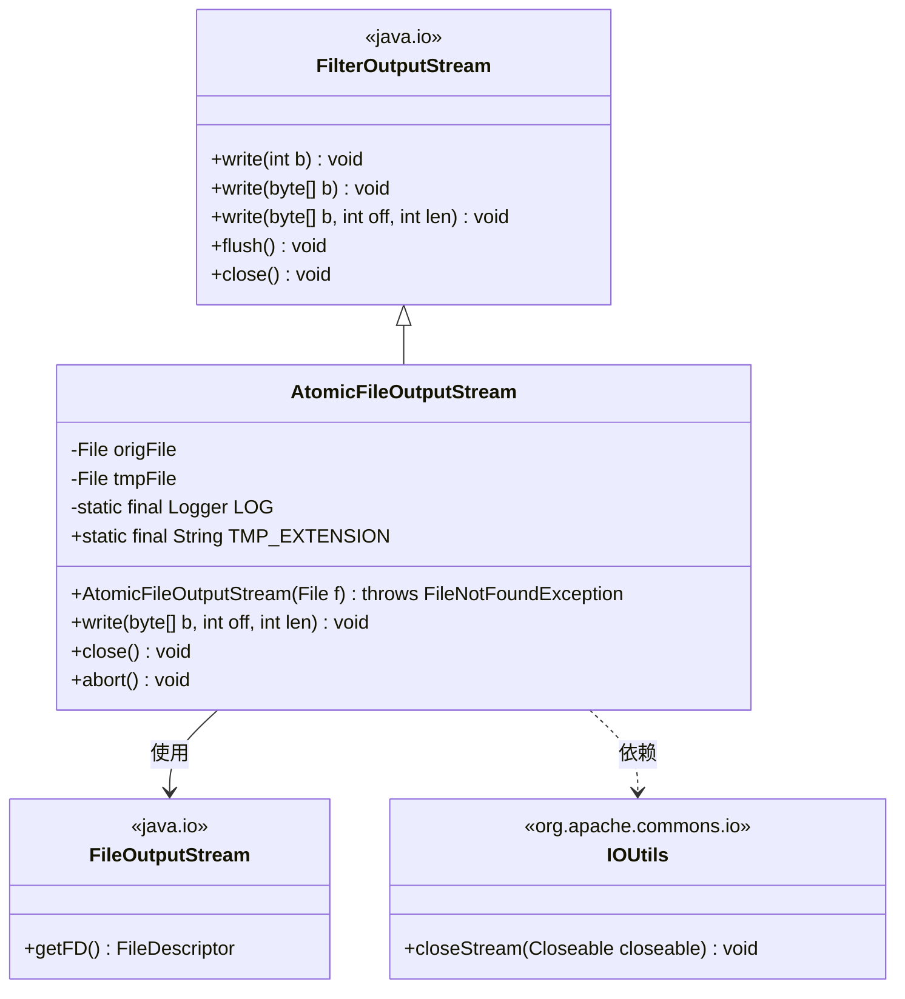
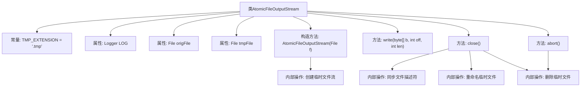

# 基础信息

|      |      |
|------|------|
| 名称 | AtomicFileOutputStream |
| 编码语言 | .java |
| 代码路径 | zookeeper/zookeeper-server/src/main/java/org/apache/zookeeper/common/AtomicFileOutputStream.java |
| 包名 | org.apache.zookeeper.common |
| 依赖项 | ['java.io.File', 'java.io.FileNotFoundException', 'java.io.FileOutputStream', 'java.io.FilterOutputStream', 'java.io.IOException', 'org.slf4j.Logger', 'org.slf4j.LoggerFactory'] |
| 概述说明 | AtomicFileOutputStream类扩展FilterOutputStream，提供原子文件写入功能。通过临时文件写入，关闭时重命名确保原子性。支持高效写入和异常处理，失败时可中止操作并清理临时文件。 |

# 说明

AtomicFileOutputStream类继承FilterOutputStream，提供原子性文件写入功能。构造函数接收目标文件并创建临时文件（.tmp后缀）。重写write方法提升批量写入效率。close方法确保数据同步后关闭流，成功时将临时文件重命名为目标文件（处理Windows重命名限制），失败则清理临时文件。abort方法用于写入失败时关闭流并删除临时文件，不提交更改。类包含完善的错误处理和日志记录。

# 类列表 Class Summary

| 名称   | 类型  | 说明 |
|-------|------|-------------|
| AtomicFileOutputStream | class | AtomicFileOutputStream类通过临时文件实现原子写入，确保数据完整性。写入时生成.tmp文件，关闭时同步数据并重命名为原文件。失败时可调用abort()删除临时文件，避免数据损坏。 |

## 类 AtomicFileOutputStream

|      |      |
|------|------|
| 访问范围 | public |
| 类型 | class |
| 名称 | AtomicFileOutputStream |
| 说明 | AtomicFileOutputStream类通过临时文件实现原子写入，确保数据完整性。写入时生成.tmp文件，关闭时同步数据并重命名为原文件。失败时可调用abort()删除临时文件，避免数据损坏。 |

### UML类图

这段代码定义了一个`AtomicFileOutputStream`类，继承自`FilterOutputStream`，用于实现原子性文件写入功能。它通过临时文件（添加.tmp后缀）进行中间写入，仅在成功关闭时通过重命名操作替换原始文件，确保数据完整性。类包含核心方法`close()`（含同步刷新、重命名逻辑）和异常处理`abort()`，同时优化了批量写入性能。通过`FileOutputStream`和`IOUtils`实现底层操作，体现了事务性文件操作的设计模式。

### 内部方法调用关系图

该流程图展示了AtomicFileOutputStream类的核心结构和关键方法调用关系。该类通过临时文件机制实现原子性文件写入，主要包含构造方法、写入方法、正常关闭方法和异常中止方法。close()方法实现了文件同步、重命名和清理的完整流程，abort()方法则处理写入失败时的资源清理。流程重点突出了临时文件创建、同步操作和最终状态转换（重命名或删除）的关键路径。

### 字段列表 Field List

| 名称  | 类型  | 说明 |
|-------|-------|------|
| tmpFile | File | 私有常量临时文件对象。 |
| LOG = LoggerFactory.getLogger(AtomicFileOutputStream.class) | Logger | 声明一个私有静态不可变日志对象LOG，用于AtomicFileOutputStream类的日志记录。 |
| origFile | File | 私有不可变文件对象origFile。 |
| TMP_EXTENSION = ".tmp" | String | 定义静态常量TMP_EXTENSION，值为".tmp"。 |

### 方法列表 Method List

| 名称  | 类型  | 说明 |
|-------|-------|------|
| write | void | 重写write方法，将字节数组b从off开始写入len长度数据到输出流out，可能抛出IOException。 |
| close | void | 覆盖close方法，先刷新并同步文件，尝试关闭流。成功则重命名临时文件，失败则删除临时文件并记录警告。处理Windows重命名异常。 |
| abort | void | 方法abort尝试关闭父类并删除临时文件，失败时记录警告日志。 |

