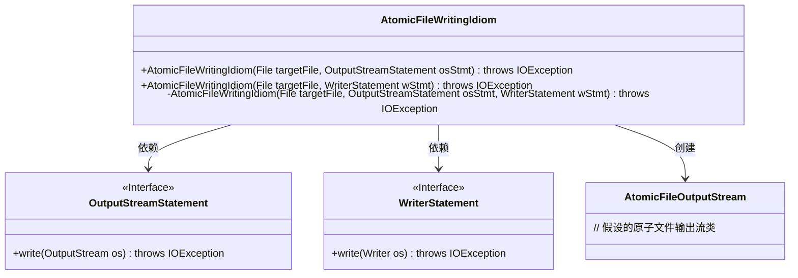
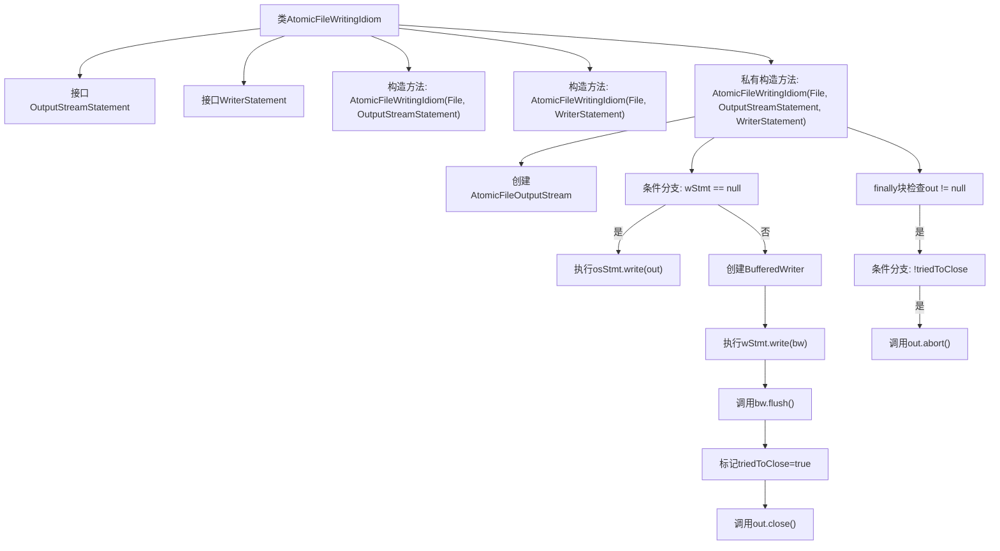

# 基础信息

|      |      |
|------|------|
| 名称 | AtomicFileWritingIdiom |
| 编码语言 | .java |
| 代码路径 | zookeeper/zookeeper-server/src/main/java/org/apache/zookeeper/common/AtomicFileWritingIdiom.java |
| 包名 | org.apache.zookeeper.common |
| 依赖项 | ['java.io.BufferedWriter', 'java.io.File', 'java.io.IOException', 'java.io.OutputStream', 'java.io.OutputStreamWriter', 'java.io.Writer'] |
| 概述说明 | 原子文件写入类，支持OutputStream和Writer两种方式，确保操作原子性，异常时清理临时文件。 |

# 说明

该代码定义了一个名为AtomicFileWritingIdiom的类，用于原子化文件写入操作。它提供了两种接口OutputStreamStatement和WriterStatement，分别处理字节流和字符流写入。构造函数支持通过这两种接口进行文件写入，内部使用AtomicFileOutputStream确保写入操作的原子性。在写入过程中，若发生异常会尝试清理临时文件，成功则提交写入，失败则回滚。整个过程注重资源管理和异常处理，确保文件操作的安全性和一致性。

# 类列表 Class Summary

| 名称   | 类型  | 说明 |
|-------|------|-------------|
| AtomicFileWritingIdiom | class | AtomicFileWritingIdiom类提供原子性文件写入，支持OutputStream和Writer两种操作，确保异常时清理资源，失败时回滚临时文件。 |

## 类 AtomicFileWritingIdiom

|      |      |
|------|------|
| 访问范围 | public |
| 类型 | class |
| 名称 | AtomicFileWritingIdiom |
| 说明 | AtomicFileWritingIdiom类提供原子性文件写入，支持OutputStream和Writer两种操作，确保异常时清理资源，失败时回滚临时文件。 |

### UML类图

这段代码展示了一个原子文件写入模式，通过两个接口`OutputStreamStatement`和`WriterStatement`定义写入操作。主类`AtomicFileWritingIdiom`提供两种构造方式（字节流/字符流），内部使用`AtomicFileOutputStream`确保文件写入的原子性。流程包含异常处理机制，确保在失败时清理临时文件。类图清晰地展示了核心组件间的依赖关系，体现了对资源安全和错误处理的重视。

### 内部方法调用关系图

流程图描述：该流程图展示了AtomicFileWritingIdiom类的核心逻辑，包含两个接口定义和三个构造方法。主流程通过私有构造方法实现原子性文件写入，根据输入参数选择OutputStream或Writer操作，确保在异常情况下通过abort()清理资源。流程包含文件流创建、条件分支、写入操作、刷新缓冲、关闭/中止处理等关键步骤，体现了健壮的错误处理机制。

### 字段列表 Field List

| 名称  | 类型  | 说明 |
|-------|-------|------|

### 方法列表 Method List

| 名称  | 类型  | 说明 |
|-------|-------|------|

