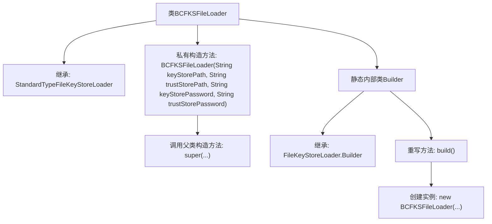

# 基础信息

|      |      |
|------|------|
| 名称 | BCFKSFileLoader |
| 编码语言 | .java |
| 代码路径 | zookeeper/zookeeper-server/src/main/java/org/apache/zookeeper/common/BCFKSFileLoader.java |
| 包名 | org.apache.zookeeper.common |
| 依赖项 | [] |
| 概述说明 | BCFKSFileLoader继承StandardTypeFileKeyStoreLoader，通过Builder构建，支持BCFKS格式密钥库和信任库加载。 |

# 说明

BCFKSFileLoader是StandardTypeFileKeyStoreLoader的子类，用于加载BCFKS格式的密钥库和信任库。其私有构造函数接收密钥库路径、信任库路径及对应密码，并调用父类构造函数指定BCFKS格式。内部静态Builder类继承自FileKeyStoreLoader.Builder，通过build方法创建BCFKSFileLoader实例，传递构造参数。该设计遵循建造者模式，确保安全初始化。

# 类列表 Class Summary

| 名称   | 类型  | 说明 |
|-------|------|-------------|
| BCFKSFileLoader | class | BCFKSFileLoader继承StandardTypeFileKeyStoreLoader，通过Builder构建，支持BCFKS格式密钥库和信任库加载。 |


## 类 BCFKSFileLoader

|      |      |
|------|------|
| 访问范围 | None |
| 类型 | class |
| 名称 | BCFKSFileLoader |
| 说明 | BCFKSFileLoader继承StandardTypeFileKeyStoreLoader，通过Builder构建，支持BCFKS格式密钥库和信任库加载。 |


### UML类图

```mermaid
classDiagram
    class StandardTypeFileKeyStoreLoader {
        <<Interface>>
    }

    class BCFKSFileLoader {
        -BCFKSFileLoader(String keyStorePath, String trustStorePath, String keyStorePassword, String trustStorePassword)
    }

    class "FileKeyStoreLoader.Builder~BCFKSFileLoader~" {
        <<Interface>>
    }

    class Builder {
        +BCFKSFileLoader build()
    }

    StandardTypeFileKeyStoreLoader <|-- BCFKSFileLoader : 继承
    "FileKeyStoreLoader.Builder~BCFKSFileLoader~" <|-- Builder : 实现
    Builder --> BCFKSFileLoader : 构建
```

这段代码描述了一个BCFKS文件加载器的实现结构。BCFKSFileLoader继承自StandardTypeFileKeyStoreLoader接口，通过私有构造函数初始化密钥库参数。其内部静态类Builder实现了泛型接口FileKeyStoreLoader.Builder，专门用于构建BCFKSFileLoader实例。整体采用建造者模式，将复杂对象的创建与表示分离，确保密钥库加载过程的安全性和可扩展性。


### 内部方法调用关系图



这段代码展示了一个BCFKS文件加载器的实现，采用建造者模式设计。主类BCFKSFileLoader继承自StandardTypeFileKeyStoreLoader，包含一个私有构造方法和一个静态内部建造者类。建造者类Builder继承自泛型基类，通过重写build()方法创建BCFKSFileLoader实例。整个结构实现了安全密钥库的加载功能，特别支持BCFKS格式的密钥存储文件。

### 字段列表 Field List

| 名称  | 类型  | 说明 |
|-------|-------|------|

### 方法列表 Method List

| 名称  | 类型  | 说明 |
|-------|-------|------|


