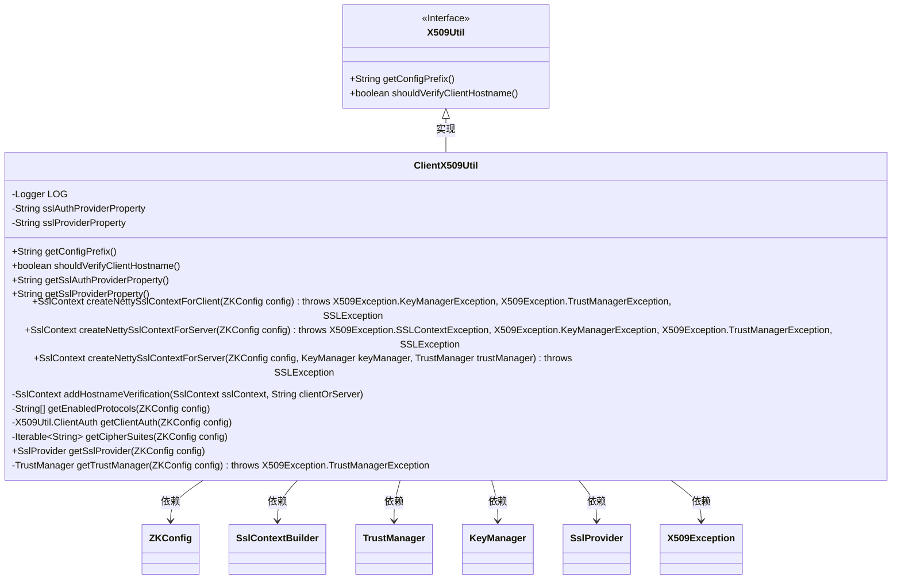

# 基础信息

|      |      |
|------|------|
| 名称 | ClientX509Util |
| 编码语言 | .java |
| 代码路径 | zookeeper/zookeeper-server/src/main/java/org/apache/zookeeper/common/ClientX509Util.java |
| 包名 | org.apache.zookeeper.common |
| 依赖项 | ['io.netty.handler.ssl.DelegatingSslContext', 'io.netty.handler.ssl.SslContext', 'io.netty.handler.ssl.SslContextBuilder', 'io.netty.handler.ssl.SslProvider', 'java.util.Arrays', 'javax.net.ssl.KeyManager', 'javax.net.ssl.SSLEngine', 'javax.net.ssl.SSLException', 'javax.net.ssl.SSLParameters', 'javax.net.ssl.TrustManager', 'org.slf4j.Logger', 'org.slf4j.LoggerFactory'] |
| 概述说明 | ClientX509Util扩展X509Util，提供客户端和服务端SSL上下文创建功能，支持密钥库、信任库配置，协议和加密套件设置，以及主机名验证。 |

# 说明

ClientX509Util是X509Util的子类，用于客户端和服务器的SSL/TLS配置。它提供创建Netty SslContext的方法，支持密钥库、信任库、密码套件、协议等配置。客户端方法允许可选密钥库，服务器方法强制要求密钥库。支持OCSP、主机名验证、FIPS模式，并可自定义SSL提供商（默认JDK）。通过ZKConfig读取配置，处理密码文件和属性，构建安全的SSL上下文。

# 类列表 Class Summary

| 名称   | 类型  | 说明 |
|-------|------|-------------|
| ClientX509Util | class | ClientX509Util继承X509Util，用于客户端和服务端SSL/TLS配置，包括密钥库、信任库管理、协议和加密套件设置，支持主机名验证和OCSP检查。 |

## 类 ClientX509Util

|      |      |
|------|------|
| 访问范围 | public |
| 类型 | class |
| 名称 | ClientX509Util |
| 说明 | ClientX509Util继承X509Util，用于客户端和服务端SSL/TLS配置，包括密钥库、信任库管理、协议和加密套件设置，支持主机名验证和OCSP检查。 |

### UML类图

类图描述：ClientX509Util 是 X509Util 接口的实现类，主要用于处理客户端和服务器的 SSL/TLS 配置。它包含多个公有方法用于创建 Netty 的 SslContext，以及私有方法用于处理协议、密码套件、信任管理器等配置。该类依赖于 ZKConfig 获取配置信息，使用 SslContextBuilder 构建 SSL 上下文，并可能抛出多种 X509Exception 异常。通过继承关系，它实现了 X509Util 接口的基本功能，并扩展了特定于客户端和服务器的 SSL 配置逻辑。

### 内部方法调用关系图

```mermaid
graph TD
    A["类ClientX509Util"]
    B["继承: X509Util"]
    C["属性: Logger LOG"]
    D["属性: String sslAuthProviderProperty"]
    E["属性: String sslProviderProperty"]
    F["重写方法: String getConfigPrefix()"]
    G["重写方法: boolean shouldVerifyClientHostname()"]
    H["方法: String getSslAuthProviderProperty()"]
    I["方法: String getSslProviderProperty()"]
    J["方法: SslContext createNettySslContextForClient()"]
    K["方法: SslContext createNettySslContextForServer()"]
    L["方法: SslContext createNettySslContextForServer()"]
    M["方法: SslContext addHostnameVerification()"]
    N["方法: String[] getEnabledProtocols()"]
    O["方法: ClientAuth getClientAuth()"]
    P["方法: Iterable<String> getCipherSuites()"]
    Q["方法: SslProvider getSslProvider()"]
    R["方法: TrustManager getTrustManager()"]

    A --> B
    A --> C
    A --> D
    A --> E
    A --> F
    A --> G
    A --> H
    A --> I
    A --> J
    A --> K
    A --> L
    A --> M
    A --> N
    A --> O
    A --> P
    A --> Q
    A --> R
```

该流程图展示了ClientX509Util类的结构及其方法关系。该类继承自X509Util，包含日志记录器、SSL相关属性配置，以及多个用于创建Netty SSL上下文的方法。核心方法包括客户端/服务端SSL上下文构建、主机名验证、协议/密码套件配置等，通过ZKConfig获取参数并处理异常情况，最终返回配置好的SslContext对象。

### 字段列表 Field List

| 名称  | 类型  | 说明 |
|-------|-------|------|
| sslProviderProperty = getConfigPrefix() + "sslProvider" | String | 私有字符串变量sslProviderProperty，值为getConfigPrefix()与"sslProvider"拼接结果。 |
| sslAuthProviderProperty = getConfigPrefix() + "authProvider" | String | 私有字符串变量sslAuthProviderProperty通过getConfigPrefix方法拼接"authProvider"初始化。 |
| LOG = LoggerFactory.getLogger(ClientX509Util.class) | Logger | ClientX509Util类中定义了一个私有静态日志记录器LOG。 |

### 方法列表 Method List

| 名称  | 类型  | 说明 |
|-------|-------|------|
| getClientAuth | X509Util.ClientAuth | 该方法从配置中获取SSL客户端认证属性值，并转换为X509Util.ClientAuth对象返回。 |
| shouldVerifyClientHostname | boolean | 覆盖方法，禁用客户端主机名验证，直接返回false。 |
| addHostnameVerification | SslContext | 该方法为SSL上下文添加主机名验证，通过设置HTTPS风格的端点识别算法来增强安全性，并在调试日志中记录启用状态。 |
| createNettySslContextForClient | SslContext | 创建客户端SSL上下文，配置密钥库、信任管理器、OCSP、协议、加密套件和SSL提供商，支持主机名验证和FIPS模式。 |
| getTrustManager | TrustManager | 方法根据配置创建TrustManager，检查信任库位置、密码和类型，验证CRL、OCSP及主机名设置，若信任库位置为空则返回null，否则创建并返回TrustManager。 |
| createNettySslContextForServer | SslContext | 创建Netty SSL服务器上下文，配置包括密钥管理器、信任管理器、OCSP、协议、客户端认证、加密套件和SSL提供程序，可选主机名验证。 |
| getSslProviderProperty | String | 这是一个Java方法，返回名为sslProviderProperty的字符串属性值。 |
| getSslProvider | SslProvider | 方法getSslProvider根据ZKConfig获取SSL提供者，默认返回JDK。 |
| createNettySslContextForServer | SslContext | 创建Netty SSL服务器上下文，需密钥库位置、密码和类型，缺失则报错，生成密钥和信任管理器后返回上下文。 |
| getCipherSuites | Iterable<String> | 获取加密套件配置，若未配置且SSL提供者非JDK则返回空，否则返回默认或指定加密套件列表。 |
| getEnabledProtocols | String[] | 方法从配置获取启用的SSL协议，若未指定则返回默认协议，否则按逗号分割返回协议列表。 |
| getSslAuthProviderProperty | String | 这是一个Java方法，返回名为sslAuthProviderProperty的字符串变量值。 |
| getConfigPrefix | String | 重写方法返回配置前缀"zookeeper.ssl."。 |

