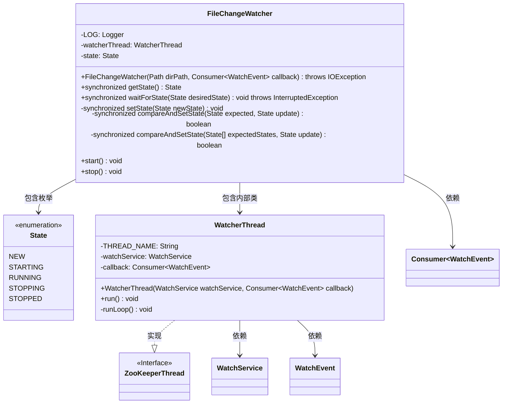
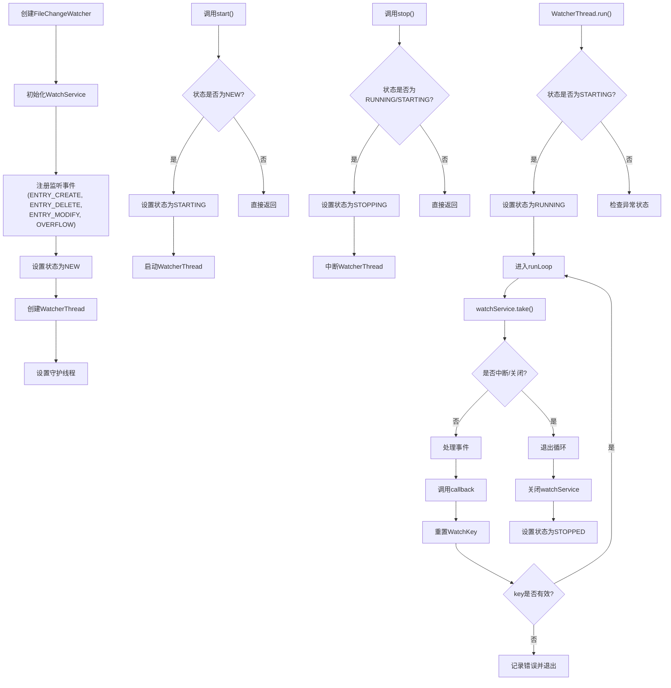
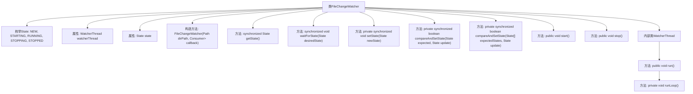
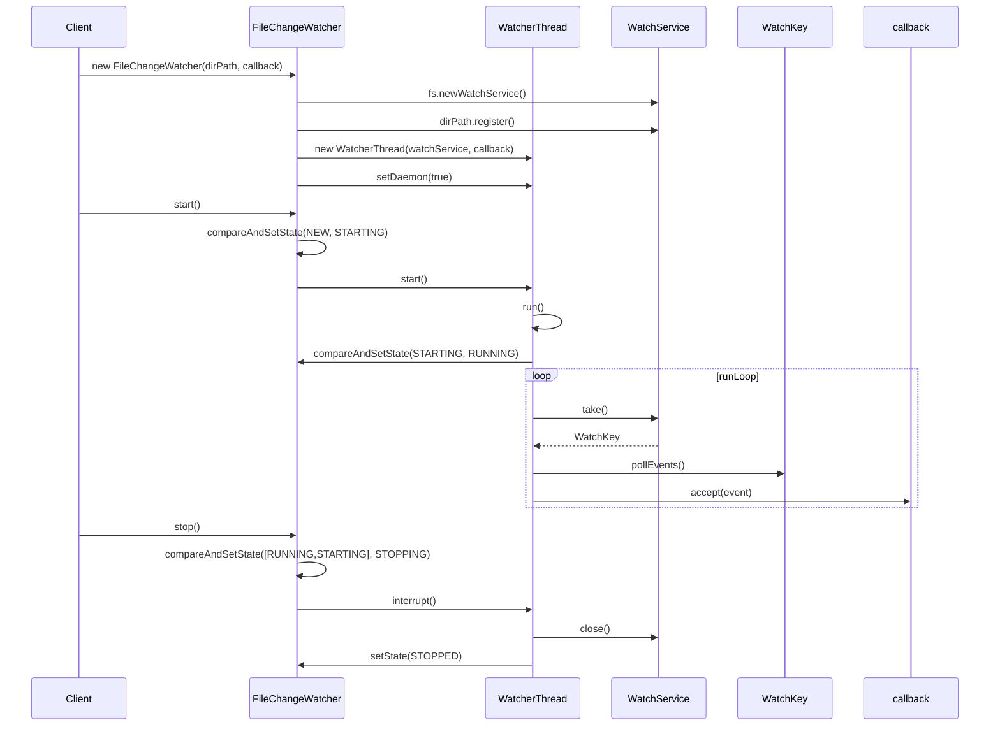

# 基础信息

|      |      |
|------|------|
| 名称 | FileChangeWatcher |
| 编码语言 | .java |
| 代码路径 | zookeeper/zookeeper-server/src/main/java/org/apache/zookeeper/common/FileChangeWatcher.java |
| 包名 | org.apache.zookeeper.common |
| 依赖项 | ['java.io.IOException', 'java.nio.file.ClosedWatchServiceException', 'java.nio.file.FileSystem', 'java.nio.file.Path', 'java.nio.file.StandardWatchEventKinds', 'java.nio.file.WatchEvent', 'java.nio.file.WatchKey', 'java.nio.file.WatchService', 'java.util.function.Consumer', 'org.apache.zookeeper.server.ZooKeeperThread', 'org.slf4j.Logger', 'org.slf4j.LoggerFactory'] |
| 概述说明 | FileChangeWatcher类监控目录文件变化，通过回调处理事件。包含状态管理（NEW、STARTING等）、线程安全操作及后台线程逻辑，支持启动、停止及状态查询。 |

# 说明

FileChangeWatcher类用于监控目录文件变化，通过WatchService监听创建、删除、修改和溢出事件。包含NEW、STARTING、RUNNING、STOPPING、STOPPED五种状态，通过同步方法管理状态转换。内部类WatcherThread处理事件回调，支持启动和停止操作，确保线程安全。异常处理和日志记录完善，提供状态等待功能。

# 类列表 Class Summary

| 名称   | 类型  | 说明 |
|-------|------|-------------|
| FileChangeWatcher | class | 文件监控类，跟踪目录变化并回调处理事件。包含状态管理（NEW、STARTING等）、线程控制及异常处理。支持启动、停止操作，确保线程安全。 |

## 类 FileChangeWatcher

|      |      |
|------|------|
| 访问范围 | public final |
| 类型 | class |
| 名称 | FileChangeWatcher |
| 说明 | 文件监控类，跟踪目录变化并回调处理事件。包含状态管理（NEW、STARTING等）、线程控制及异常处理。支持启动、停止操作，确保线程安全。 |

### UML类图

该代码实现了一个文件变化监听器，通过WatchService监控目录变化并触发回调。核心类FileChangeWatcher通过状态机管理生命周期，内部类WatcherThread继承ZooKeeperThread实现异步监听。流程图展示了从初始化、启动、运行到停止的完整流程，包含状态转换和异常处理路径。类图清晰地展示了类之间的关系和依赖，特别是枚举状态和线程实现关系。

### 内部方法调用关系图

这段代码实现了一个文件变化监视器，通过WatchService监控指定目录的文件创建、删除和修改事件。核心是WatcherThread线程类，通过状态机管理生命周期（NEW/STARTING/RUNNING等），使用同步方法保证线程安全。流程图展示了类结构和主要方法调用关系，时序图描述了从初始化、启动监控到停止的完整流程，包括事件监听循环和状态转换过程。该设计具有完善的错误处理和状态管理机制。

### 字段列表 Field List

| 名称  | 类型  | 说明 |
|-------|-------|------|
| watcherThread | WatcherThread | 私有最终监视线程实例。 |
| state | State | 私有状态变量state。 |
| LOG = LoggerFactory.getLogger(FileChangeWatcher.class) | Logger | 日志记录器初始化，用于FileChangeWatcher类的日志输出。 |

### 方法列表 Method List

| 名称  | 类型  | 说明 |
|-------|-------|------|
| getState | State | 同步方法返回当前状态对象。 |
| waitForState | void | 同步方法等待状态：循环检查当前状态是否等于目标状态，否则调用wait()等待。 |
| stop | void | 方法stop()尝试将状态从RUNNING或STARTING改为STOPPING，成功则中断watcherThread线程。 |
| start | void | 检查状态是否为NEW，是则启动线程，否则直接返回。 |
| compareAndSetState | boolean | 私有同步方法，比较并设置状态：若当前状态等于预期值，则更新状态并返回true；否则返回false。 |
| compareAndSetState | boolean | 私有同步方法compareAndSetState检查当前状态是否匹配预期状态数组，匹配则更新状态并返回true，否则返回false。 |
| setState | void | 私有同步方法setState用于更新状态并通知所有等待线程。参数为新状态newState，赋值后调用notifyAll唤醒线程。 |

